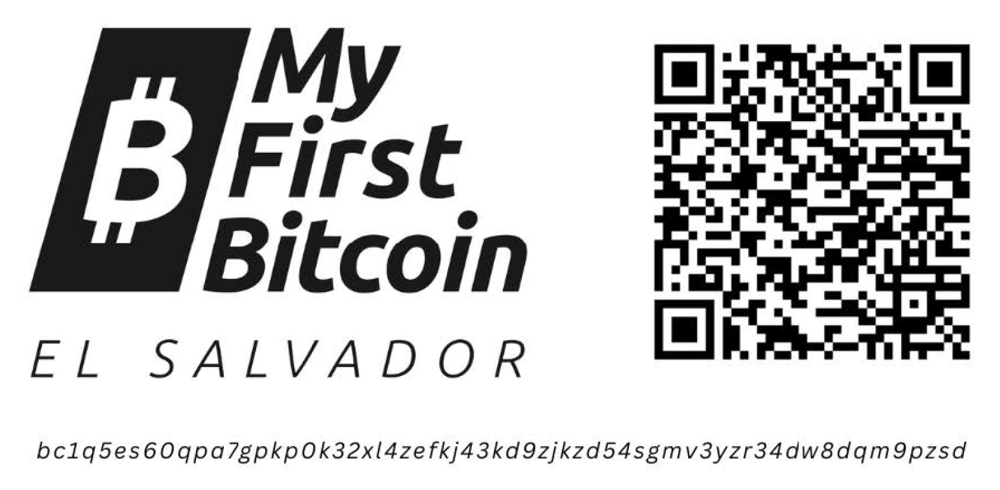

# Bitcoin Diploma    
    
### _Financial Education for the Bitcoin Era_    

 
 

### ***Student Workbook***    
English Version | 2024

 

__________________________________________________________________________________________________________

 

**_My First Bitcoin_** has created this work and made it    
freely available under **Creative Commons**.    

This work is licensed under     
**Creative Commons**     
**Attribution-ShareAlike**    
**4.0 International (CC BY-SA 4.0)**    
 
 
 

 

__________________________________________________________________________________________________________          

 

***DONATE NOW (scan with a Bitcoin wallet - On-Chain transaction):***    

       

 
 

__________________________________________________________________________________________________________              
           
 

### Acknowledgments    

     

***The Bitcoin Diploma Story***

There is nothing more powerful than an idea whose time has come.

The Bitcoin Diploma story began in El Salvador, with the first pilot of 38 public school students graduating in June 2022.

It’s hard to believe that was only a year and half ago.

The growth in 2023 was phenomenal, with thousands of students from all over the nation graduating with a Bitcoin Diploma. In September, just 15 months after that first graduation, a much bigger pilot program began. The Ministry of Education in El Salvador created their own Bitcoin Diploma with our workbook as the primary source material. Along with Bitcoin Beach, our teachers taught the Bitcoin Diploma to 150 public school teachers. Those teachers returned to their own schools and taught their own students. This year, we plan to start by helping to train 700 additional public school teachers scattered across the country, and the hope is to bring quality bitcoin education to every school in El Salvador within two years.

One of our original goals was to teach a nation and demonstrate Bitcoin education as a tool for good at mass scale. That dream is now well on its way.

El Salvador is the focus; the mission is the world.

We have open-sourced the workbook, as well as a variety of other educational materials, and have been blown away by the international interest. 2022 was the first time a Bitcoin Diploma had ever been taught in a public school system anywhere in the world. In 2023, that exploded. Translated into 12 languages, it has now been taught in Guatemala, Honduras, USA, Canada, Cuba, Dominican Republic, South Korea, Costa Rica, Brazil, Uruguay, Argentina, India, Italy, Mexico, South Africa, Zambia, Kenya, Portugal, the UK, & Hong Kong. And just as growth in 2023 dwarfed the previous year, we expect 2024 to do the same.

This is a global, decentralized movement.

Independent, impartial, community-led bitcoin education will change the world. It already has.

 
 
 

**For a better world,**

 

**-My First Bitcoin team-**     
**2024**
