[Back to Main Page of Web View](https://github.com/MyFirstBitcoin/Bitcoin-Diploma-2024/tree/main/Web%20View#web-view-of-bitcoin-diploma-2024)

 

## _Chapter #2_

# ***What is Money?***

- [**2.0** Introduction](https://github.com/MyFirstBitcoin/Bitcoin-Diploma-2024/blob/main/Web%20View/14.Chapter-2.md#20-introduction)
  - [**Activity:** Class Discussion - “What is Money?”](https://github.com/MyFirstBitcoin/Bitcoin-Diploma-2024/blob/main/Web%20View/14.Chapter-2.md#activity-class-discussion---what-is-money)         
- [**2.1** Definition of Money](https://github.com/MyFirstBitcoin/Bitcoin-Diploma-2024/blob/main/Web%20View/14.Chapter-2.md#21-definition-of-money)       
- [**2.2** Function of Money](https://github.com/MyFirstBitcoin/Bitcoin-Diploma-2024/blob/main/Web%20View/14.Chapter-2.md#22-function-of-money)       
- [**2.3** Properties of Money](https://github.com/MyFirstBitcoin/Bitcoin-Diploma-2024/blob/main/Web%20View/14.Chapter-2.md#23-properties-of-money)      
- [**2.4** Types of Money](https://github.com/MyFirstBitcoin/Bitcoin-Diploma-2024/blob/main/Web%20View/14.Chapter-2.md#24-types-of-money)          
- [**2.5** The Psychology of Money: Scarcity, Time Preference, and Trade-offs](https://github.com/MyFirstBitcoin/Bitcoin-Diploma-2024/blob/main/Web%20View/14.Chapter-2.md#25-the-psychology-of-money-scarcity-time-preference-and-trade-offs)        
  - [**Activity:** Time Preference](https://github.com/MyFirstBitcoin/Bitcoin-Diploma-2024/blob/main/Web%20View/14.Chapter-2.md#activity-time-preference)         
          
 

_______________________________________________________________________________________

### ***2.0 Introduction***  

> "Money is a guarantee that we may have what we want in the future. Though we need nothing at the moment, it ensures the possibility of satisfying a new desire when it arises."    
 **$\color[RGB]{250,175,64} Aristotle$**

 

Building upon our exploration of the necessity of money, this chapter explores the core question: What is money? We’ll start off with a group discussion and activity.

 

[Back to the beginning of Chapter #2](https://github.com/MyFirstBitcoin/Bitcoin-Diploma-2024/blob/main/Web%20View/14.Chapter-2.md#chapter-2)

 
 

### _Activity: Class Discussion - “What is Money?”_

- ⭐ Please do not eat the piece of candy placed on your desk yet.
- ⭐ Who would be willing to trade their candy for a US$1 bill?
- ⭐ Now, keep your hands up if you would still be willing to trade your candy for a $1 monopoly bill instead of your piece of candy.
- ⭐ Why or why not?
- ⭐ What makes one bill so desirable and another one as good as trash?
- ⭐ What gives money its “value”?
- ⭐ Where does money come from and who decides how much of it to print?
- ⭐ Why not print more money and distribute it among everyone equally?

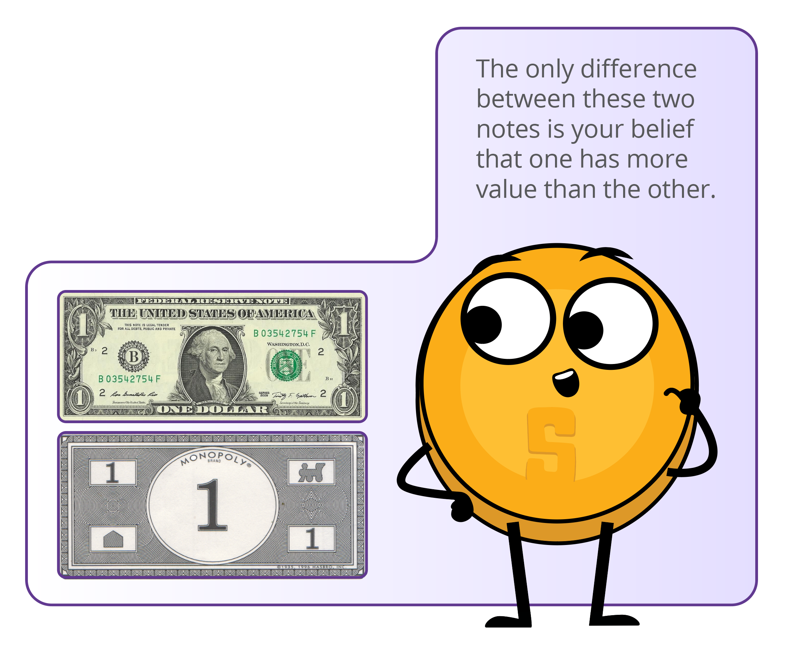

 

[Back to the beginning of Chapter #2](https://github.com/MyFirstBitcoin/Bitcoin-Diploma-2024/blob/main/Web%20View/14.Chapter-2.md#chapter-2)

 
 

### ***2.1 Definition of Money***  

Have you ever stopped to think about what money really is? Ever wonder what makes money…well, money? Most of us know how to use it, but not many of us understand where it comes from or how it works. Money is essentially a way to exchange goods and services. It represents the value of these items in a form that can be easily traded. This can take many different forms, such as paper notes, metal coins, and electronic payments. Governments or other authorities typically issue and control money, but money is so much more than just a physical or digital medium of exchange; it’s like a universal language that allows us to trade with people all around the world, even if we don’t speak the same language or have the same culture. For example, you can be on the other side of the world and still “speak” money by placing a product on the counter and exchanging it for the local currency or using a credit card.

Money is like a social contract that allows us to make exchanges without having to rely on bartering or finding someone who specifically wants what we have to offer. If a group of people started accepting chocolate as payment for most goods and services, chocolate would become money (although, since it would melt in some
parts of the world, we might consider it bad money).

As French economist Jean-Baptiste Say pointed out, “Money performs but a momentary function in an exchange; and when the transaction is finally closed, it will always be found that one kind of commodity has been exchanged for another.”

In other words, money itself doesn’t have the power to satisfy human wants; it’s just a tool that allows us to trade one commodity for another.

- 💡 **$\color[RGB]{250,175,64} Transaction$** is an exchange or transfer of goods and services. It is a way of exchanging value between two or more parties.

There are many different types of transactions, ranging from simple exchanges (such as buying a sandwich at a deli) to more complex financial transactions (such as buying a house or investing in stocks or bonds). Transactions can be conducted in person, over the phone, online, or through other means, and they can involve a wide range of parties, including individuals, businesses, and financial institutions.

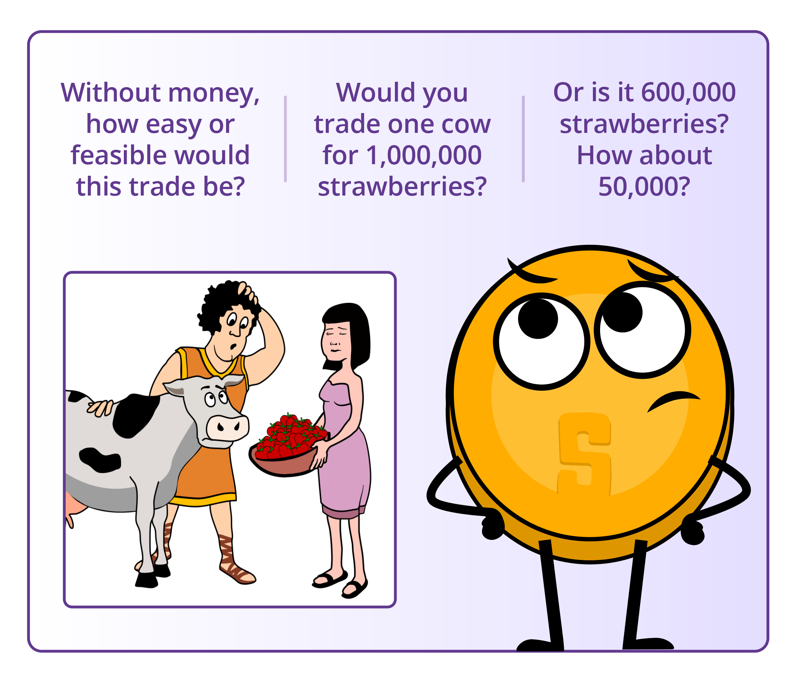

<a rel="YouTube video of What is money?" href="https://www.youtube.com/watch?v=InwVM6s7WoY">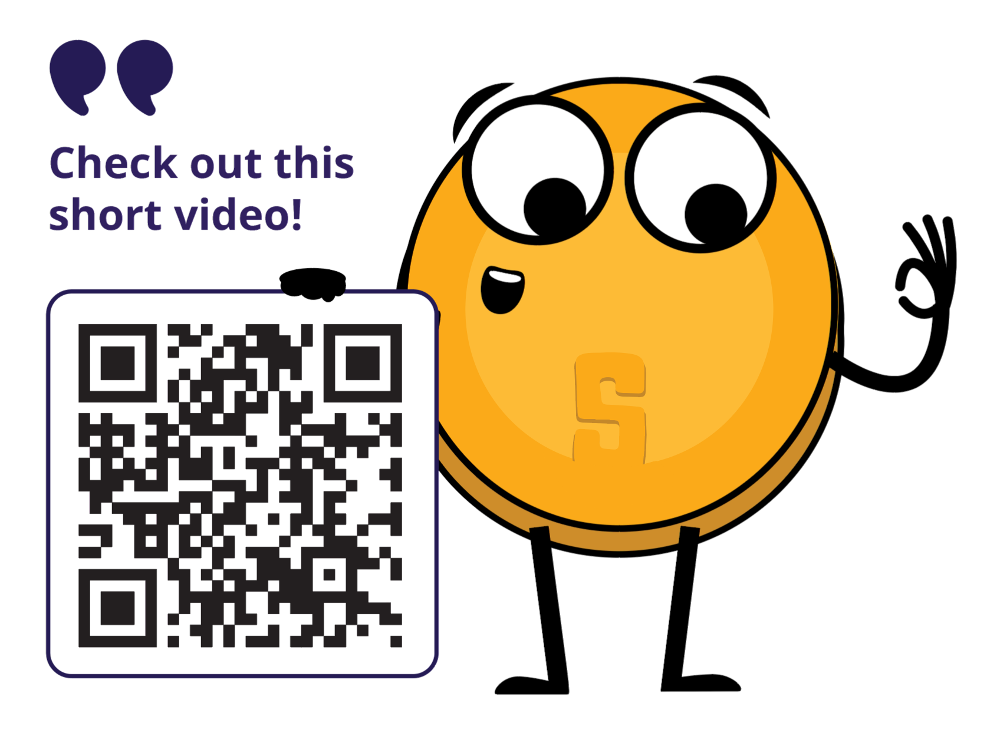

 

- 💡 Money **$\color[RGB]{250,175,64} IS$** the value **$\color[RGB]{250,175,64} BY$** which goods are exchanged. Money **$\color[RGB]{250,175,64} IS \ NOT$** the value **$\color[RGB]{250,175,64} FOR$** which goods are exchanged

 

**$\color[RGB]{104,59,147} In \ summary, \ money$**:    
Facilitates trade because everyone accepts it as final payment. It also allows us to measure the value and to make comparisons between different goods and services. Next, we’ll look at the function of money.

 

[Back to the beginning of Chapter #2](https://github.com/MyFirstBitcoin/Bitcoin-Diploma-2024/blob/main/Web%20View/14.Chapter-2.md#chapter-2)

 
 

### ***2.2 Function of Money***  

When it comes to buying and selling goods and services, money is the key player. Money serves several important functions in the world, like:    

1. **$\color[RGB]{104,59,147} A \ store \ of \ value$**: Money should maintain its value over time, making it useful as a method to save and invest the value of human labor. This lets people use money to plan for the future and borrow and lend money. So, the next time you’re saving up for something special, remember that money is more than just a way to pay for things – it’s a tool to help you plan and invest in your future.

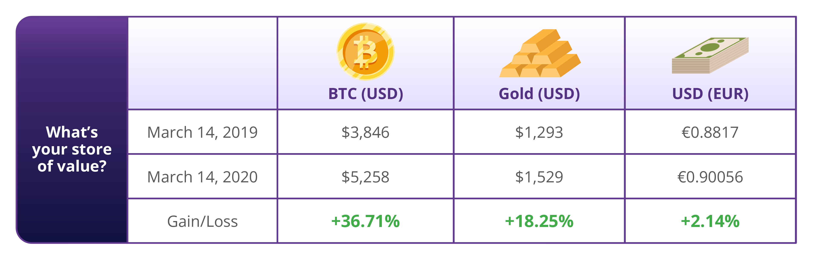

2. **$\color[RGB]{104,59,147} Medium \ of \ Exchange$**: With money, you don’t have to find someone who wants exactly what you have to trade. Instead, you can use money to buy and sell anything you want. This makes trading and commerce much more convenient and efficient.

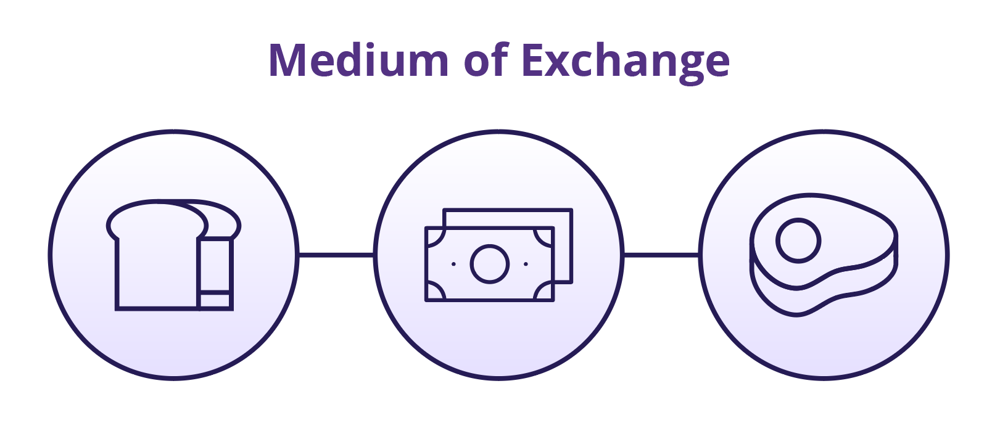

3. **$\color[RGB]{104,59,147} Unit \ of \ Account$**: Money provides a universal standard of value that allows people to express and compare the price of different goods and services. This allows for a more efficient and transparent market, where people can make informed decisions about what to buy and sell.

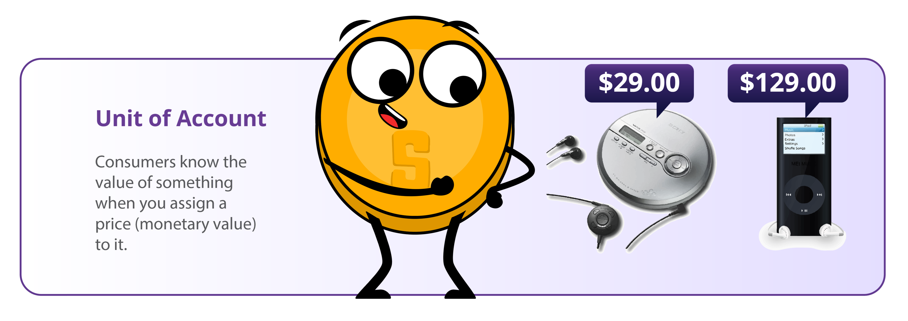

Think of it like this: if you wanted to buy a new car, you could compare prices from different dealerships and make an informed decision about which one to buy based on the price in dollars. Without a unit of account, you’d have to try to compare the value of one car to another using something else, like the number of cows it was worth or the length of time it took to make the car.

These three functions are what allow economies to become complex and dynamic. Without money, it would be much harder to buy and sell goods and services, and our economy would be much less developed.

 

**Class Exercise: What function of money is this an example of?**
- ⭐ Evan decided to save a portion of his weekly paychecks to buy a puppy.
- ⭐ Adam buys two slices of pizza for $8.30 at Ray’s Pizza.
- ⭐ Marc can’t decide whether to buy concert tickets for $75 or buy a ski pass for $95.

 

[Back to the beginning of Chapter #2](https://github.com/MyFirstBitcoin/Bitcoin-Diploma-2024/blob/main/Web%20View/14.Chapter-2.md#chapter-2)

 
 

### ***2.3 Properties of Money***  

Over time, people have ultimately realized that money must possess certain qualities to be effective as a medium of exchange. These characteristics include durability, divisibility, portability, acceptability, scarcity, and fungibility.

- ⭐ **$\color[RGB]{104,59,147} Durability$** refers to the ability of money to resist physical deterioration and last over time. This ensures that money can circulate in the economy in an acceptable and recognizable state. Gold is a durable material that can withstand wear and tear, making it a good representation of the durability characteristic of money.

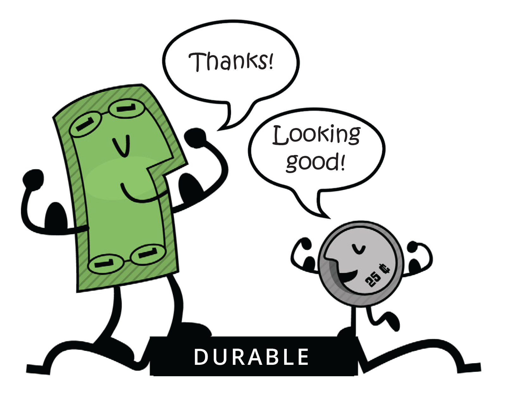

 

- ⭐ **$\color[RGB]{104,59,147} Divisibility$** refers to the ability of money to be divided into smaller units so that people can use it to make purchases of varying amounts. Paper bills can be easily divided into smaller denominations, making them a good representation of the divisibility characteristic of money.

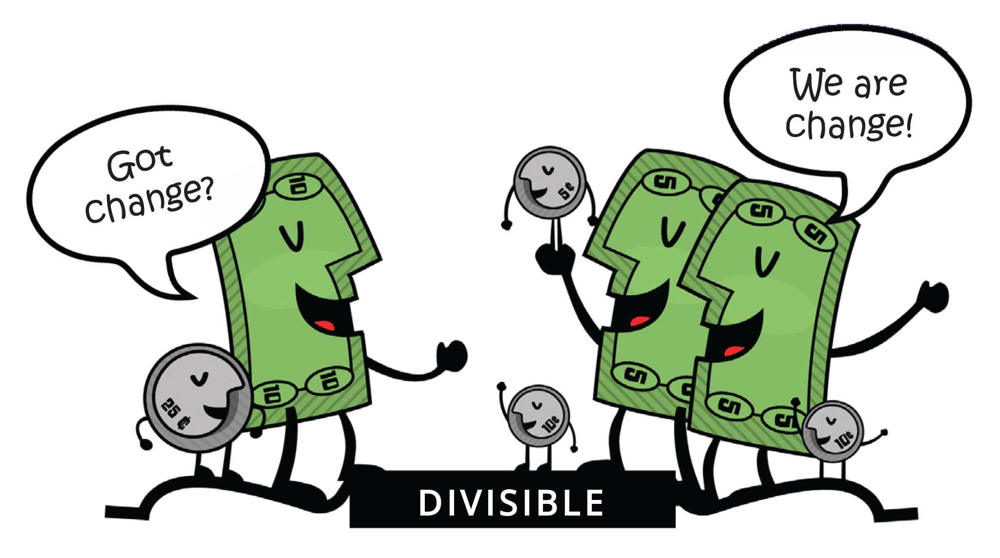

 

- ⭐ **$\color[RGB]{104,59,147} Portability$** refers to the ease with which money can be transported and carried around. This allows people to use money to buy and sell goods and services without difficulty. Credit cards are portable, as they can easily be carried in a wallet or purse, making them a good representation of the portability characteristic of money.

 

- ⭐ **$\color[RGB]{104,59,147} Acceptability$** refers to the widespread acceptance of money as a form of payment so that people can use it to buy and sell goods and services with confidence. The US dollar is widely accepted as a form of payment, making it a good representation of the acceptability characteristic of money.

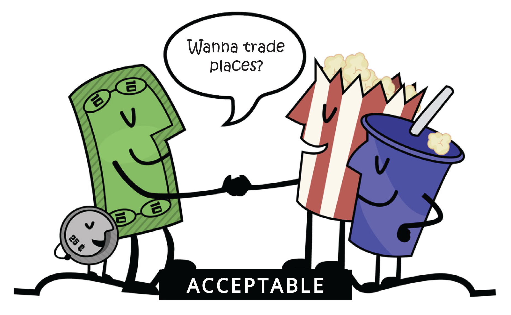

 

- ⭐ **$\color[RGB]{104,59,147} Scarcity$** refers to the limited supply of money, which helps maintain its value and prevent us from having to spend more money to buy the same amount of goods. Collectible stamps, especially rare and valuable ones, can be a good form of money because they are scarce and can appreciate in value over time. Stamp collectors often use their stamps as a way to invest their wealth and to diversify their portfolio.

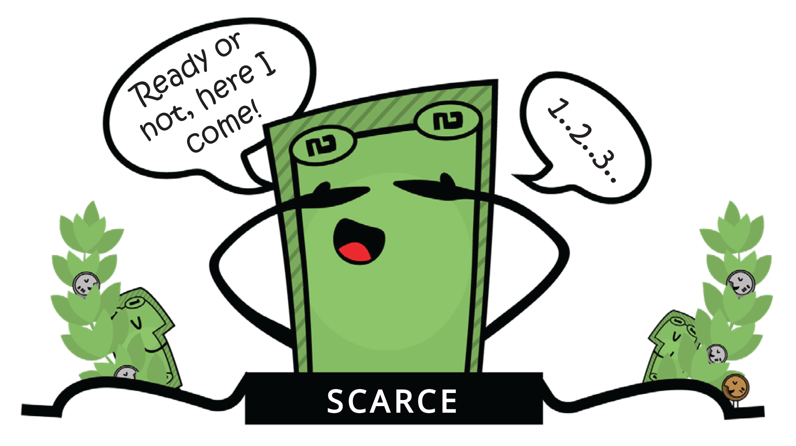

 

- ⭐ **$\color[RGB]{104,59,147} Fungibility$** refers to the interchangeability of money so that one unit of money is equivalent to another unit of the same value. Money should be uniform. Copper coins are uniform in size and weight, making them a good representation of the uniformity characteristic of money. One cent is always one cent.

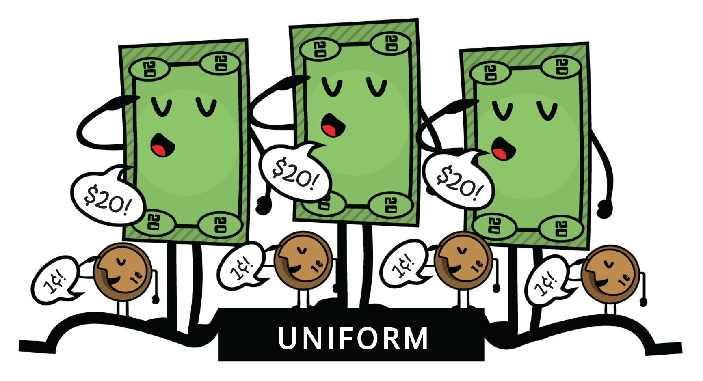

 

Overall, these characteristics make money a useful and effective tool for facilitating trade and commerce, and they are essential for the development and stability of economies.

 

**$\color[RGB]{104,59,147} Class \ Exercise$**

Different assets have different properties and perform the functions of money to varying degrees. Society ultimately determines which asset is used as money based on factors such as stability, scarcity, divisibility, transferability, and acceptance as a medium of exchange.

To determine how well different items meet the specific characteristics of money, you can score each item on a scale from 1 to 5 for each characteristic. By tallying up the scores for each item, you can determine which one is best suited to be a form of money.

[ **0 = Terrible**; **$\color[RGB]{250,175,64} 3 \ = \ Okay;$** **$\color[RGB]{104,59,147} 5 \ = \ Excellent$** ]

* **Please do not fill in the column for Bitcoin; we will return to it later in the course.**

 

**Use the following questions** to help determine how well the different items in the table meet the characteristics of money.

- ⭐ **$\color[RGB]{104,59,147} Durability$**: Can the money withstand wear and tear over time?
- ⭐ **$\color[RGB]{104,59,147} Fungibility$**: Is money interchangeable with other forms of money?
- ⭐ **$\color[RGB]{104,59,147} Acceptability$**: Is the money widely accepted as a form of payment?
- ⭐ **$\color[RGB]{104,59,147} Scarcity$**: Is the money scarce and not too abundant?
- ⭐ **$\color[RGB]{104,59,147} Portability$**: Can the money be easily transported and used in different locations?
- ⭐ **$\color[RGB]{104,59,147} Divisibility$**: Can the money be divided into smaller units for transactions?

| Characteristic of Good Money  | 🐄  Cows | 🚬  Cigarettes | 💎  Dimonds | 💶  Euros | ₿  Bitcoin |
| ------------- | ------------- | ------------- | ------------- | ------------- | ------------- |
| Durable |     |     |     |     |     |
| Portable |     |     |     |     |     |
| Uniform |     |     |     |     |     |
| Acceptable |     |     |     |     |     |
| Scarce |     |     |     |     |     |
| Divisible |     |     |     |     |     |
| Total |     |     |     |     |     |

 

[Back to the beginning of Chapter #2](https://github.com/MyFirstBitcoin/Bitcoin-Diploma-2024/blob/main/Web%20View/14.Chapter-2.md#chapter-2)

 
 

### ***2.4 Types of Money***  

Money can be divided into two main categories: physical and digital.

Physical money includes:

- ⭐ Fiat money, which is the paper bills and coins issued by governments and accepted as a medium of exchange.

- ⭐ Representative money, which represents a claim on a physical commodity.

- ⭐ Commodity money, which is a physical object that has intrinsic value and is widely accepted as a medium of exchange. For example, gold and silver.

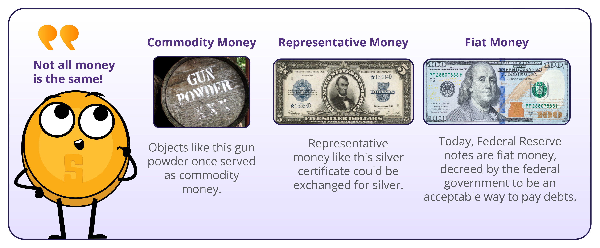

- 💡 **$\color[RGB]{250,175,64} Digital \ currencies,$** on the other hand, can be used for online transactions and include electronic currencies, stablecoins, and cryptocurrencies. **$\color[RGB]{250,175,64} Electronic \ currencies$** are digital versions of regular money, like dollars or euros, and can be used to buy and sell things online via digital **$\color[RGB]{250,175,64} payment \ rails.$**

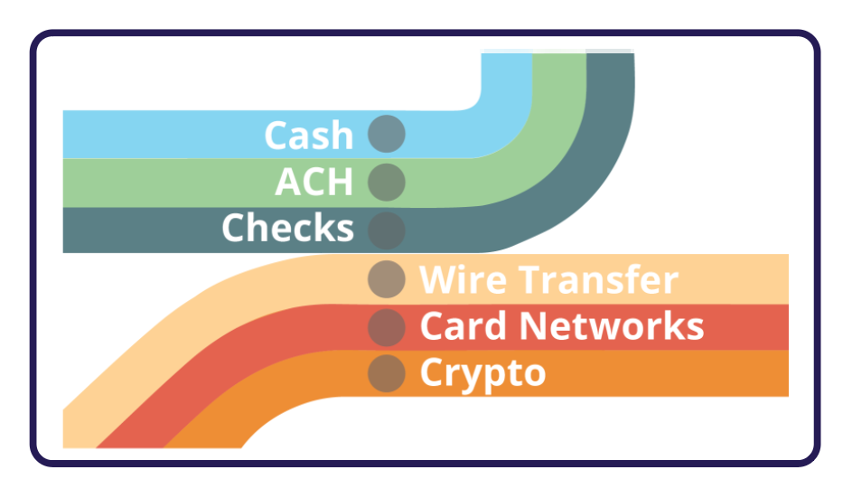

Payment rails are the infrastructure enabling the movement of electronic currencies and other digital assets from one place to another. However, in the traditional financial system, there is always a middleman, such as a bank or financial institution, that charges a fee and has the authority to accept, cancel, revert, or delay transactions.

In the intermediated financial system, the main types of digital payment rails include card networks – which facilitate the transfer of funds between financial institutions and merchants when a customer makes a purchase using a debit or credit card – and digital wallets, which are online accounts that allow users to store and manage their electronic currencies and make payments by transferring funds from their account to the recipient’s account.

- 💡 **$\color[RGB]{250,175,64} Central \ Bank \ Digital \ Currencies \ (CBDCs)$**: Are digital versions of a country’s fiat currency, which are issued and backed by the central bank and intermediated by the government.

- 💡 **$\color[RGB]{250,175,64} Stablecoins$** are digital currencies designed to maintain a stable value relative to an asset, like the U.S. dollar.

- 💡 **$\color[RGB]{250,175,64} Cryptocurrencies$** are a type of digital currency. Some cryptocurrencies are decentralized and governed by rules, while others are centralized and controlled by a small group of people.

Ultimately, a currency that operates without intermediaries is more efficient and beneficial for society, as it prevents a few individuals from controlling the money supply and concentrating their power. However, creating such a currency that facilitates secure transactions without relying on trust between parties has been a challenge throughout history. To achieve this, a currency must be created that operates like the internet, where control is distributed among everyone and no one at the same time. This requires the agreement of all parties, including those who hold power, to relinquish control for the greater good.

 

[Back to the beginning of Chapter #2](https://github.com/MyFirstBitcoin/Bitcoin-Diploma-2024/blob/main/Web%20View/14.Chapter-2.md#chapter-2)

 
 

### ***2.5 The Psychology of Money: Scarcity, Time Preference, and Trade-offs***  

Imagine you are stranded in a desert and you only have one bottle of water left. You are thirsty and desperate for a drink, but you also know that you will need the water to survive until you can find more. This is a classic example of scarcity – you only have a limited amount of a resource (water) and you must make a choice about how to use it. In this situation, you might decide to ration it and take small sips over a longer period of time to make it last as long as possible.

- 💡 **$\color[RGB]{250,175,64} Scarcity$**  forces us to weigh the pros and cons of how we use our resources and make trade-offs.

Alternatively, you might decide to drink as much as you can in one go, hoping that the burst of hydration will give you the energy you need to find more water. Regardless of which choice you make, you are faced with a difficult decision. In this case, the choice is between quenching your immediate thirst and conserving the water for later. This concept of scarcity applies to all kinds of resources, not just water. Whether it’s money, time, or even love and attention, we are constantly faced with choices about how to allocate our limited resources.

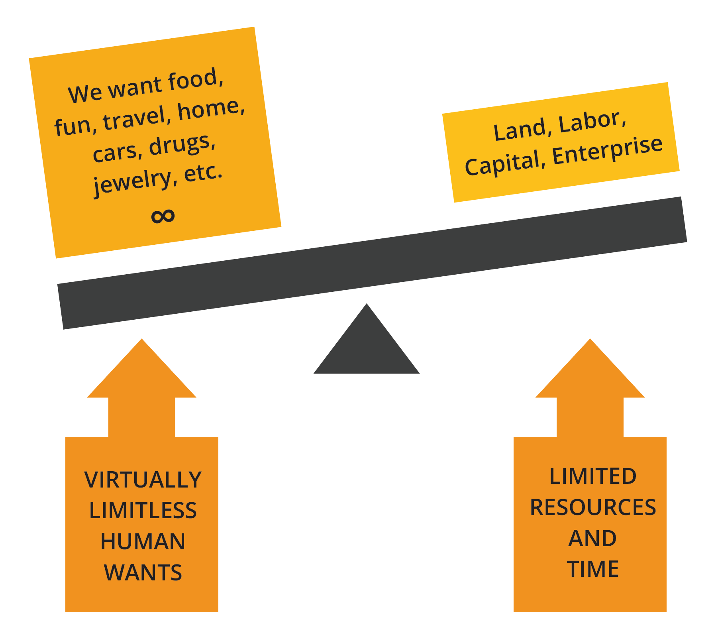

There are two types of scarcity: human-made and natural.

- ⭐ Human-made scarcity, also known as centralized scarcity, includes things like limited edition designer bags, rare sports cards, and numbered art pieces. These can be easily replicated or counterfeited.

- ⭐ Natural scarcity, also known as decentralized scarcity, includes things like salt, shells, and precious metals like gold. These are harder to replicate or counterfeit. The main difference between the two is control.

Centralized scarcity is controlled by a single entity, like a company or government, while decentralized scarcity is not controlled by anyone. An example of centralized scarcity that disproportionately affects the poor is the control of essential resources like clean water. In some regions, access to clean water is managed by private companies or government entities that may limit its distribution, leading to a scarcity of this vital resource. This centralized control can result in price increases or unequal access to clean water, with impoverished communities often bearing the brunt of the impact. Limited access to clean water not only affects their health and well-being but also perpetuates poverty as they may be forced to pay higher prices for water or travel long distances to obtain it.

Scarcity affects our choices. Understanding it can improve our decision-making. We often have to choose between immediate gains and long-term benefits, and these trade-offs shape our path to achieving our goals.

- 💡 **$\color[RGB]{250,175,64} Time \ preference$** refers to the idea that people generally prefer to have something NOW rather than later.

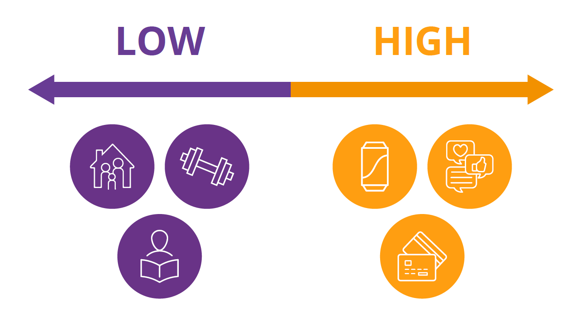

An example of time preference:

Let’s say you have the option to receive $100 today or $110 in a year. If you have a high time preference, you might choose to receive the $100 today because you value having the $100 now more than the benefits of waiting a year for the extra $10. On the other hand, if you have a low time preference, you’ll prefer to wait for the larger reward because you are more focused on long-term planning and less concerned with immediate gratification.

 

[Back to the beginning of Chapter #2](https://github.com/MyFirstBitcoin/Bitcoin-Diploma-2024/blob/main/Web%20View/14.Chapter-2.md#chapter-2)

 
 

### _Activity: Time Preference_

Class Activity. High TIme Preference vs Low TIme Preference

1. ⭐ Listen to the teacher’s explanation of the candy choice.
2. ⭐ Decide whether you would like to receive a small candy or marshmallow now or wait until the end of the class to receive two candies or a larger, more desirable candy.
3. ⭐ Commit to your decision and let the teacher know your choice. Receive your candy either immediately or at the end of the class, based on your decision.
4. ⭐ Participate in the class discussion about the activity, reflecting on your decision-making process and the concept of time preference.

 

**$\color[RGB]{104,59,147} Conclusion \ and \ Discussion$**:
- ⭐ What factors influenced your decision to take the candy now or wait for a larger reward later?
- ⭐ How do you feel about your decision now that the activity is over?
- ⭐ Can you think of real-life examples where high time preference might be harmful and where low time preference might be beneficial?
- ⭐ What are some potential consequences of choosing high time preference over low time preference?

 

In the context of the desert example, this means that you might be more inclined to drink all of the water right away, even if it means that you won’t have any left for later. This is because the thirst you feel right now is more pressing than the potential thirst you might feel in the future.

On the other hand, if you choose to ration the water and drink it slowly over time, you are demonstrating a lower time preference. This means that you are willing to wait to satisfy your thirst and improve your chances of survival. The concept of opportunity cost is closely related to the idea of scarcity and time preference.

- 💡 **$\color[RGB]{250,175,64} Opportunity \ cost$** refers to the value of the next best alternative that you give up when you make a decision. **$\color[RGB]{250,175,64} Every \ decision \ involves \ trade-offs.$**

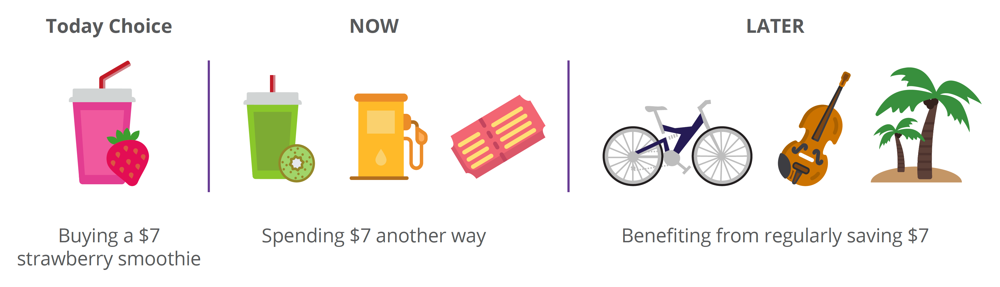

In the desert example, the opportunity cost of drinking all of the water right away is the survival benefits you would have gained from rationing the water and using it over a longer period of time.

Let’s say you decide to ration the water and take small sips over a longer period of time. As a result, you have the energy and hydration you need to search for more water. However, while you are searching, you come across a cactus that has a small amount of water inside. It’s not a lot, but it’s enough to quench your thirst for the moment. If you had decided to drink all of your water at once, you might not have had the energy to search for more water and come across the cactus.

In this case, the opportunity cost of drinking all of your water at once would have been the chance to find the cactus and get more hydration.

This example illustrates how opportunity cost involves not just the immediate trade-off between two options but also the potential future opportunities that may be gained or lost as a result of our choices.

Our willingness to give up a larger reward in the future in exchange for a smaller reward now is influenced by our time preference, or how much we value immediate gratification versus long-term planning.

In this chapter, we explored the fundamental concept of money, covering its definition, functions, properties, and various types. An essential aspect of our discussion involved understanding the psychology of money, focusing on concepts like scarcity, time preference, and tradeoffs. This exploration laid the groundwork for comprehending the complicated nature of money and its role in our lives. In the next chapter, we’ll talk about the history of money and how it has evolved over time.

 

[Back to the beginning of Chapter #2](https://github.com/MyFirstBitcoin/Bitcoin-Diploma-2024/blob/main/Web%20View/14.Chapter-2.md#chapter-2)

