## _Chapter #3_

# ***The History of Money***

- [**3.0** Introduction](https://github.com/MyFirstBitcoin/Bitcoin-Diploma-2024/blob/main/Web%20View/15.Chapter-3.md#30-introduction)      
  - [**Activity:** Barter Game](https://github.com/MyFirstBitcoin/Bitcoin-Diploma-2024/blob/main/Web%20View/15.Chapter-3.md#activity-class-exercise---barter-game)     
- [**3.1** Evolution from Barter to Modern Currency](https://github.com/MyFirstBitcoin/Bitcoin-Diploma-2024/blob/main/Web%20View/15.Chapter-3.md#31-evolution-from-bartering-to-modern-currency)     
  - [**3.1.1** Problems with Early Forms of Money](https://github.com/MyFirstBitcoin/Bitcoin-Diploma-2024/blob/main/Web%20View/15.Chapter-3.md#311-problems-with-early-forms-of-money)     
  - [**3.1.2** Development of Coinage and Paper Money](https://github.com/MyFirstBitcoin/Bitcoin-Diploma-2024/blob/main/Web%20View/15.Chapter-3.md#312-development-of-coinage-and-paper-money)     
  - [**3.1.3** Transition from Sound to Unsound Money](https://github.com/MyFirstBitcoin/Bitcoin-Diploma-2024/blob/main/Web%20View/15.Chapter-3.md#313-transition-from-sound-to-unsound-money)     
  - [**3.1.4** Paper to Plastic](https://github.com/MyFirstBitcoin/Bitcoin-Diploma-2024/blob/main/Web%20View/15.Chapter-3.md#314-paper-to-plastic)     
- [**3.2** Digital Currency](https://github.com/MyFirstBitcoin/Bitcoin-Diploma-2024/blob/main/Web%20View/15.Chapter-3.md#32-digital-currency)     

____________________________________________________________________________________________________

### ***3.0 Introduction***

> "Money was not evolved by design, but arose out of the market process. It was not created by governments. It emerged over time as a spontaneous order."    
 **$\color[RGB]{250,175,64} Murray \ Rothbard$**

 

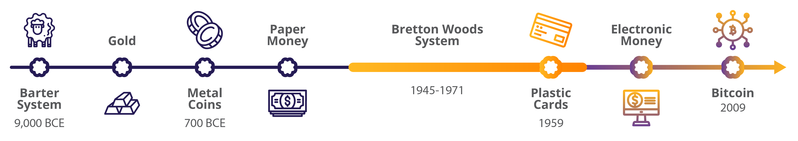

Imagine a time long ago when people didn't have the coins or paper bills we use today. Back then, they had a unique way of trading things – using items like shells or precious metals like gold as a kind of special currency. This might sound strange, but it was their version of money, something everyone agreed had value. In this chapter, we will embark on a journey through time, experiencing the evolution of money firsthand. We’ll trace its origins and observe how it has changed and adapted through history.

 
 

### _Activity: Class Exercise - Barter Game_

Your teacher has given you a small piece of paper. Your goal is to trade what you “have” with what you “want” in a game of commerce throughout history. Please write your name at the top of the paper in small, legible letters.

 

- ⭐ **$\color[RGB]{104,59,147} Round \ 1: \ Barter$**

It is the year 6000 BCE. Needless to say, money as we know it has not been invented. You are in Mesopotamia and directly exchange goods and services with one another through **bartering**.

- 💡 As a side note, many businesses that still accept non-monetary payments for their services and governments treat these bartered transactions the same as currency transactions for tax-reporting purposes.

  - ☆ Cut your sheet of paper at the dashed line. Your goal is to trade away your “have” as many times as you need to finally get your original “want.” You cannot change your original “want.” You will have five minutes to accomplish the goal of this exercise.

  - ☆ When your new “have” matches your original “want,” return to your seat. After the time is up, if you have not found a trading partner, return to your seat anyway.

- ✋ Raise your hand if you were able to get what you wanted after one trade. Two? Three?

**Answer the following questions briefly but substantially.**

**1.** Why were some of you able to get someone to trade with and others were not?
_______________________________________________________________________________________________
_______________________________________________________________________________________________
**2.** What are the benefits of barter?
_______________________________________________________________________________________________
_______________________________________________________________________________________________
**3.** Based on your experience with this exercise, what are the drawbacks to using barter?
_______________________________________________________________________________________________
_______________________________________________________________________________________________

 

- ⭐ **$\color[RGB]{104,59,147} Round \ 2 \ - \ Commodity \ Money$**

Fast forward and travel to the western coast of Africa sometime around the 14th century BCE. Bartering has become tedious and inefficient. We have evolved as a civilization and are now using **commodity money**.

Your teacher has given you one macaroni (for simplicity purposes). Let’s assume that, by convention, the price of each good is worth one macaroni.    

Your goal again is to obtain what you “want,” but now, our species has smartened up a bit and found a way to solve certain problems.

- ⭐ Why do we consider macaroni commodity money?
- ⭐ How do we get the things we want now?
- ⭐ Was the macaroni round easier?
- ⭐ Why do you think money has replaced commodities?
- ⭐ In what ways is using commodity money more efficient than bartering?
- ⭐ What are the drawbacks to using macaroni as money?
- ⭐ What do you think happened when Spain started to bring back boatloads of macaroni into your community (gold and silver from the Americas back to Spain)?
____________________________________________________________________________________________________________
____________________________________________________________________________________________________________
____________________________________________________________________________________________________________
____________________________________________________________________________________________________________
____________________________________________________________________________________________________________
____________________________________________________________________________________________________________

 
 

### ***3.1 Evolution from Bartering to Modern Currency***    
### _3.1.1 Problems with Early Forms of Money_

<a rel="YouTube video of -- The History of Paper Money - Origins of Exchange - Extra History - Part 1" href="https://www.youtube.com/watch?v=-nZkP2b-4vo">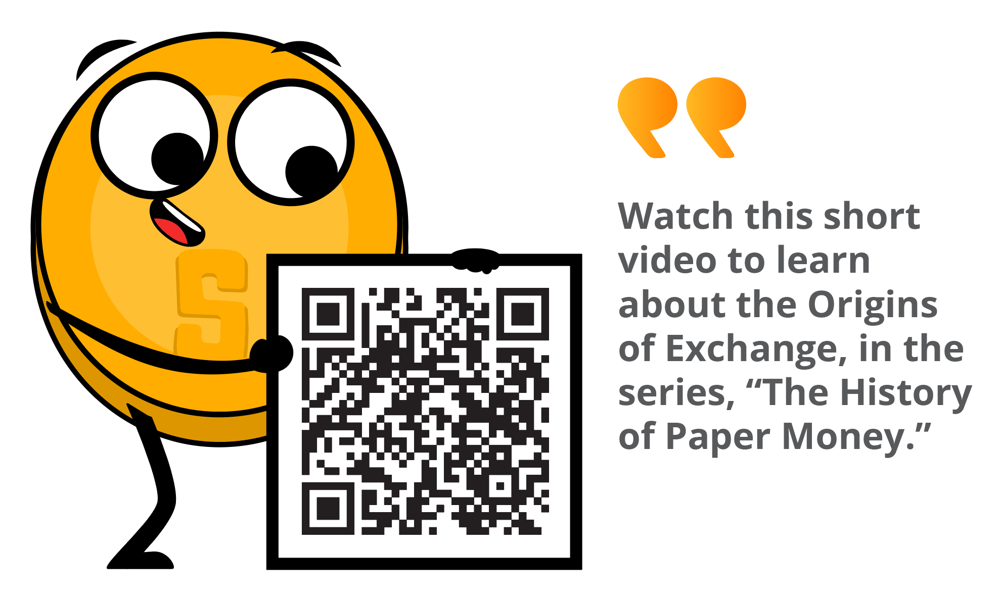

In barter economies, people trade with each other based on the relative value of the goods and services they have to offer. Barter economies are inefficient and can be difficult to manage, especially in complex societies.

A situation as the **double coincidence** of wants is necessary in any bartering system since people must always find someone who has what they want but who also wants what they have to offer in exchange.

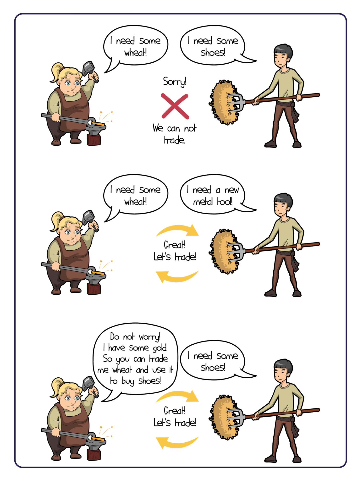

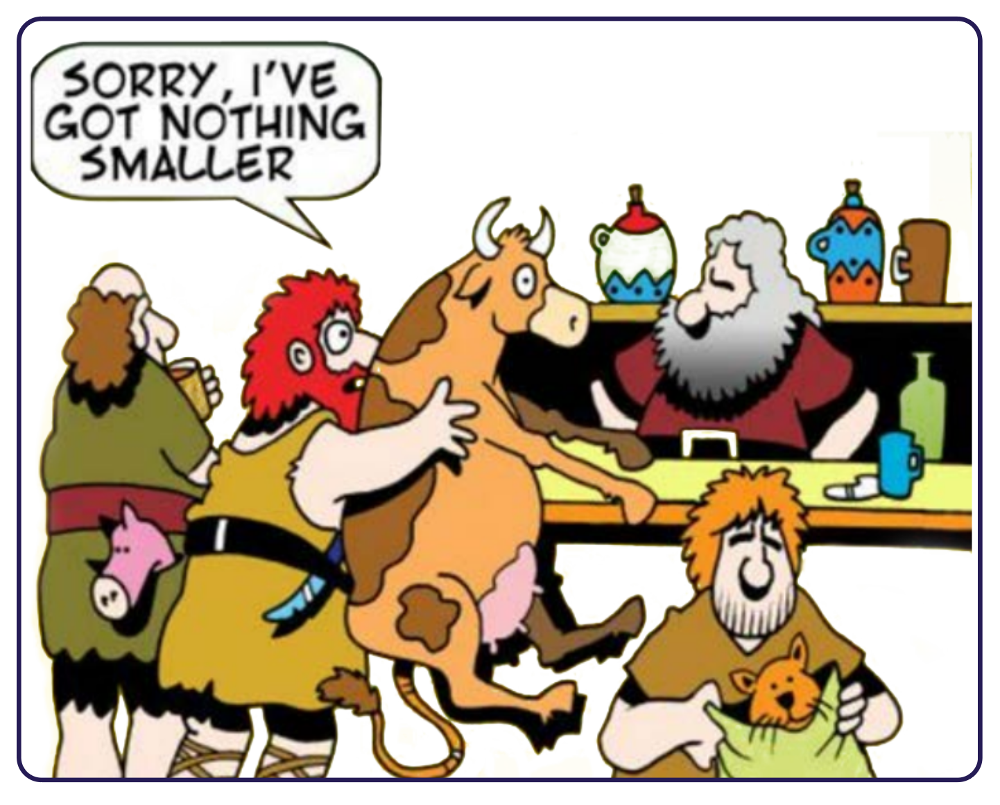

 

**Let’s suppose:**

- ⭐ Joseph wants to trade his banana for Yael’s coconut.
- ⭐ But Yael only wants to trade her coconut for Tammy’s mango.
- ⭐ And Tammy only wants to trade her mango for Joseph’s banana.
- ⭐ They are stuck in a never-ending cycle of fruit-trading without a double coincidence of wants.
- ⭐ Joseph suggests they just trade their fruits for a nice cold soda, but they realize they are on a remote island and there is no soda.
- ⭐ They decide to just sit on the beach and enjoy their fruits in silence.

<a rel="YouTube video of -- The History of Paper Money - Not Just Noodles - Extra History - Part 2" href="https://www.youtube.com/watch?v=rPHTmGjoe2k">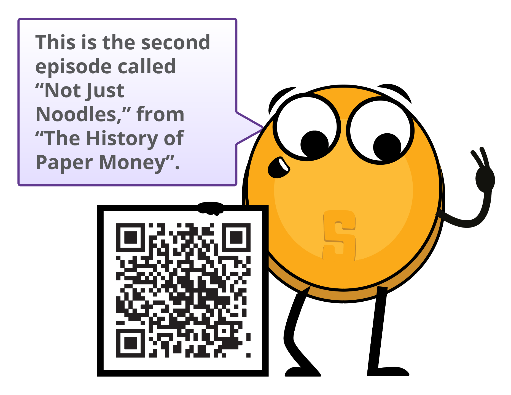

 
 

### _3.1.2 Development of Coinage and Paper Money_    

As you and your community become more involved in trade and commerce, you realize the limitations of using bartering and other forms of non-monetary exchange. You decide to adopt the use of metal coins as a form of money.

- 💡 **$\color[RGB]{250,175,64} Commodity \ money$** is money made from valuable metal materials like gold and silver. These have historically been used as a store of value, a medium of exchange and, in the distant past, as a unit of account.

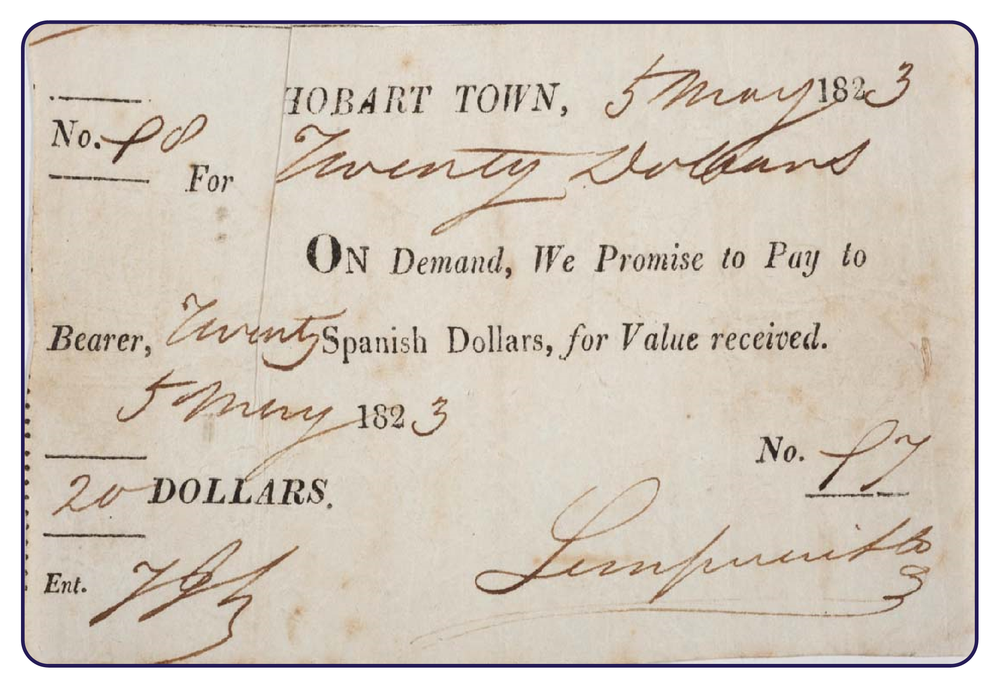

However, as you begin to use metal coins more frequently, you encounter some drawbacks. They can be heavy and inconvenient to carry in large transactions, and you notice that some people are taking advantage of the system by melting down the coins and creating new ones by mixing them with cheaper metals, which causes prices to rise and undermines trust in the system.    

In an effort to address these issues, you and your community start to use paper receipts as a form of money. These paper receipts, which have their origins in Ancient China, are a convenient and easily exchangeable form of currency. They are backed by gold and other valuable metals and can be converted into these metals, as they were from the seventeenth to the nineteenth century. This allows you to have a more portable, easily transferable form of money while still maintaining the value and security of precious metals.

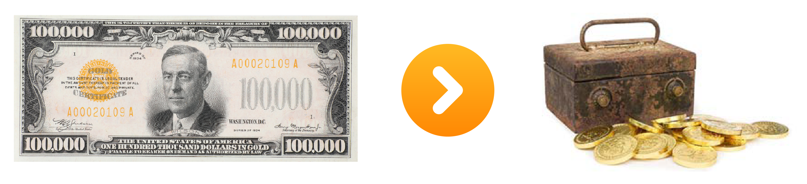

 
 

### _3.1.3 Transition from Sound to Unsound Money_    

Fast forward to the 17th century in Sweden. Now, you are completely dependent on banks to store your valuable assets. However, you start to notice something fishy going on with these bankers; it seems they are issuing more paper receipts than they have gold in storage, allowing them to create more money than they have assets to back it up. This sneaky practice allows the bankers to profit from the difference between the value of the paper receipts and the value of the gold they are holding for their customers.

<a rel="YouTube video of -- The History of Paper Money - Lay Down the Law - Extra History - Part 4" href="https://www.youtube.com/watch?v=lzH1p3t2oRE">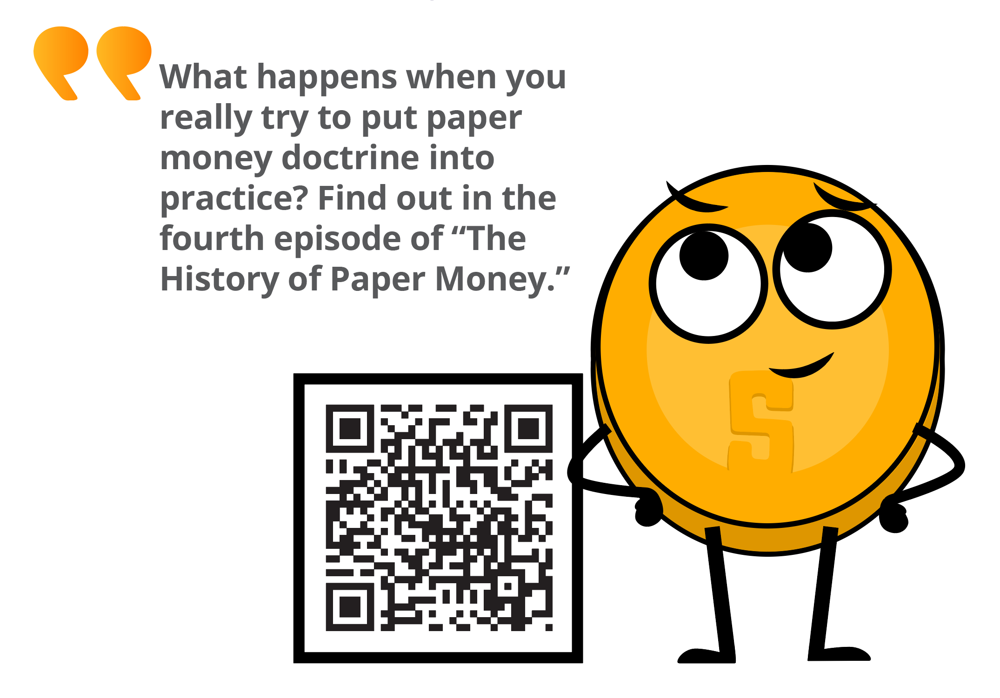

You realize that this marks a major shift in the way money works. You are moving from a system of sound money (i.e. money backed by precious metals) to a system of unsound money (i.e. fiat currency not backed by a physical commodity). This transition didn’t happen overnight but rather was a gradual process influenced by several factors. The Industrial Revolution, with its mass production and urbanization, played a role, as did the growth of advanced financial systems like banks and stock markets. The emergence of central banks and other monetary authorities contributed to the centralization or the control of money, leading to the issuance of fiat currencies to support economic growth.

- 💡 However, you also begin to see the **$\color[RGB]{250,175,64} downsides \ of \ this \ centralization$**, including irresponsible consumption, **$\color[RGB]{250,175,64} increased \ debt$**, and manipulation of citizens through economic incentives.

Until World War I, you were able to convert your paper money into a preset amount of gold. However, the two world wars and the 1929 economic crisis put an end to that. In 1944, the Bretton Woods agreement was signed, establishing the U.S. dollar as the world’s reserve currency and fixing the value of the U.S. dollar to the price of gold at a rate of $35 per ounce. Other countries’ currencies are pegged to the dollar, which helps stabilize international financial markets.

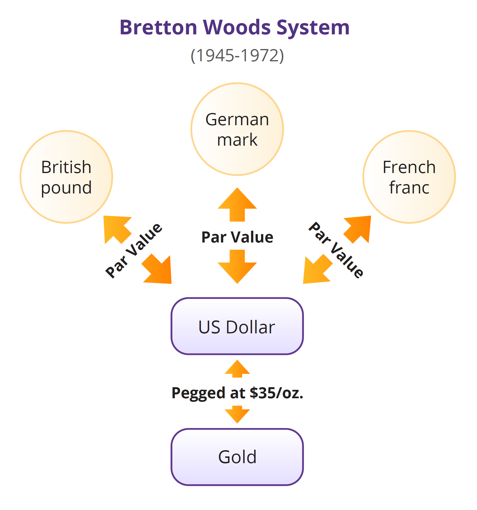

Unfortunately, the system began to break down in the late 1960s, leading to the Nixon Shock in 1971, when the U.S. government suspended the convertibility of the dollar into gold. This marks the end of the gold standard and the beginning of a world driven by the creation and accumulation of debt.

As you go about your daily life, you begin to notice that the value of money is no longer as stable as it used to be. Just like a flexible ruler makes it difficult to accurately measure the length of a table, living in a fiat world where the value of money is subject to the unpredictability of those in power can also make it difficult to accurately measure the value of goods and services. You feel confusion and unease adjusting to a world where the value of money is no longer tied to a physical commodity like gold.

You see the impacts of this shift on the global economy and start to question the stability and reliability of fiat currencies. You realize that, in this modern world, the dollar is no longer fixed and consistent as it was when it was pegged to gold but instead becomes subject to fluctuation. This makes it more difficult to use the dollar as a unit of account, as its value is affected by various factors including inflation (rising prices), interest rates, the strength of the country’s economy, political events, market speculation, and demand in international trade. It can be a confusing and unpredictable time as you try to navigate the constantly shifting value of the dollar and its impact on your daily life.

 

Despite efforts to improve quality of life through modern monetary systems, increased efficiency, greater access to information, and enhanced communication, the majority of people’s standards of living begin to decline due to:

- ⭐ Abuse of centralization
- ⭐ Rising prices
- ⭐ Stagnated real wages.
- ⭐ Weakening currencies.
- ⭐ The need to spend more money for fewer things

This has challenges for those with lower economic resources who may have limited access to education, credit, resources, social networks, and political representation, leading to potential disadvantages in their ability to succeed.

As a result, the rich seem to keep getting richer and the poor seem to keep getting poorer.

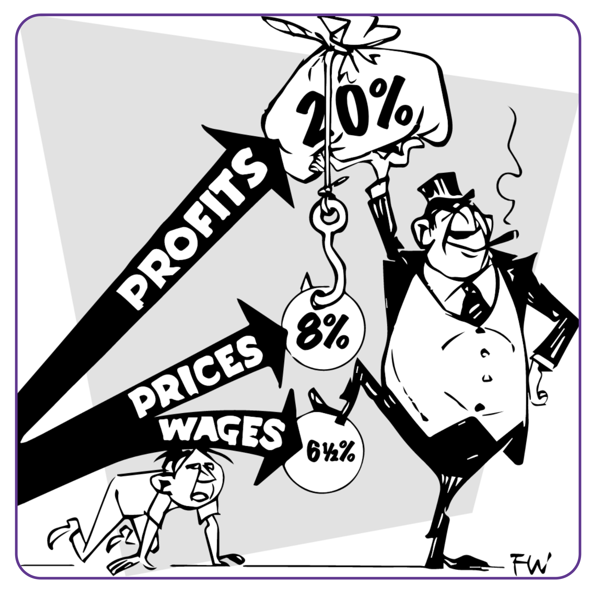

 
 

### _3.1.4 Paper to Plastic_    

Today, we’ve come a long way from the introduction of the first credit card back in the 1950s. With a simple swipe of plastic, we can buy whatever we want, whenever we want, without any hassle. It’s like opening up a world of endless possibilities, and the excitement of discovering what it holds is palpable...or so we thought. Little did we know that our reliance on credit would have painful aftereffects – like raising the overall cost of goods and incentivizing a certain economy doomed to fail.

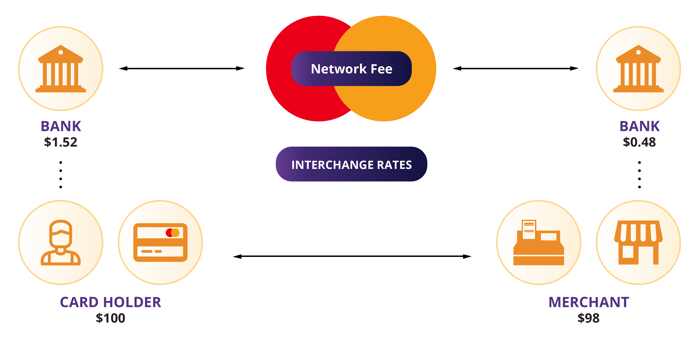

As technology advances, so does the way we handle money. The internet becomes a major player in the financial world, with online banking and e-commerce websites making it possible to manage and spend money entirely online.    

The rise of digital money marks the next significant leap in this evolution, offering new possibilities and reshaping the way we make financial transactions.

 
 

### ***3.2 Digital Currency***    

Unlike traditional ones, digital currencies exist solely in electronic form. They are stored and exchanged using computers and special software.    

Digital currency allows individuals to send their money through the internet. Much like how email allows us to send messages instantly and without shipping costs, digital currencies allow us to send and receive value instantaneously and with very little cost.    

The currencies we use today are becoming more and more digital. Only a small fraction of the money supply exists in the form of coins and paper bills. Banks and banking services provide their users with applications to seamlessly exchange money over the internet. But where is the money coming from?    

In this chapter, we've witnessed the transformation from sound money, represented by gold, to unsound money in the form of paper, and now, digital fiat currency. In the next chapter, we'll explore how the current fiat monetary system works and how it came to be.    
