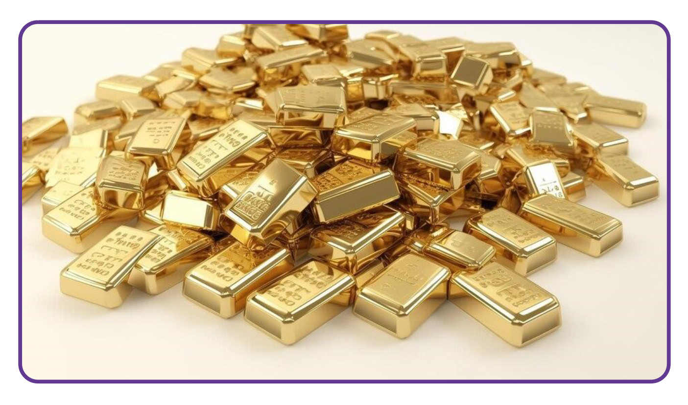
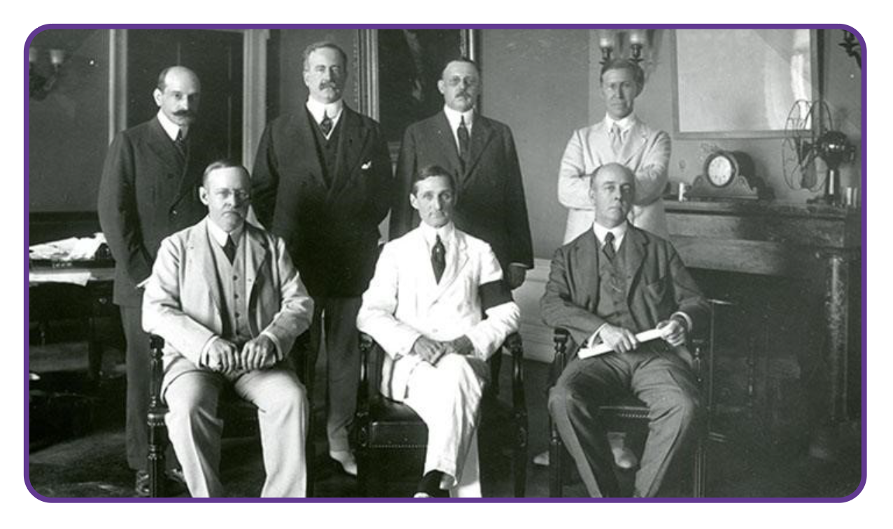
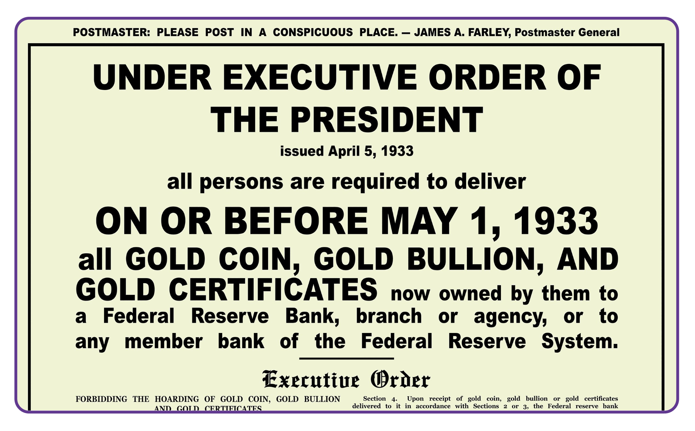
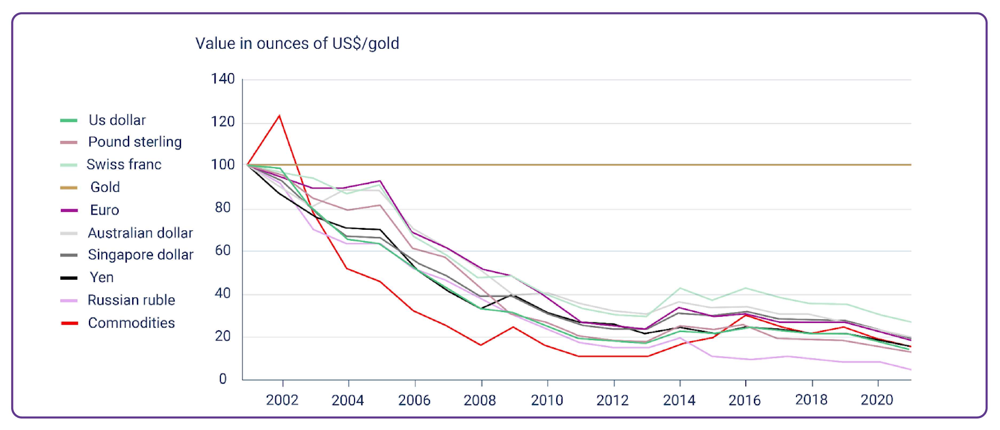
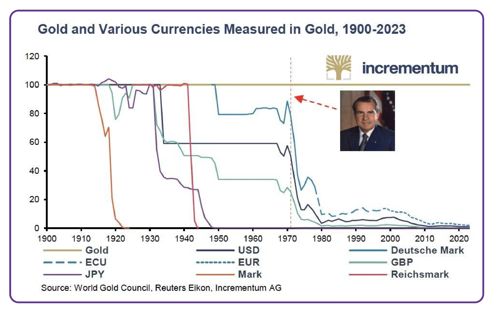
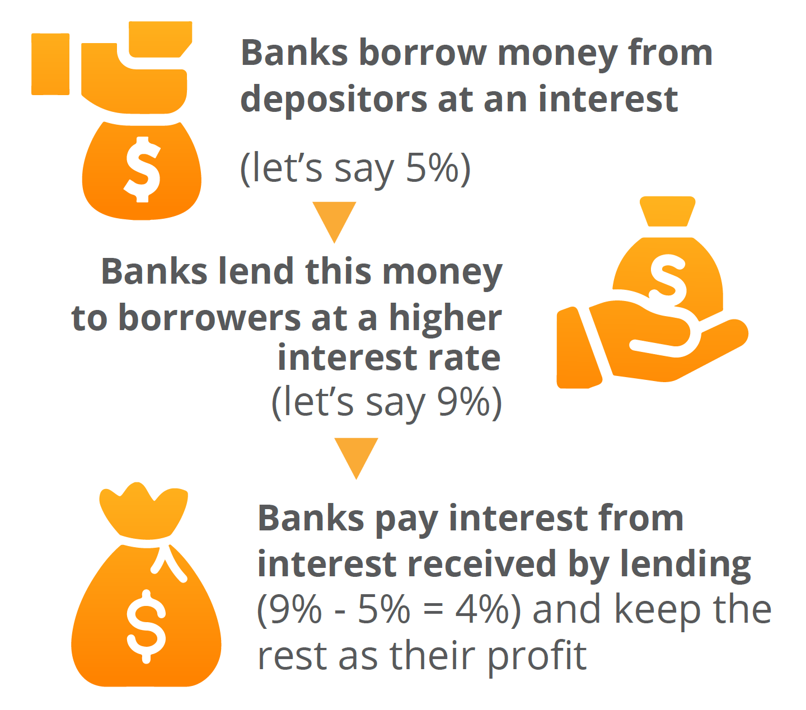
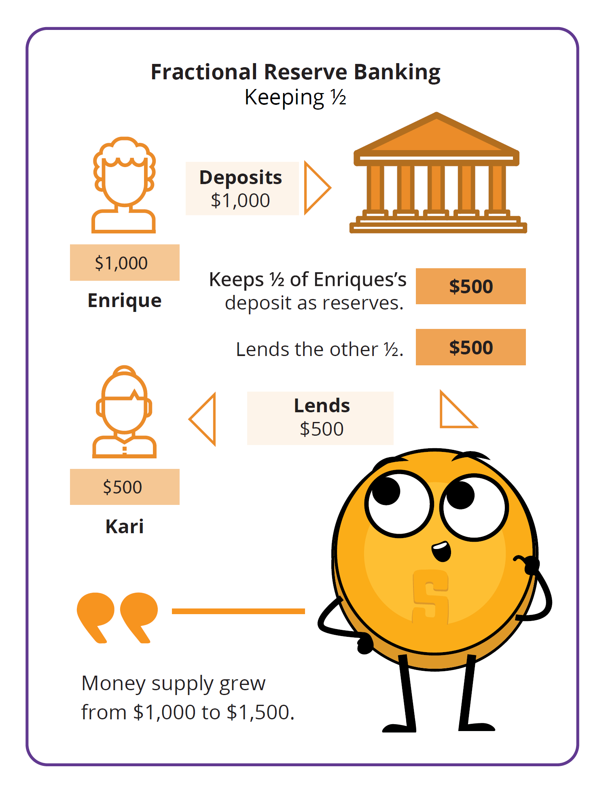
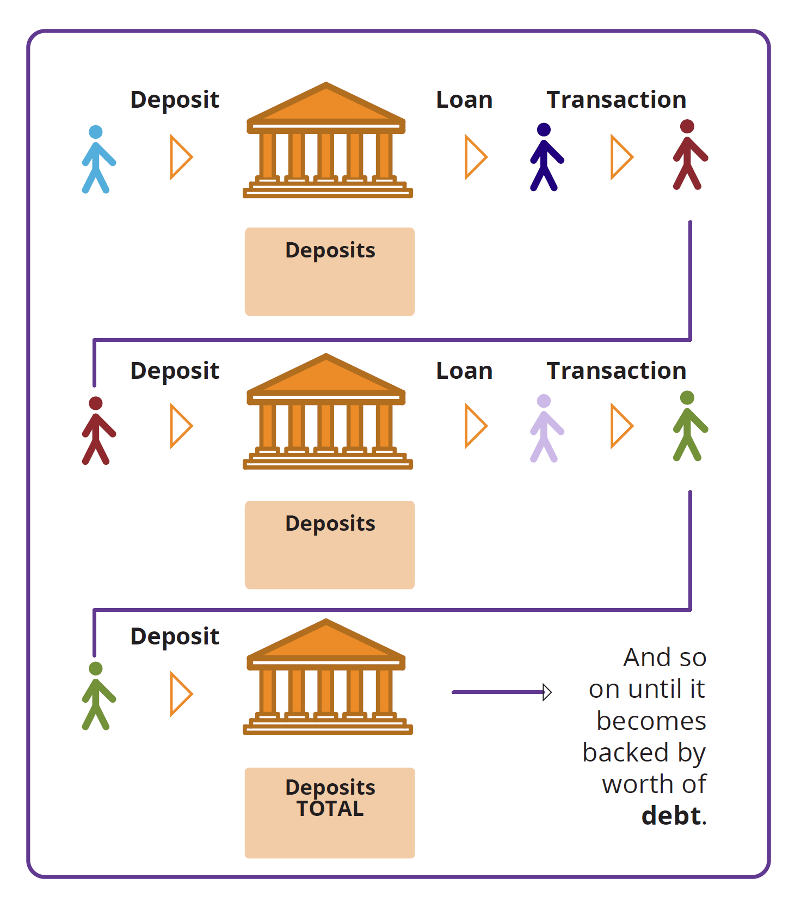
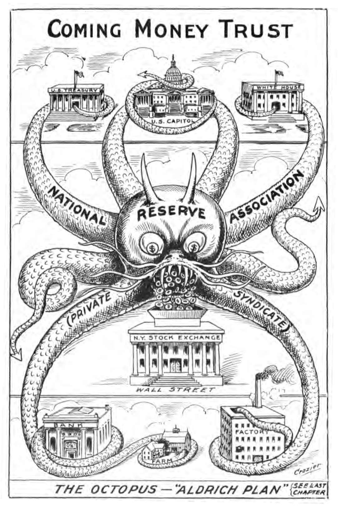
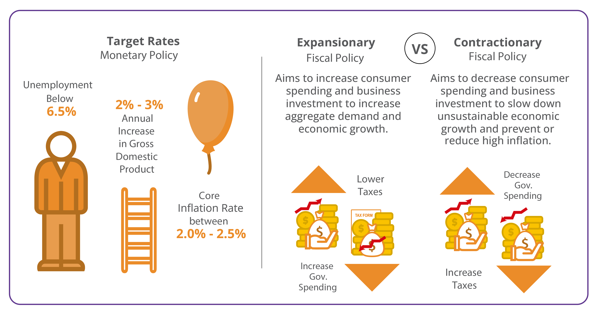

## _Chapter #4_

# ***What is Fiat Money and Who Controls it?***

- [**4.0** Introduction](https://github.com/MyFirstBitcoin/Bitcoin-Diploma-2024/blob/main/Web%20View/16.Chapter-4.md#40-introduction)    
- [**4.1** Brief History of Fiat Money](https://github.com/MyFirstBitcoin/Bitcoin-Diploma-2024/blob/main/Web%20View/16.Chapter-4.md#41-brief-history-of-fiat-money)    
- [**4.2** The Fiat System](https://github.com/MyFirstBitcoin/Bitcoin-Diploma-2024/blob/main/Web%20View/16.Chapter-4.md#42-the-fiat-system)    
  - [**4.2.1** A Monetary System by Decree](https://github.com/MyFirstBitcoin/Bitcoin-Diploma-2024/blob/main/Web%20View/16.Chapter-4.md#421-a-monetary-system-by-decree)    
  - [**4.2.2** - Fractional Reserve Banking: A System Fueled by Debt](https://github.com/MyFirstBitcoin/Bitcoin-Diploma-2024/blob/main/Web%20View/16.Chapter-4.md#422-fractional-reserve-banking-a-system-fueled-by-debt)    
  - [**Activity:** Fractional Reserve Banking](https://github.com/MyFirstBitcoin/Bitcoin-Diploma-2024/blob/main/Web%20View/16.Chapter-4.md#activity-fractional-reserve-banking)    
  - [**4.2.3** Who Controls the Fiat System and How Do They Benefit?](https://github.com/MyFirstBitcoin/Bitcoin-Diploma-2024/blob/main/Web%20View/16.Chapter-4.md#423-who-controls-the-fiat-system-and-how-do-they-benefit)
- [**4.3** Central Bank Digital Currencies: The Future of Fiat Money](https://github.com/MyFirstBitcoin/Bitcoin-Diploma-2024/blob/main/Web%20View/16.Chapter-4.md#43-central-bank-digital-currencies-the-future-of-fiat-money)    

______________________________________________________________________________________________________

### ***4.0 Introduction***    

> "The history of mankind is the history of money losing value."    
 **$\color[RGB]{250,175,64} Milton \ Friedman$**

 

We saw in the previous chapter how money evolved over time and how our monetary system transitioned from sound to unsound money, shaping the world we live in today. This chapter dives deeper into how these developments led to the fiat system of today and how that fiat system works.

So, what does this fiat system look like, and how did it come into existence?

To answer this question, we need to begin by centering our attention on the U.S. dollar, the world's current reserve currency, which plays a dominant role in today’s world. Every country, directly or indirectly, feels the impact of the decisions made regarding the U.S. dollar. To truly understand how the fiat system operates in your country, it is essential to unravel the historical threads that connect it to the fiat system's birthplace – the United States of America.

 
 

### ***4.1 Brief History of Fiat Money***    

| **$\color[RGB]{104,59,147} 1815-1933$** | **$\color[RGB]{104,59,147} 1913$** | **$\color[RGB]{104,59,147} 1933$** | **$\color[RGB]{104,59,147} 1934$** | **$\color[RGB]{104,59,147} 1944$** | **$\color[RGB]{104,59,147} 1971$** | **$\color[RGB]{104,59,147} 1980$** |
| :-----------: | :-----------: | :-----------: | :-----------: | :-----------: | :-----------: | :-----------: |
| The Gold Standard | Creation of the Central Bank called “the Federal Reserve” | Executive Order 6102. Every citizen was obliged to turn in their gold at an exchange rate of $20.67 per ounce | Gold Reserve Act. Stealing wealth from the people by devaluing the dollar by 40% to $35 per ounce of gold | Bretton Woods Agreement: USD became the dominant world reserve currency | Nixon Shock, which gave birth to the fiat system by ending the redeemability of U.S. dollars for gold | Value of gold increased from $35 per ounce in 1970 to $870 per ounce in 1980, which caused a loss of value of people’s money by 96% in just 10 years |

**$\color[RGB]{104,59,147} <--------- \ Timeline \ Visual \ --------->$**

 

In the 19th century, civilizations worldwide thrived on a sound money standard, using precious metals like gold and silver due to their scarcity, durability, and recognizability. As global trade grew, carrying large amounts of metal became challenging, leading to the emergence of gold and silver warehouses. These warehouses securely stored people's valuable metals and provided paper certificates redeemable for specific amounts of gold or silver. In exchange for depositing their money, individuals received paper certificates directly tied to the exact gold or silver amount they stored. This direct link between paper certificates and tangible commodity money marked the early stages of what we now recognize as banks.
    

 

 

Initially, banks aimed to safeguard clients' money but later engaged in risky lending practices, issuing certificates for gold they didn't have. This practice posed the threat of bank runs if too many clients claimed their money simultaneously. To address the risk, banks collaborated with governments to establish a system legalizing re-lending. In 1913, they created the Federal Reserve, a central bank responsible for generating new paper certificates and bailing out troubled banks. Globally, governments recognized the value of gold and silver, leading to conflicts and wars for control. In the years leading to World War II, leaders like Lenin, Stalin, Churchill, Roosevelt, Mussolini, and Hitler seized gold for strategic purposes.

 

In the early 1930s, a significant change occurred in the way money was backed by assets in the United States. At that time, a lot of people’s wealth was stored in the form of gold. However, in 1933, President Roosevelt issued Executive Order 6102, which demanded that every citizen give up their gold. This wasn't a voluntary exchange – people were required to surrender their gold, and if they refused, they faced severe penalties.

The government set the exchange rate at $20.67 per ounce of gold. This meant that for every ounce of gold a person had, they received paper certificates equivalent to $20.67. People had to accept these paper dollars, hoping that one day, they would be able to exchange them back for gold.

 

In 1934, the Gold Reserve Act allowed people to exchange their paper dollars for gold again. However, there was a catch: the government deliberately devalued the paper dollars by increasing the exchange rate to $35 per ounce of gold. This devaluation hit hard-working individuals in the lower and middle classes as it meant that their savings, once worth more, were now worth less due to the decrease in the value of the paper dollars.

After World War II, the Bretton Woods agreement in 1944 established the U.S. dollar as the world's reserve currency, and it could be exchanged for gold. However, this link between the U.S. dollar and gold was severed in 1971 when President Nixon ended the redeemability of the U.S. dollar for gold. This marked a significant shift, leading to the adoption of a fiat money system where the value of the currency is not backed by a physical commodity like gold but rather by the trust and confidence of the people who use it. As governments and central banks retained most of the people's gold, the value of gold surged, reaching $870 per ounce in 1980.

 

In conclusion, the story of how human society transitioned from a sound money standard into an unsound (fiat) standard tells us how governments and banks captured precious metals from their citizens. While real money ended up in the pockets of governments and banks, the people were left with pieces of paper whose only value comes from governments mandating its use.

 
 

### ***4.2 The Fiat System***    

> "The root problem with conventional currency is all the trust that’s required to make it work. The central bank must be trusted not to debase the currency, but the history of fiat currencies is full of breaches of that trust."    
 **$\color[RGB]{250,175,64} Satoshi \ Nakamoto$**

 

Humanity transitioned from sound money controlled by the many, to unsound money controlled by the few. But how does this system work exactly?

 
 

### _4.2.1 A Monetary System by Decree_

The Fiat System is marked by its mandatory nature, imposed on people through legal tender laws. The term "fiat," originating from Latin, means “by decree,” representing a directive issued by authorities.

Unlike money backed by tangible assets such as gold, fiat money lacks such support. Instead, its use is mandated by law. Everyday currencies like dollars, euros, pounds, yuans, pesos, and others fall under the category of fiat money.

- 💡 **Legal tender law:** A law making it obligatory for all citizens to accept a specific kind of currency.

The value of fiat money is based on the belief that it can be exchanged for goods and services and the illusion that it will retain its value over time. Fiat money is comparable to a concert ticket; its value lies not in the paper-ticket itself but in the assurance that the band (the government and its central bank) will deliver a great show (provide economic stability).

 

**$\color[RGB]{104,59,147} Pros \ of \ Fiat \ Money$**
- ⭐ **Ease of use:** Fiat money is convenient for everyday transactions.
- ⭐ **Lower costs and risks:** Fiat money doesn’t require heavy security like gold, making it cheaper and safer.

 

**$\color[RGB]{104,59,147} Cons \ of \ Fiat \ Money$**
- ⭐ **Inflation risks:** Prices can continuously rise, causing inflation and historical instances of hyperinflation.
- ⭐ **Centralized control and manipulation:** Small groups can influence and manipulate the system, leading to censorship and confiscation.
- ⭐ **Counterparty risk:** If the government faces challenges, the currency can lose value.
- ⭐ **Potential for abuse:** The system can be misused, resulting in corruption and loss of trust.

 

| **Commodity vs. Fiat: Picture the Difference** |
| :---------- |
| **Remember:** Before fiat currency came about, governments would mint coins out of a valuable, scarce, and difficult-to-get physical commodity such as gold or silver, or they would print paper money that could be redeemed for a set amount of a physical commodity. This was the commodity-backed system.     Now, in the fiat system, it's more like having Monopoly money. Money in the fiat system consists of pieces of paper printed by the central bank, and the government's policies directly influence its value. The government and Central Banks are basically “the bankers of the Monopoly game” who are in control of how the game works, who gets what, and how much it is worth. In other words, the government promises to do a good job at managing the monetary system.     **In conclusion, fiat currencies only have value because the government mandates their use; there is no utility to fiat money in itself.** |

In summary, the fiat system is a trust game where the value of our money relies on the promises of those in charge and people can only hope that their government acts for the benefit of all. Next, we'll see how banks make new money, who's involved, and how it affects the economy.

 
 

### _4.2.2 Fractional Reserve Banking: A System Fueled by Debt_

> "It is well enough that people of the nation do not understand our banking and monetary system, for if they did, I believe there would be a revolution before tomorrow morning."    
 **$\color[RGB]{250,175,64} Henry \ Ford$**

 

Fractional Reserve Banking is one of the main parts of the fiat system, allowing banks to lend out a significant portion of their clients' deposits. Have you ever wondered why banks offer so many services to their customers? While it may seem like they are being generous, it’s important to remember that banks are businesses and their primary goal is to make a profit. But how do they make a profit if they let people borrow money?    

In addition to earning interest on deposits, banks generate revenue in other ways, including:

- ⭐ Charging interest on loans they give out
- ⭐ Charging fees for services like ATM usage and account maintenance
- ⭐ Earning money through investments, like buying and selling securities or investing in real estate
- ⭐ Keeping a percentage of loans in reserve and investing or lending out the rest
- ⭐ Paying interest on deposits and charging fees on checking and savings accounts

When a bank receives a deposit, it's required to keep only a fraction (reserve requirement) and can lend out the remaining portion.

For instance, if you deposit $100 with a 10% reserve requirement, the bank can lend $90, keeping only $10 as reserves. The borrower deposits $90 into another bank, allowing the cycle to continue. Despite the initial $100 deposit, the total money in the economy grows to $271, seemingly appearing out of nowhere – a phenomenon known as the multiplier effect.

This process leads to a debt-driven monetary system as banks create new currency with each loan, increasing the overall money supply. As fractional reserve banking continues, the total debt in the economy rises, contributing to inflation.    
The system relies on a continuous cycle of currency creation through lending, akin to a steady supply of drugs for an addict. However, if banks lend more money than they have in reserves and depositors rush to withdraw simultaneously, banks could face failure.

Here, the central bank intervenes as a lender of last resort, providing new currency to prevent bank failures. The central bank achieves this by repurchasing assets or injecting currency directly into banks' accounts. In essence, banks are saved from failure through the constant injection of new currency by central banks. This debt-fueled system systematically rescued by the central bank results in boom and bust cycles.

| **Imagine you have a friend who also happens to be a banker, let's call him Dax.** |
| :---------- |
| Dax loves bikes, and he wants to borrow your bike because he has a lot of places to go. You give him your bike, and in a twist, Dax starts to promise the same bike to lots of other friends at the same time. With your one real bike that you lend to him, Dax manages to create more imaginary bikes and starts to lend them out to friends. Each of his friends think they can enjoy a nice ride whenever they like. But, here's the twist – there's only one real bike! All the others are imaginary and just promises.     So, what happens? As more imaginary bikes circulate, everyone is very happy, at least initially, because in the beginning, no one uses the bike at the same moment – it looks like there is no problem; it feels like there's an abundance of bikes for everyone. So, all friends start making more plans, thinking about all the places they'll go with their bikes.     However, here's where the magic starts to lose its charm. One sunny day, everyone decides it's a perfect day for a bike ride. They all show up at Dax’s doorstep, excited to take their imaginary bikes for a spin. But, reality hits – there's only one real bike. Disappointment ensues, and suddenly, the value of the promised rides diminishes.     In the world of fractional reserve lending, it's a similar story. Banks lend out more money than they actually have, and for a while, everyone enjoys the benefits. More money circulates, and it seems like there's plenty to go around. But, if too many people try to withdraw their money at the same time, the true value becomes apparent: there's not enough to fulfill all the promises.     This scenario affects the common good and value of everyone involved. The promise of abundance turns into a scam. Just as the imaginary bikes lose their perceived value when everyone wants a real ride, the value of money in the economy can diminish when everyone rushes to claim their real share. When that happens, people figure out that the money they have at a bank isn’t really in there, which leads to panic, bank runs, and even the collapse of entire economies. The ones who are paying for these collapses have, until now, always been the same group: the lower and middle class of the world. |

 

| **Example of how fractional reserve banking works** |
| :----------: |
| Credit expansion via fractional reserve banking (commercial banks create fiat currency and lend it to customers)   ⬇️   **$\color[RGB]{104,59,147} Boom$**   ⬇️   Expansion of the money supply (the newly created currency enters the system and inflates the money supply)   ⬇️   Over Investment (customers use the loans to invest in markets, creating a surge in demand)   ⬇️   Price inflation (prices rise as a result of new demand)   ⬇️   Lack of new demand   ⬇️   **$\color[RGB]{104,59,147} Bust$**   ⬇️   Prices fall (investors panic and begin to sell their investments at lower prices as there is no real demand for them)   ⬇️   Individuals and businesses default on their loans (as the value of their collateral decreases)   ⬇️   Banks default (as they now own assets worth less than the value of the loans they issued)   ⬇️   Central Bank Intervention, rescuing banks   ⬇️   Banks rescued with new currency (the central bank repurchases the assets the banks are holding at a higher price than current market valuation in order to rescue them, or directly create new currency and give it to them)   ⬇️   Repeat (more credit expansion, preparing for the next boom phase) |

 
 

### _Activity: Fractional Reserve Banking_

In the following exercise, we’ll explore how fractional reserve banking can lead to currency debasement, inflation, and a decrease in purchasing power. We’ll use a simplified example involving six participants, one of whom will act as a bank, and a reserve ratio that’s still being used a lot today: 10%.

IMAGE

- ⭐ Person A just won $100,000 from the lottery and deposits it in the bank (B). With a 10% reserve ratio, B must keep $10,000 in its vault and can lend out the remaining $90,000.

- ⭐ Person C borrows the maximum amount ($90,000) from B and uses it to buy a house from D.

- ⭐ Person D deposits the $90,000 received from C into the bank (B). The total deposits in the bank are now $190,000.

- ⭐ Person E requests a loan from B, and the bank lends out 90% of the new deposit, which is $81,000.

- ⭐ Person E uses the $81,000 loan to buy an art piece from F, who then deposits the money in the bank (B). The total deposits recorded are now $271,000.

In this scenario, the initial $100,000 deposit has resulted in a total of $271,000 in deposits after circulating through the economy.

If the reserve ratio were lowered to 1%, the amount of money created would be significantly higher ($100,000 / 0.01 = $10,000,000). In this case, how much money would actually be created with those $100,000 if the money continues to circulate throughout the economy?

It’s important to note that as of 2020, the Federal Reserve (the Central Bank of the USA) reduced reserve requirement ratios to zero percent in order to stimulate the economy.

 
 

### _4.2.3 Who Controls the Fiat System and How Do They Benefit?_

There are four main players: the government, wealthy individuals, the financial sector, and the central bank. Together, they control the fiat system.

- ⭐ **The Government:** The government is like the director of the fiat show. Along with tax collection, it is funded through new debt (bonds) issued by the Treasury. When there is insufficient demand for these bonds, any remaining debt is purchased by the central bank. This means they can keep doing their activities and pursuing their interests without needing approval from the people. It's like getting a credit card without worrying about paying it back immediately. This might seem good for the government, but it comes at a cost for everyone else.

- ⭐ **Wealthy Individuals:** Wealthy individuals benefit a lot from the fiat system. With the ability to accumulate more debt, they can invest in assets like commodities, real estate, and stocks, creating new wealth almost effortlessly.

- ⭐ **Financial Sector (banks):** Banks and other financial institutions do not directly control the fiat system but greatly benefit from it. Free from accountability, they can pursue and accelerate the creation of new currency via fractional reserve lending, benefiting from higher revenue. Banks are virtually free from consequences as they are bailed out with new fiat currency to prevent the whole system from collapsing.

- ⭐ **The Central Bank:** The central bank is the one pulling the strings, supposedly controlling the growth of the money supply. But here's the trick — the central bank is also subject to the government's laws, serving the government's interests. It's like a puppeteer being controlled by another puppeteer. The central bank might seem like the one in charge, but it's indirectly serving the government's wishes to print money out of thin air when they need it.

**How They Benefit:** These groups benefit in various ways, creating a complex web of control. The government gets funds without immediate consequences, wealthy individuals and banks make money effortlessly, and the central bank keeps the show running. Meanwhile, the rest of the population might feel the effects, facing challenges as the system unfolds.

In the end, the fiat system's puppeteers create a show where a few benefit greatly but many are left wondering about the fairness of the financial stage they find themselves on.

 

| **The Role of Central Banks** |
| :---------- |
| Central banks quietly shape how an economy works. Their official job is to ensure stability, integrity, And “keep things stable,” but their methods reveal a more mysterious side.     Central banks work closely with governments and pull the strings of monetary policy, controlling the money supply with tools like interest rates. In times of crisis, they print money out of thin air and inject it into the economy through commercial banks, making it seem like everything is okay.     They don’t just watch over things; central banks regulate commercial banks, set the rules of the game, and step in to help when banks are in trouble (acting as lenders of last resort). This web of control, while appearing protective, makes the economy and banks even more dependent on them. |

 

Understanding where trillions of dollars in stimulus funds come from and who gets to decide their allocation is critical for comprehending the broader financial system. Governments use several tools to manage the money supply at specific moments in time.

Central banks and governments can use monetary and fiscal policy tools to influence the money supply and the economy. For example, the United States Federal Reserve (The Fed) uses monetary policy to adjust interest rates, affecting the amount of money in circulation. Fiscal policy, on the other hand, involves using spending and tax policies to influence economic activity.

Exchange rate policies, supply shocks, and price controls serve as additional tools to regulate the money supply and impact trade and the economy. While these policies aim to stabilize prices and control inflation, the intervention often leads to boom and bust cycles, creating challenges for everyone using the controlled currency.

Example: ”Too big to fail” refers to financial institutions so large and interconnected that their failure would have catastrophic repercussions on the entire financial system. During the 2008 financial crisis, several large banks were deemed “too big to fail,” leading the U.S. government to intervene and provide bailouts to prevent their collapse.

One of the most prominent examples of a “too big to fail” institution during the financial crisis was investment bank Lehman Brothers. When Lehman Brothers filed for bankruptcy in September 2008, it set off a domino effect of events, including the near-collapse of insurance giant AIG and a massive drop in the stock market. The U.S. government had to intervene and provide bailouts to other major financial institutions to avert further chaos and safeguard the broader economy.

Knowing how these policies function is vital for understanding the limitations of centralized fiat monetary systems. Until you understand the problem, you won’t recognize the solution. Now that we’ve covered how the fiat system has worked in the past and present, we’ll discuss what the future of fiat currently looks like: Central Bank Digital Currencies, or CBDCs.

 
 

### ***4.3 Central Bank Digital Currencies: The Future of Fiat Money***    

Central Bank Digital Currencies (CBDCs) are the next step of fiat currencies. Unlike the combination of physical bills, coins, and digital payments, CBDCs are fully digital forms of fiat currencies issued by governments and controlled by central banks.

Imagine the currency you use every day but without any physical presence — no coins to jingle in your pocket or bills to fold. What sets CBDCs apart is the heightened level of control and monitoring they offer to governments and central banks. With CBDCs, authorities gain unprecedented visibility into financial transactions, making it easier to track and regulate the flow of money. Governments and central banks can readily adjust the form and supply of CBDCs, manipulate interest rates, and deploy monetary and fiscal policy tools with greater precision. In essence, CBDCs provide a more efficient means for authorities to influence and manage their fiat currency.

While CBDCs seem the future of fiat money, the world's current monetary system already operates on a pure fiat standard. Fiat currencies are no longer tied to gold, resulting in a significant expansion of the monetary supply without any real restriction.

Now that you have a clearer understanding of how the fiat system operates, it's time to explore its consequences in Chapter 5.
