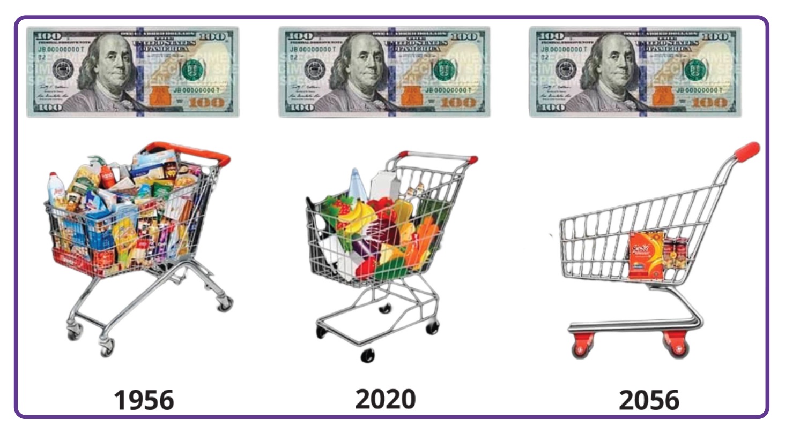
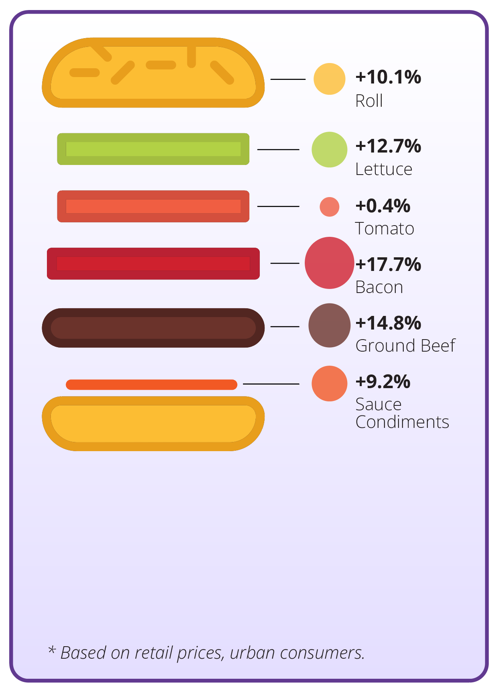
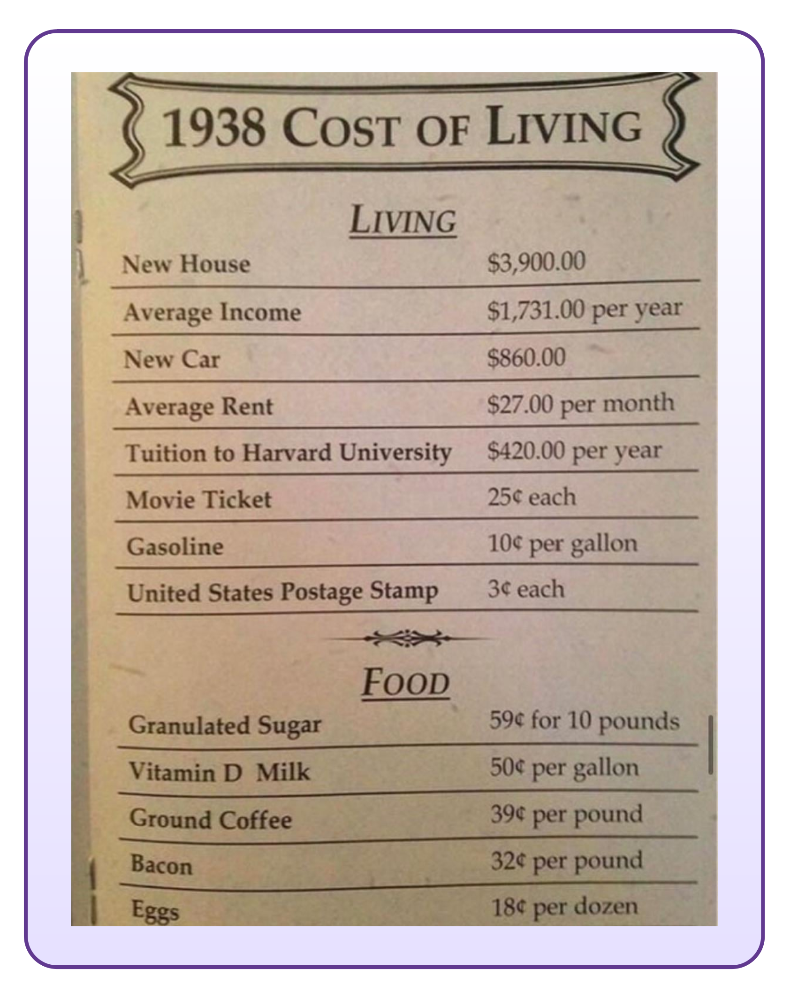
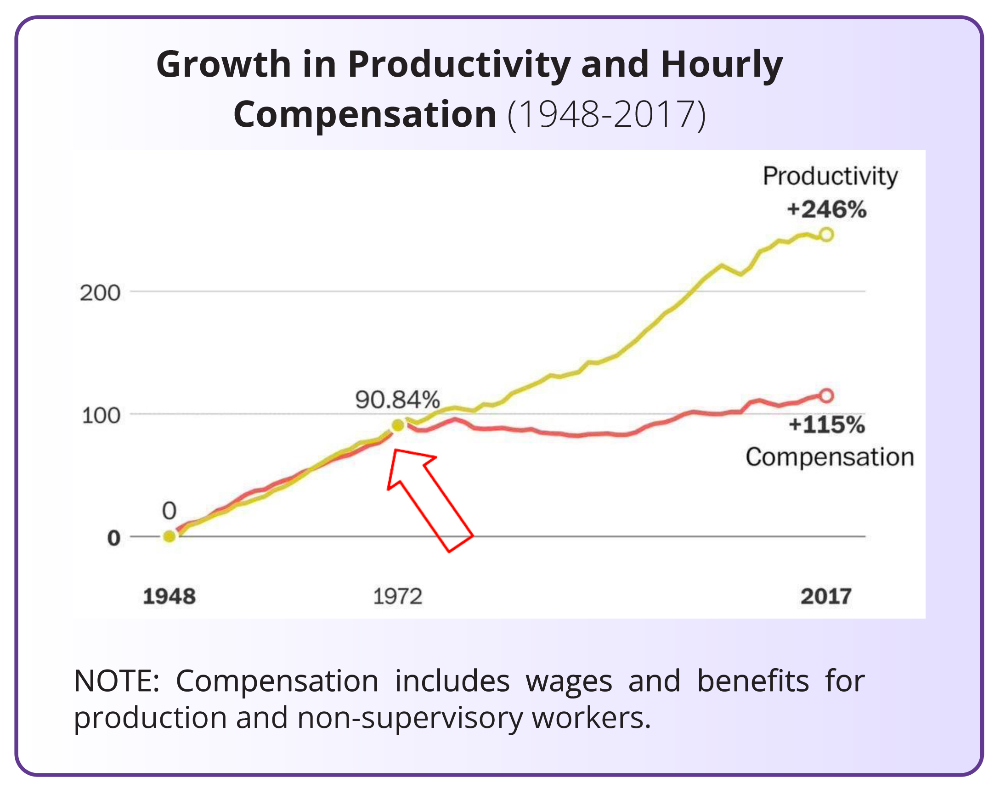
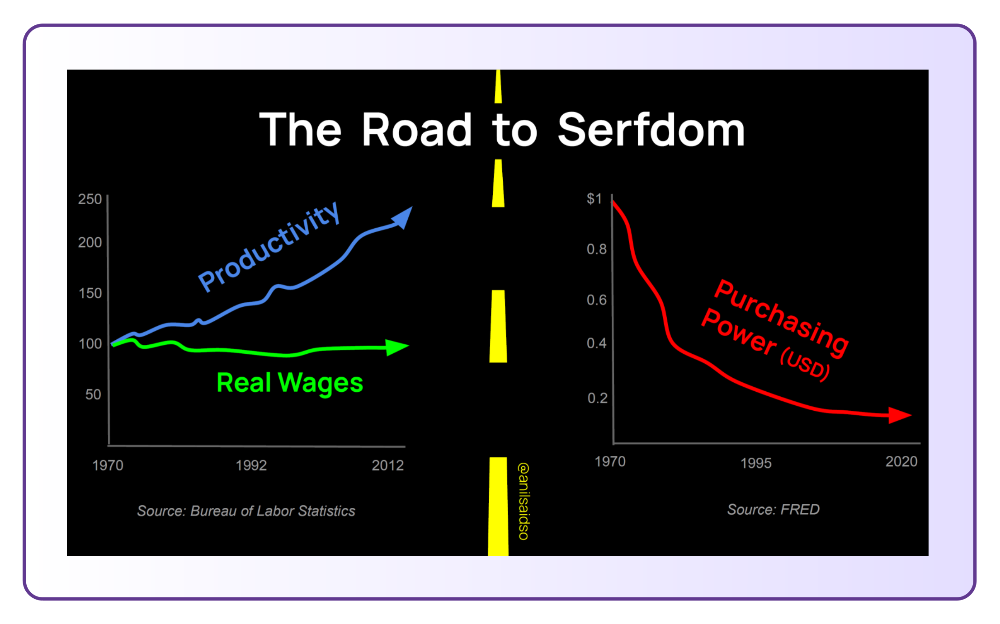
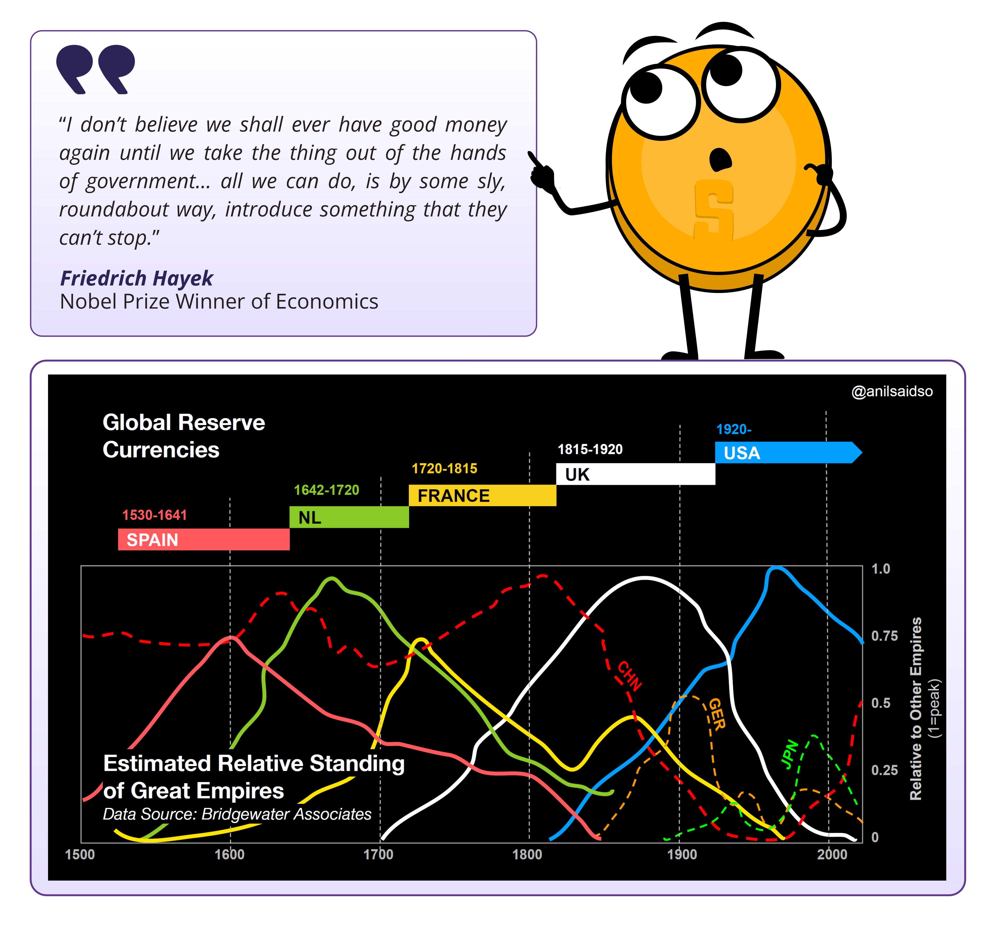
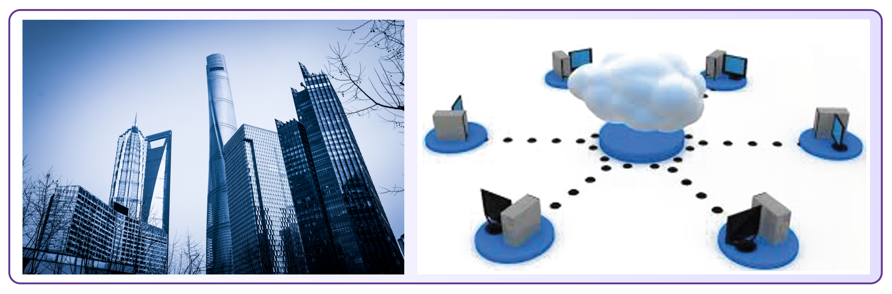

## _Chapter #5_

# ***How Problems Lead to Solutions***

- [**5.0** Introduction to the Problem](https://github.com/MyFirstBitcoin/Bitcoin-Diploma-2024/blob/main/Web%20View/17.Chapter-5.md#50-introduction-to-the-problem)    
- [**5.1** Decreasing Purchasing Power](https://github.com/MyFirstBitcoin/Bitcoin-Diploma-2024/blob/main/Web%20View/17.Chapter-5.md#51-decreasing-purchasing-power)    
  - [**5.1.1** Monetary Inflation and Its Effect on Purchasing Power](https://github.com/MyFirstBitcoin/Bitcoin-Diploma-2024/blob/main/Web%20View/17.Chapter-5.md#511-monetary-inflation-and-its-effect-on-purchasing-power)    
  - [**Activity:** The Effects of Inflation - An Auction Activity](https://github.com/MyFirstBitcoin/Bitcoin-Diploma-2024/blob/main/Web%20View/17.Chapter-5.md#activity-the-effects-of-inflation---an-auction-activity)    
- [**5.2** The Global Debt Burden and Social Inequality](https://github.com/MyFirstBitcoin/Bitcoin-Diploma-2024/blob/main/Web%20View/17.Chapter-5.md#52-the-global-debt-burden-and-social-inequality)    
  - [**5.2.1** Impact on the Individual - Loss of Purchasing Power](https://github.com/MyFirstBitcoin/Bitcoin-Diploma-2024/blob/main/Web%20View/17.Chapter-5.md#521-impact-on-individuals---loss-of-purchasing-power)    
  - [**5.2.2** Impact on Society - Increasing Wealth Inequality](https://github.com/MyFirstBitcoin/Bitcoin-Diploma-2024/blob/main/Web%20View/17.Chapter-5.md#522-impact-on-society---increasing-wealth-inequality)
  - [**Activity:** Consequences of the Fiat System](https://github.com/MyFirstBitcoin/Bitcoin-Diploma-2024/blob/main/Web%20View/17.Chapter-5.md#activity-consequences-of-the-fiat-system)    
  - [**5.2.3** The Global Debt Burden](https://github.com/MyFirstBitcoin/Bitcoin-Diploma-2024/blob/main/Web%20View/17.Chapter-5.md#523-the-global-debt-burden)
- [**5.3** The Cypherpunks and the Quest for a Decentralized Currency](https://github.com/MyFirstBitcoin/Bitcoin-Diploma-2024/blob/main/Web%20View/17.Chapter-5.md#53-the-cypherpunks-and-the-quest-for-a-decentralized-currency)
  - [**5.3.1** The Cypherpunks](https://github.com/MyFirstBitcoin/Bitcoin-Diploma-2024/blob/main/Web%20View/17.Chapter-5.md#531-the-cypherpunks)
  - [**5.3.2** Centralized vs Decentralized Systems](https://github.com/MyFirstBitcoin/Bitcoin-Diploma-2024/blob/main/Web%20View/17.Chapter-5.md#532-centralized-vs-decentralized-systems)
  - [**5.3.3** Brief History of Digital Currencies](https://github.com/MyFirstBitcoin/Bitcoin-Diploma-2024/blob/main/Web%20View/17.Chapter-5.md#533-brief-history-of-digital-currencies)

______________________________________________________________________________________________________

### ***5.0 Introduction to the Problem***    

> "Whoever controls the volume of money in our country is absolute master of all industry and commerce...when you realize that the entire system is very easily controlled, one way or another, by a few powerful men at the top, you will not have to be told how periods of inflation and depression originate."    
 **$\color[RGB]{250,175,64} James \ A. \ Garfield, \ U.S. \ President$**

 

In Chapter 4, you learned that the financial world relies on a system that might not be as strong as it seems. The fiat system, held up by constant additions of paper money, seems to benefit a few more than many. This chapter uncovers what the fiat system means for regular people and society. Finally, we explore the story of a group of individuals who noticed the problems and quietly worked to find a solution that could change the future of human society.

 
 

### ***5.1 Decreasing Purchasing Power***    
### _5.1.1 Monetary Inflation and Its Effect on Purchasing Power_

Monetary inflation is the increase in the money supply within an economy, directly impacting the average person by reducing their purchasing power. The cycle of price inflation starts when there's more money in circulation. This, in turn, boosts the demand for goods and services, ultimately causing prices to go up.

Let's imagine a small group of friends – Alex, Bob, and Charlie – each with a dollar in hand, and there's one bottle of water available for sale. The initial situation is simple: three people with a total of three dollars and one bottle of water. Now, suppose someone – let's say the local government – decides to give each friend an extra dollar. Now, they collectively have six dollars. With this newfound money, they all feel like buying that single bottle of water. As all three friends want the same bottle, they start bidding against each other.

The increased demand, fueled by the extra money, prompts them to offer more than the initial price for the water bottle. In the end, the bidding war causes the price of the water bottle to go up. This situation reflects a decline in their purchasing power. Even though they have more money, they can't buy as many bottles of water as they could before, showcasing the impact of inflation on the value of their money.

In this example, the friends experienced a decrease in their purchasing power because they were using a form of money that was influenced by external factors, such as the additional dollars introduced by the government. The lack of control over the money supply, combined with increased demand, led to a rise in prices, making it more challenging for the friends to buy the same amount of goods with their extra dollars.

This illustrates how the friends' purchasing power was impacted by factors beyond their control, emphasizing the importance of understanding and questioning the systems that influence the value of our money.

Now, let's explore how this plays out in real life.

 
 

### _Activity: The Effects of Inflation - An Auction Activity_

Objective: To understand the concept of inflation and how it affects the prices of goods and services in an economy.

 

**Definitions:**
- ⭐ The Money Supply: the total amount of money in circulation within an economy at a specific time. This includes:
  - Physical currency, such as coins and bills
  - Checking accounts
  - Savings accounts
  - Money Market accounts
  - Small time deposits (like CDs) under $100,000
- ⭐ Auction: A public sale in which goods or property are sold to the highest bidder.

 

**Class Exercise. Follow the instructions below:**
1. You will receive a random amount of Monopoly money from the teacher. This represents the money supply in a society.
2. Write down the total money supply in the chart provided.
3. The teacher will auction a candy bar to the students. To win the candy bar, you will need to make the highest bid using your Monopoly money. Record the winning bid next to the money supply.
4. The teacher will then add a significant amount of Monopoly money to the total money supply. This represents an increase in the money supply in an economy. Later, you will learn how money supply is added or reduced in an economy.

 

- 💡 **Societies can often be unpredictable and unjust, exemplified by the simulation of a teacher randomly giving a significant amount of money to only a select few students. This mimics real-life situations where unequal distribution of resources and opportunities can occur, highlighting the inherent randomness and unfairness in many situations.**

 

5. The teacher will auction a second candy bar to the students using the same process as before. Record the winning bid next to the money supply on the chart.
6. The teacher will repeat the auction a third time.

 

| **$\color[RGB]{82,49,131} Round$** | **$\color[RGB]{82,49,131} Money \ Supply$** | **$\color[RGB]{82,49,131} Winning \ Bid$** |
| :-----: | :------------: | :-----------: |
| 1 |   |   |
| 2 |   |   |
| 3 |   |   |

 

**Conclusion:**
1. How did the increase in money supply affect winning bids for the candy bars?
2. What is the relationship between increasing money supply and inflation?
3. How is money supply relevant in the real world?
4. When new money is injected into the economy, what do you think will happen to the prices of goods and services? Do you think the change in prices are temporary or permanent, and why? How do you think price changes affect citizens long-term?

 
 

### ***5.2 The Global Debt Burden and Social Inequality***    
### _5.2.1 Impact on Individuals - Loss of Purchasing Power_

Jaime is a college student who lives in a small apartment. He works part-time at a coffee shop to pay for his living expenses and tuition. As soon as he began living independently, Jaime became good at managing his own ledger.

- 💡 A **ledger** is a detailed record of all of your monetary transactions. Whether it’s money you’re earning or spending, a ledger helps you keep track of it all.

At the beginning of 2023, he budgeted $10,000 for his living expenses for the entire year, including rent, food, and other necessities. These were his transactions for January 2023:

| **$\color[RGB]{82,49,131} Date$**  | **$\color[RGB]{82,49,131} Description$** | **$\color[RGB]{82,49,131} Amount$** | **$\color[RGB]{82,49,131} Type$** | **$\color[RGB]{82,49,131} Balance$** |
| :-------------: | :-------------: | :---------: | :---------: | :---------: |
| 01/01/2023 | Starting Balance |     |     | **$1,600.00** | 
| 01/01/2023 | Rent for January | **$\color[RGB]{210,34,41} 800.00 \ USD$** | **$\color[RGB]{210,34,41} Debit$** | **$800.00** |
| 01/05/2023 | Groceries | **$\color[RGB]{210,34,41} 100.00 \ USD$** | **$\color[RGB]{210,34,41} Debit$** | **$700.00** |
| 01/15/2023 | Part-time paycheck | **$\color[RGB]{64,173,73} 500.00 \ USD$**  | **$\color[RGB]{64,173,73} Credit$** | **$1,200.00** |
| 01/20/2023 | Gas for car | **$\color[RGB]{210,34,41} 50.00 \ USD$** | **$\color[RGB]{210,34,41} Debit$** | **$850.00** |
| 01/30/2023 | Textbooks | **$\color[RGB]{210,34,41} 150.00 \ USD$** | **$\color[RGB]{210,34,41} Debit$** | **$650.00** |

This ledger shows that Jaime’s starting balance was $1,600 out of which he **$\color[RGB]{210,34,41} spent$** (a **$\color[RGB]{210,34,41} debit$**) $800 to pay rent for the month. He then spent $100 on groceries and received **$\color[RGB]{64,173,73} 500 \ USD$** (a **$\color[RGB]{64,173,73} credit$**) in pay for his part-time job, bringing his balance to $1200. He then **$\color[RGB]{210,34,41} spent$** money on gas and textbooks, bringing his balance down to $700 at the end of the month.

Twelve months later, Jaime is having lunch with his grandfather with whom he shares the details of his budget for 2024. Jaime notices that his budget is not stretching as far as it used to and that his cost of living has increased significantly over the past year. While Jaime is wondering how this could be, his grandfather shows him the next image.

Jaime cannot believe his eyes. This is the moment he discovers that the cost of goods and services increase drastically over time, leading to a decrease in his purchasing power.

His grandfather says: “In 1956, I was just a young man starting out in the world. I remember that I used to earn $380 a month as a factory worker. It may not seem like much, but it was a decent wage at the time. In fact, I was able to save up enough money to buy my own house in the suburbs.”

The grandfather continues: “The costs of things were very different in the past century. For example, in 2020, purchasing 30 Hershey’s chocolate bars would cost you $26.14. However, if we go back in time to 1913, the cost for the same quantity of Hershey’s chocolate bars would only be $1.00.”

This significant difference in price highlights the change in purchasing power over time and how it has shifted over the years due to inflation.

Jaime: _“What? That’s crazy. I can't imagine how low my rent would have been then compared to now.”_

Grandfather: _“Well, yes your rent would have been much cheaper back then. I have another example to illustrate this: back then, $1.00 would have bought you about 10 bags of pretzels. In 2020, I paid $9.69 for the same amount. Imagine how much 10 bags of pretzels would cost today.”_

Jaime: _“Wow, that’s really interesting, Grandpa. How did you experience this yourself when you were younger?”_

Grandfather: _“Oh, Jaime, all things were just much cheaper when I was young. A loaf of bread would only cost $0.18, and you could buy a gallon of gasoline for just $0.29. It is unbelievable how much the cost of living has gone up.”_

 

After the conversation with his grandfather, Jaime goes home to take another look at his ledger. He quickly discovers that he needs to budget an additional $1,000 for 2024 to be able to buy the same basket of goods and services that he purchased in the previous year. This means that his purchasing power has decreased by $1,000 as he now has to spend more money to buy the same goods and services. While Jaime's salary only increases minorly, his costs for living skyrocket every year.

The following table shows Jaime’s costs in the first year and second year, as well as the percentage increase in price.

In order for Jaime to live under the same standard of living, he will need to work more hours per week to receive an additional $1,000.

Based on information from the U.S. Bureau of Labor Statistics, prices today are about 30 times higher than they were in 1913. This means that a dollar today can buy only around 3% of what it could buy back then.

| **$\color[RGB]{82,49,131} Item$** | **$\color[RGB]{82,49,131} Cost \ Year \ 1$** | **$\color[RGB]{82,49,131} Cost \ Year \ 2$** | **$\color[RGB]{82,49,131} % \ Increase$** |
| :---: | :---: | :---: | :---: |
| Rent | $4,000 | $4,500 | 12.5% |
| Groceries | $2,000 | $2,300 | 15% |
| Necessities | $4,000 | $4,200 | 5% |
| **Total** | **$10,000** | **$11,000** | **10%** |

To illustrate, someone offering Jaime a time-travel choice – either take $100 in 1913 or wait until 2023 and receive only $3 – is like choosing between a past shopping spree or getting just a few small treats today. The significant difference in value shows how much money's purchasing power has decreased over the years.

When we think in numbers, Jaime earns many more dollars in a year than his grandfather ever did, but the dollars that Jaime’s grandfather possessed were much more valuable and could buy much more back then.

In today's world, the significant impact of inflation discourages people from saving money. Instead, most choose to spend their money immediately because its value decreases rapidly. This pessimistic outlook hampers their ability to plan for the future. As seen in the graph, the average individual's salary growth remains stagnant when adjusted for inflation, meaning they aren't receiving raises at the same rate as the decreasing value of their money, despite working harder.

 

Jaime's example is just one among many. In the fiat world, it's quite common for governments to create money out of thin air to further their own agenda, leaving individuals worldwide to bear the consequences. Prices of everyday items, from bread to housing, groceries to holidays, increase each year. While the rich benefit from inflation due to owning assets, ordinary folks see their hard-earned money lose its value. The result? People and families worldwide struggle due to the decrease in their purchasing power.

 

People around the world find themselves working more jobs and longer hours just to maintain the same standard of living. It's like being on a treadmill – running faster and faster but never really getting ahead. The fiat system leaves individuals feeling like they are in a perpetual race against rising prices.

In their struggle to keep pace with increasing costs, many turn to credit, which is like using a small Band-Aid on a very deep wound. People take on loans or make impulsive decisions just to get by. Fast money becomes a necessity, and individuals find themselves in a cycle where survival today takes precedence over planning for tomorrow.

The fiat system, with its constant money printing, impacts humanity’s psychology. It instills a high time-preference – a focus on short-term gains over long-term planning. Just like a quick fix for immediate relief, individuals in the fiat world tend to prioritize short-term benefits. It is a survival instinct, creating a cycle of dependency where individuals seek any means to obtain fast money, even if it is not sustainable or workable in the long run.

In essence, the impact of the fiat system paints a challenging picture for individuals globally. In the fiat system, prices rise, incomes stagnate, and the struggle to survive becomes a daily battle. While certain groups get richer, most individuals worldwide stay dependent on a system that makes them poorer and poorer.

 
 

### _5.2.2 Impact on Society - Increasing Wealth Inequality_

In a society based on sound money, a government’s financial decision-making is tied to the people's approval. However, in the fiat system, governments can go into unlimited debt on the backs of its citizens.

The power to print money at will often leads to political centralization. The fiat system enables governments to accumulate massive debts, making decisions that benefit themselves rather than the majority. Superpowers, like the United States, gain a competitive edge due to this phenomenon. They can print money endlessly to fund their plans, including wars. This ability allows these dominant nations to control, influence, and engage in geopolitical conflicts, creating a global power imbalance. Wars and major actions to control others become financially feasible for superpowers, while others without the same financial flexibility face limitations.

Under the fiat system, wealth does not distribute itself evenly. Instead, it tends to concentrate in the hands of a select few. This phenomenon is like playing a game of Monopoly where a handful of players possess almost all the hotels and properties while the majority struggle to stay afloat. The fiat system has become a tool for certain groups to concentrate wealth. Money printing allows governments and their tight collaboration with central banks to inject more currency into the economy, and the receivers of this newly created money are those with existing wealth and status – powerful entities and individuals. These groups benefit from the freshly printed money before its negative effects, like a decrease in purchasing power, start to manifest through the economy.

Wealth inequality is not just about the haves and have-nots; it is about suppressing economic mobility. Those from less privileged backgrounds find it increasingly challenging to climb the economic ladder, akin to starting a race with a heavy backpack. The growing gap between the rich and the poor causes problems for everyone, with the wealthy shaping policies in their favor. This makes things harder for regular people, leading to social unrest, a lack of trust in institutions, and communities falling apart like to a house of cards. The fiat system's instability manifests in economic uncertainty, political unrest, and global repercussions when the Western world faces an economic downturn.

This is a global phenomenon, affecting societies in developed and developing nations alike. The wealthy, often operating on a transnational scale, use the global financial system to their advantage, further widening the gap between the upper and lower classes.

Under the fiat system, getting into debt has become the norm for humanity. Governments, institutions, businesses, and individuals worldwide find themselves immersed in a sea of debt. The psychological shift toward considering debt as acceptable has its roots in the fiat system's design. During the past decades, it became easier and easier for entities to take on substantial debt, and it often becomes a necessity for ordinary people due to rising prices and living costs.

Consumerism, a constant urge to buy and consume, leads people to purchase more than they need, resulting in overconsumption and waste. While it may seem like a never-ending shopping spree, the real cost goes beyond the price tag, impacting people's psychological health and well-being.

It becomes clear that the fiat system is not just an economic mechanism. Rather, it is a system that shapes human society as a whole. From the concentration of power to global dynamics, wealth disparities, and societal norms, the fiat system directly influences how nations operate and how regular citizens navigate their lives.

 
 

### _Activity: Consequences of the Fiat System_

1. Are there any other consequences that individuals and a society as a whole experience as a result of the fiat system?
2. What are the consequences in your country as a result of the fiat system? What happened throughout history, and how did that affect the people in your country?
   - Personal examples: interactive session

 
 

### _5.2.3 The Global Debt Burden_

As a result of the fiat system, governments across the globe find themselves stuck in an enormous web of debt, caught up in what is called, ”The global debt spiral.” Imagine a scenario where you borrow more money than you can ever hope to repay. This is happening on a massive scale worldwide. Governments, drowning in debt, have been caught in a dangerous game of accumulating more debt than they can ever pay back. It's a story of reckless spending, borrowing, and a lack of foresight that now pushes nations around the world to the brink of financial disaster.

As of today, the U.S. federal government has added a staggering $10 trillion of new debt since 2019. Total debt has skyrocketed from about $23 trillion during the fourth quarter of 2019 to an astronomical $34 trillion today. The pace at which governments globally churn out new debt isn't slowing down; in fact, it's accelerating. The year 2023 was projected to be the most debt-additive year since the turbulent times of 2021, marked by the Covid pandemic.

So, what does this mean for the individuals and societies that already need to deal with the consequences of the fiat system? The debt spiral they are caught up in is like a snowball rolling down a hill—it just keeps getting bigger, and we're not sure how to stop it. The consequences mentioned earlier, from wealth inequality to societal unrest, won't fade away. Instead, the global debt burden has reached a point of no return, ensuring that things are destined to get worse.

 

 
 

### ***5.3 The Cypherpunks and the Quest for a Decentralized Currency***    

We observed a progressive capture of money by banks and governments throughout history, leading to the fiat system we know today and its disastrous consequences for society. But the rise of new technologies like encryption and the internet allowed for new ideas to emerge such as independent digital money—free of government intervention, open and accessible to all. Let's dive into the journey of those leading this revolutionary movement: the cypherpunks.

 
 

### _5.3.1 The Cypherpunks_

> "The computer can be used as a tool to liberate and protect people rather than to control them.”    
 **$\color[RGB]{250,175,64} Hal \ Finney$**

 

The second half of the 20th century saw the rise of multiple technological breakthroughs, like the computer and the internet, paving the way for a new digital age.

A group of people discovered that these massive innovations would soon transform how society functions. They foresaw both the potential and danger of the personal computer, either as a freedom-enabling tool to empower the individual or as a tool for complete control and surveillance.

These people were called the Cypherpunks. They emerged as a loosely connected group of activists, cryptographers, programmers, and privacy activists who shared a common vision: the pursuit of privacy, security, and a decentralized digital future. The term "Cypherpunk" is a fusion of "cypher," referring to cryptographic code, and "punk," representing the countercultural ethos of rebellion.

The Cypherpunks believed in the power of cryptography to protect individual liberties. Their goals included developing tools to secure online communications, anonymize internet activities, and establish digital currencies to operate beyond the control of centralized authorities.

The Cypherpunks understood the consequences of the fiat system and saw the threat of an “Orwellian future.” They believed they had to ensure that the personal computer and the internet would become good things for humanity instead of tools that could exacerbate control of the state over its people.

- 💡 **THE DEFINITION OF AN ORWELLIAN FUTURE:**   An Orwellian future refers to a dystopian vision inspired by George Orwell's works. The term is associated with a nightmarish and totalitarian society characterized by oppressive government control, extensive surveillance, propaganda, and the manipulation of information. The term "Orwellian" often describes a scenario where citizens' freedoms and individual autonomy are severely restricted, dissent is suppressed, and reality is distorted to serve the interests of a powerful and authoritarian regime. The concept is named after George Orwell, who, in his writings, warned against the potential dangers of unchecked government power and the erosion of fundamental human rights.

Key figures within the Cypherpunk movement included luminaries like Eric Hughes, Timothy C. May, and John Gilmore. In 1992, Eric Hughes penned "A Cypherpunk Manifesto,” outlining the group's principles. The manifesto emphasized the importance of privacy, encryption, and the need for individuals to take control of their digital identities.

<a rel="YouTube video of -- Cypherpunks Write Code" href="https://www.youtube.com/watch?v=9vM0oIEhMag">

One of the most notable inventions of the Cypherpunks was the creation of cryptographic tools and protocols. In 1991, Phil Zimmermann introduced PGP (Pretty Good Privacy), an email encryption software that became a flagship project. PGP allowed users to send encrypted messages over the internet without the ability for anyone to decrypt them except the intended recipient. Before that, any message sent over the internet could be intercepted and read by others, like governments.

The Cypherpunks thought that the breakthrough of encryption, along with the internet and the computer, provided a solid foundation for the creation of decentralized networks in the digital space, allowing individuals to communicate and transact on the internet privately and without the interference from a central authority.

The Cypherpunks were on the right track to foster a brighter future for humanity, where technology would be a tool to maximize freedom instead of control. The only missing pieces were a decentralized network and digital currency.

 
 

### _5.3.2 Centralized vs Decentralized Systems_

**Centralized Systems: One Ruler, Many Problems**    
In a centralized system, everything revolves around one main authority, like a tall building in a city. This authority controls how the entire system works. Think of traditional banks as an example, where a small group makes all the decisions.
- ⭐ Real-world example: In 2022, during peaceful protests in Canada, banks froze protestors' accounts, showing how a central authority could step in and control financial access.

 

**Problems with Centralized Systems:**
- ⭐ Central point of failure: If something goes wrong with the central authority, the whole system can collapse.
- ⭐ Control: A small group at the top has all the control and power, often making decisions that benefit them more than everyone else.
- ⭐ Inefficiency and intermediaries: Like traffic jams in a city, centralized systems can become slow and expensive because of unnecessary middlemen.
- ⭐ Lack of autonomy: People might not get to make their own financial choices; it's all decided by the top authority.
- ⭐ Censorship and restriction: Just like some parts of a city can be blocked off, centralized systems may block or limit access to certain financial resources.
- ⭐ Scaling challenges: When more people need financial services, centralized systems may struggle to keep up.
- ⭐ Security risks: Problems with the central authority can put the whole system at risk of cyberattacks.
- ⭐ Lack of transparency and trust: The inner workings of centralized systems can be hard to understand, making it tough for people to trust them.

 

**Decentralized Systems: Power to the People**
Now, think of a decentralized system like a big forest. Each tree represents a separate part, and the whole forest represents the entire system. Unlike a city with a single central point, a decentralized system is more like a resilient forest that can keep going even if one part faces problems.

- ⭐ Real-world example: The Tor network and its browser create a decentralized system where people can stay anonymous on the internet and the network is difficult to stop or censor.

 

**Benefits of Decentralized Systems:**
- ⭐ Enhanced resilience and reliability: There is no single point of failure which makes the system strong, even if there are some issues.
- ⭐ Increased security: With the right encryption/protection, a decentralized system is better at resisting control from a single authority.
- ⭐ Greater Sovereignty: People have more control over their money, data, and decisions.
- ⭐ Improved Transparency: Everyone sees the same information, making the system more trustworthy.
- ⭐ Permissionless and Limitless Nature: Anyone can join or take part, making it an inclusive financial system.
- ⭐ Equal Opportunities: Everyone has a fair chance to contribute and have a say.
- ⭐ Enhanced Privacy: Data is distributed across multiple participants and mostly pseudonymous, making decentralized systems more private.

While decentralized systems have lots of advantages, making decisions together can be a bit tricky. It requires everyone to work together.

**Changing how power is wielded**

In the world of centralized and decentralized systems, it's all about who holds the power. Centralized systems give power to a small group, while decentralized systems spread it out, letting everyone have a say. This shift in power would mean a fairer and more democratic future, where many people influence the system that shapes their lives.

 
 

### _5.3.3 Brief History of Digital Currencies_

One of the most pivotal concepts discussed by the Cypherpunks was digital cash. The Cypherpunks realized that state and money needed to be separate to ensure the future would benefit the common good. David Chaum's groundbreaking work on cryptographic protocols for secure and private transactions laid the groundwork. The downside was that this protocol required a central authority to function efficiently, raising concerns about a single point of failure and potential censorship.

In the years that followed, multiple Cypherpunks attempted to iterate each other's ideas to create a workable solution for a digital currency free from government control. The table below describes several key innovations the Cypherpunks developed in their quest to create digital cash:

| **$\color[RGB]{82,49,131} Name \ and \ Date$** | **$\color[RGB]{82,49,131} Description$** | **$\color[RGB]{82,49,131} Limitations$** |
| :---------: | :--------: | :--------: |
| E-Cash (1982) | David Chaum's E-Cash was an early concept of electronic cash, focusing on privacy through cryptographic techniques. | Required a central authority, raising concerns about a single point of failure and potential censorship. |
| DigiCash (1990) | DigiCash, founded by David Chaum, aimed to create a digital form of currency with an emphasis on privacy. | The centralized model contributed to its eventual bankruptcy in 1998. |
| B-Money (1996) | B-Money, proposed by Wei Dai, was a theoretical proposal for an anonymous, distributed electronic cash system. | Never implemented, remaining a conceptual idea. Lacked a practical implementation. |
| HashCash (1998) | HashCash, developed by Adam Back, was a proof-of-work system designed to limit email spam and denial-of-service attacks. | Did not directly address the double-spending problem associated with digital currencies. |
| Bit Gold (1998 | Bit Gold, proposed by Nick Szabo, described a decentralized digital currency system with elements of proof-of-work. | Never implemented, remained a theoretical concept. |
| e- Gold (2004) | e-Gold was a centralized digital currency backed by physical gold, allowing users to buy and transfer e-Gold units. | Legal issues led to its closure in 2009, highlighting challenges associated with centralized digital currencies. |

Despite the numerous attempts made by Cypherpunks over decades to create a digital currency free from the control of any one group or government, their efforts faced practical challenges and couldn't fully materialize in the real world. The Cypherpunks concluded that it was not that easy to build a digital form of cash that was secure, scalable, and had the potential to become widely adopted.

However, the story takes a turn when an individual, learning from the lessons of the Cypherpunks, elevated the concept of a decentralized digital currency to new heights. In the following chapters, we'll explore how this person's contribution, building upon 40 years of prior work, ultimately led to the creation of a functional system.
