## _Chapter #6_

# ***An Introduction to Bitcoin***

- [**6.0** Satoshi Nakamoto and the Creation of Bitcoin](https://github.com/MyFirstBitcoin/Bitcoin-Diploma-2024/blob/main/Web%20View/18.Chapter-6.md#60-satoshi-nakamoto-and-the-creation-of-bitcoin)    
- [**6.1** How Does Bitcoin Work?](https://github.com/MyFirstBitcoin/Bitcoin-Diploma-2024/blob/main/Web%20View/18.Chapter-6.md#61-how-does-bitcoin-work)    
  - [**6.1.1** The Nakamoto Consensus Mechanism](https://github.com/MyFirstBitcoin/Bitcoin-Diploma-2024/blob/main/Web%20View/18.Chapter-6.md#611-the-nakamoto-consensus-mechanism)    
  - [**6.1.2** The Players of the Game](https://github.com/MyFirstBitcoin/Bitcoin-Diploma-2024/blob/main/Web%20View/18.Chapter-6.md#612-the-players-of-the-game)    
  - [**Activity:** Consensus Building in a Peer-to-Peer Network](https://github.com/MyFirstBitcoin/Bitcoin-Diploma-2024/blob/main/Web%20View/18.Chapter-6.md#class-exercise---consensus-building-in-a-peer-to-peer-network)
- [**6.2** Bitcoin as Sound Digital Money](https://github.com/MyFirstBitcoin/Bitcoin-Diploma-2024/blob/main/Web%20View/18.Chapter-6.md#62-bitcoin-as-sound-digital-money)    
  - [**6.2.1** Introduction](https://github.com/MyFirstBitcoin/Bitcoin-Diploma-2024/blob/main/Web%20View/18.Chapter-6.md#621-introduction)    
  - [**6.2.2** Bitcoin’s Features](https://github.com/MyFirstBitcoin/Bitcoin-Diploma-2024/blob/main/Web%20View/18.Chapter-6.md#622-bitcoins-features)
  - [**Activity:** Class Discussion - Is Bitcoin Sound Money?](https://github.com/MyFirstBitcoin/Bitcoin-Diploma-2024/blob/main/Web%20View/18.Chapter-6.md#activity-class-discussion---is-bitcoin-sound-money)    
  - [**6.2.3** Embracing Personal Responsibility](https://github.com/MyFirstBitcoin/Bitcoin-Diploma-2024/blob/main/Web%20View/18.Chapter-6.md#623-embracing-personal-responsibility)

______________________________________________________________________________________________________

### ***6.0 Satoshi Nakamoto and the Creation of Bitcoin***    

> "A lot of people automatically dismiss e-currency as a lost cause because of all the companies that failed since the 1990s. I hope it's obvious it was only the centrally controlled nature of those systems that doomed them. I think this is the first time we’re trying a decentralized non-trust-based system."    
 **$\color[RGB]{250,175,64} Satoshi \ Nakamoto$**

 

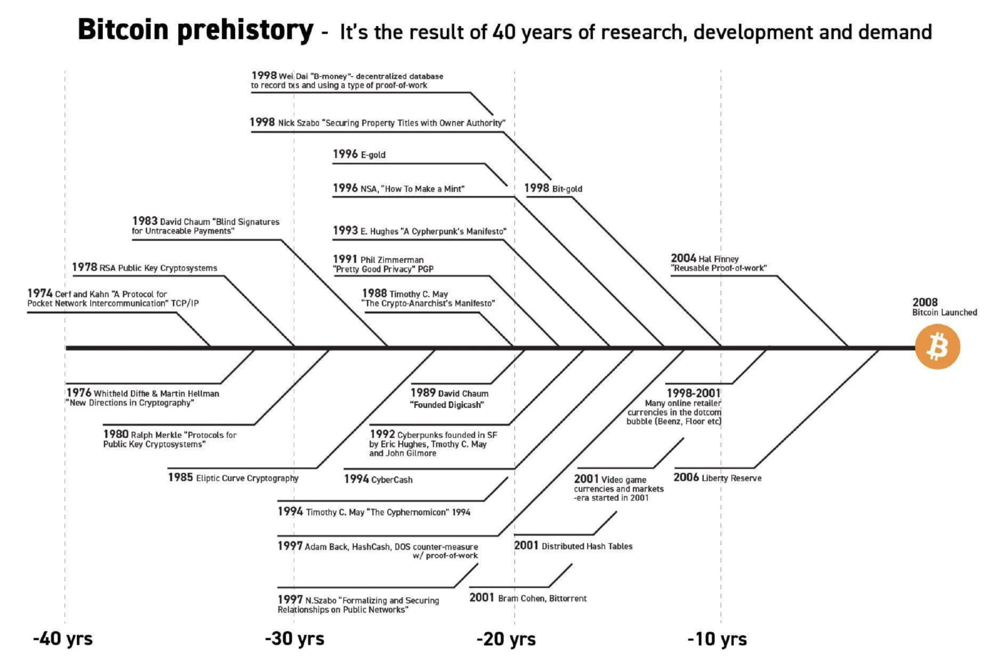

As you’ve read in the previous chapter, multiple cypherpunks attempted to create an alternative money system. This chapter continues the story of one of them: a visionary mind by the name “Satoshi Nakamoto.” This anonymous person (man, woman, or group), long before Bitcoin, was part of cryptography enthusiasts like computer scientists and hackers, engaging in discussions to find practical solutions to replace the fiat system.

In October 2008, Nakamoto unveiled a groundbreaking whitepaper titled, “Bitcoin: A Peer-to-Peer Electronic Cash System” on a cryptography mailing list. This document laid the foundation for a decentralized peer-to-peer protocol, designed to facilitate secure online transactions without the need for intermediaries. Nakamoto's vision was clear: to create a purely peer-to-peer version of electronic cash, free from the control of powerful governments and financial institutions.

<a rel="Bitcoin Whitepaper" href="https://www.bitcoin.org/bitcoin.pdf">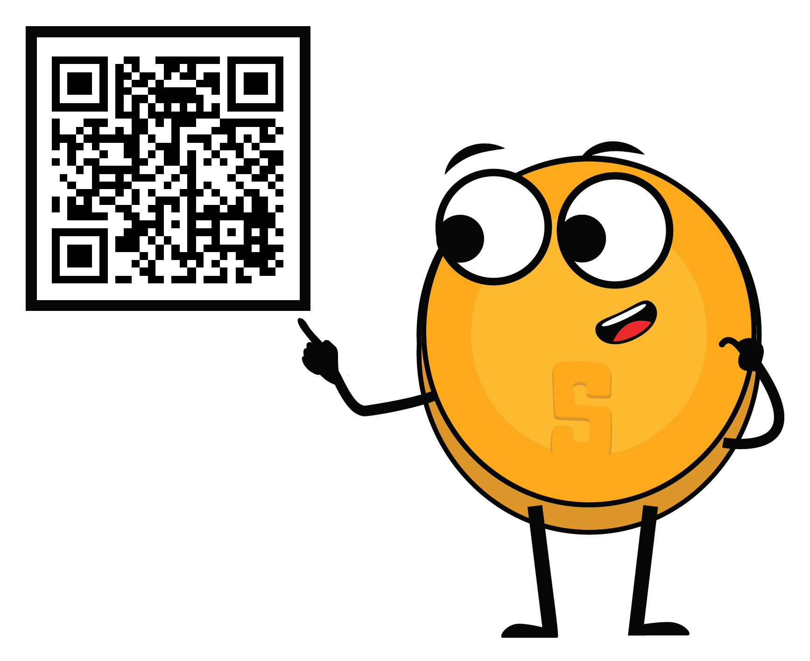

| Genesis Block and the Disapearence of Satoshi |
| :-------: |
| Fast forward to January 3, 2009, Nakamoto mined the first Bitcoin block known as the "genesis block." This marked the official launch of the Bitcoin network, a new money system built on trust and security through a decentralized ledger. In the months and years that followed, more and more enthusiasts started to join and contribute to the idea.     

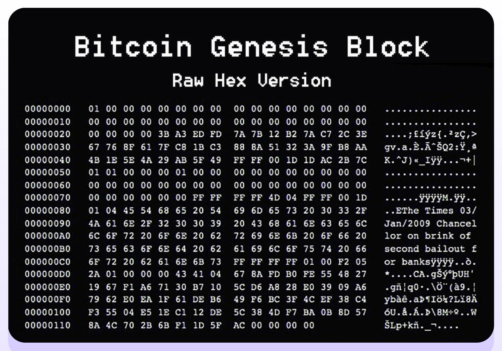
   In 2011, after the Bitcoin network proved it could operate successfully without the need of its influential creator, Nakamoto sent an email to a fellow Bitcoin developer, announcing to remove themselves from the Bitcoin scene and giving its future away to other “good hands” that shared their vision.|

Although Nakamoto’s identity remains a mystery until this very day, their goal for creating Bitcoin was never a mystery. In essence, Nakamoto created it to take the power away from the few and give it back to the many by creating an alternative in the form of a decentralized, open-sourced, transparent money system, separating money from the state. Creating Bitcoin was Nakamoto’s response to the 2008 financial crisis that hurt regular people worldwide while enriching the elite class—again. Bitcoin was Nakamoto’s answer on the corruption and fragility of the fiat system. Nakamoto set the foundation for a new revolution and walked away from it instead of claiming credit.

 

In the years that followed, Bitcoin started to grow quickly and emerged as a symbol of hope, empowerment, and resilience, challenging the fiat system and providing a secure, censorship-resistant means of financial transactions. Bitcoin is an open-source protocol, meaning that no one has the power to own or control it. Its design is public and open for anyone to participate.

Today, Nakamoto's dream of a borderless, transparent, and secure financial system lives on, empowering the global freedom revolution we are witnessing today. Everyday, ordinary people are opting out of the fiat system and into the world of Bitcoin. Bitcoin hubs—the so-called Bitcoin circular economies—have been launched by freedom enthusiasts in regions all over the world. Even entire countries that are looking for an alternative path, like El Salvador, are starting to adopt Bitcoin in their own ways.

 
 

### ***6.1 How Does Bitcoin Work?***    
### _6.1.1 The Nakamoto Consensus Mechanism_

So, how does Bitcoin work? Bitcoin has lots of features, and the rabbit hole goes deep—very deep.Fortunately, if you enter the Bitcoin world for the first time, you do not have to perfectly understand how it works to start using it. The same counts for using the internet. Most people do not know how the TCP/IP protocol works, yet they send emails, messages, and post content on their social media accounts every day. The same goes for driving a car—most people do not know exactly how a car works, yet they do know how to drive.

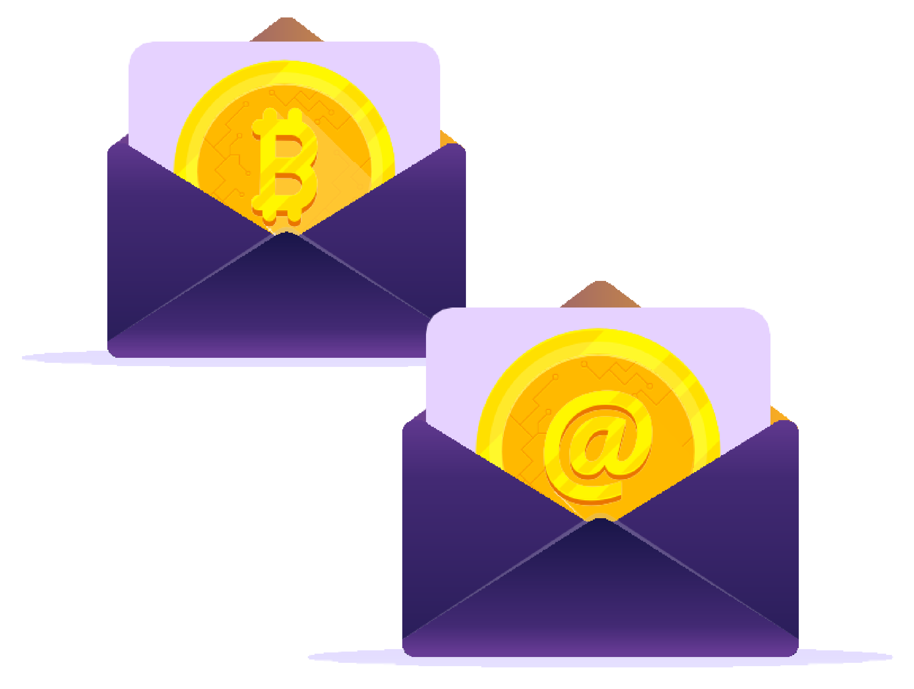

However, Bitcoin is not yet widely adopted. It is still a pretty new technology, like the internet was during the ‘90s. Because of this, it can be helpful to grasp the basics of Bitcoin in a simple, less technical way.

 

The key idea behind how Bitcoin operates can be condensed into one sentence: Bitcoin is an agreement among people online. You can think about it like playing a board game with friends. With a game like Monopoly, you are in agreement with the other players about specific rules. One of the rules of Monopoly is that only special “Monopoly bills” are to be accepted. If James, (one of the players), goes against the rules by using toilet paper to buy a house instead of Monopoly bills, the other players would tell James he is a cheater and would simply stop playing with him. In short, to play the game, you have consensus on a set of rules with each other and you do not drift away from those rules, otherwise you will be rejected.

This is essentially how Bitcoin works. Bitcoin is a network of people that agrees on the same set of rules. These rules are mathematically bound, written in computer code, and accepted directly by everyone who runs the Bitcoin software. The rules of Bitcoin apply to all participants equally, which means that everyone either follows the rules of the game or they are unable to play because the network will reject them.

For example, one of the rules of Bitcoin is, "There will never be more than 21 million bitcoins." If someone wanted to create a million extra bitcoins for themselves, it will be of no use to them because they would automatically be identified and rejected by everyone else. This is what makes Bitcoin so robust.

_It does not matter who you are or where you come from; if you enter the Bitcoin world, you need to play with the same set of rules as anyone else._

This also applies to all the people and entities with an enormous amount of control and influence in the fiat world. In the Bitcoin world, there is no room for cheating or sabotage—everyone is treated equally, and no one can change that.

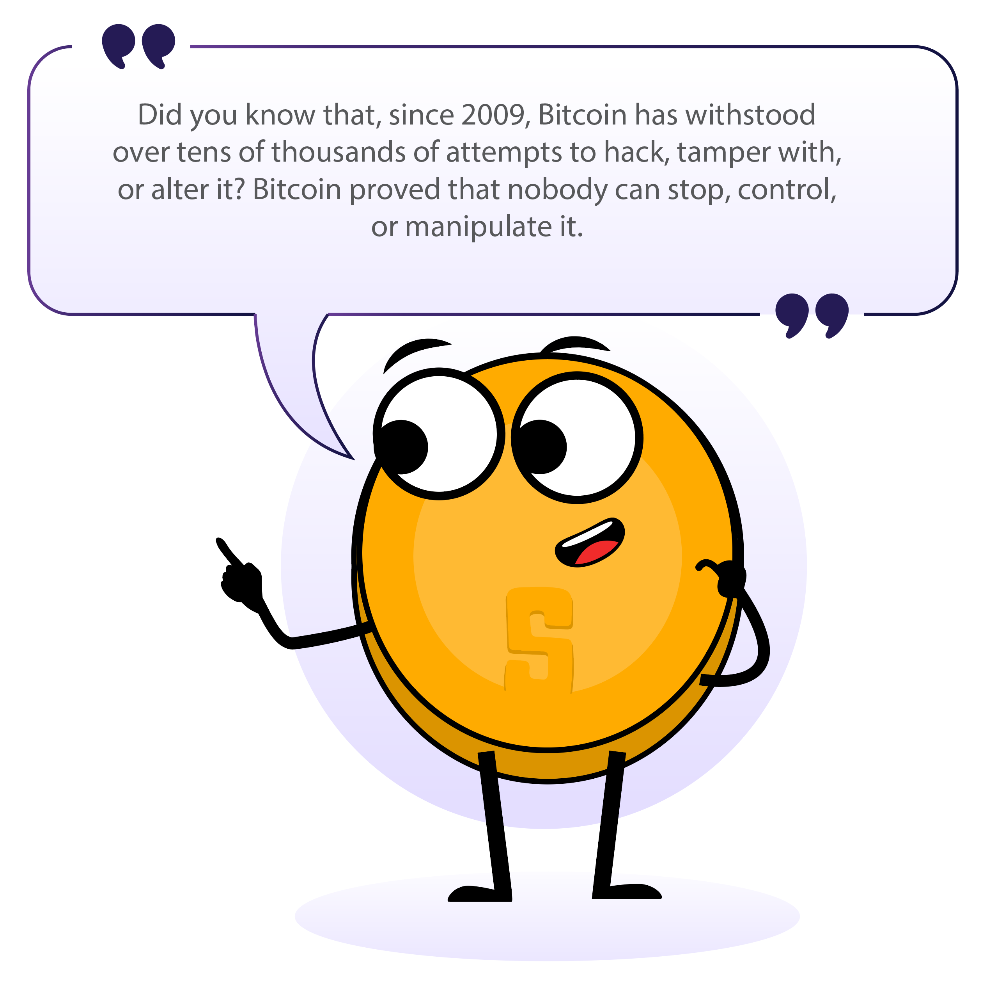

 
 

### _6.1.2 The Players of the Game_

To better understand the decentralization of Bitcoin, we need to dive deeper into the different roles within the network. In the Bitcoin world, various participants play distinct yet harmonious roles, contributing to the seamless functioning of the network.

1. **Miners: The Architects of Security**

   Miners are the backbone of Bitcoin. These are people or groups of people who work behind the scenes to maintain and secure the network through a mechanism called Proof-of-Work (PoW). These players are armed with special computers that contain heavy computational power. They make their hardware available to the Bitcoin network, competing with each other to find complex cryptographic numbers, verify transactions, and add new blocks of information about transactions to Bitcoin’s decentralized ledger (the so-called blockchain). Their commitment ensures the immutability of the ledger and guards against malicious attacks.

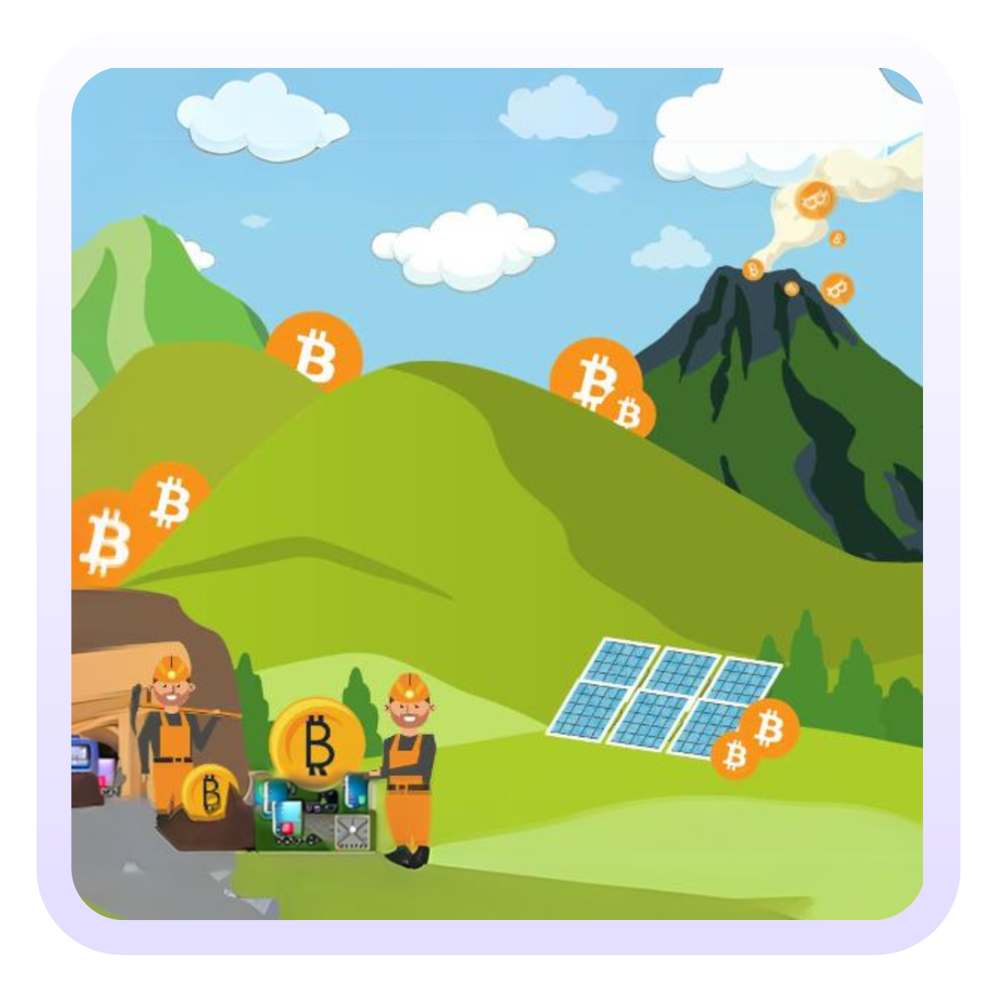

   The decentralized nature of mining allows anyone with sufficient computing resources to participate. Because of their hard work, the miners who solve the puzzle the quickest are rewarded in the form of bitcoin.

   Bitcoin miners are distributed all over the world, safeguarding the network against centralization and ensuring Bitcoin's security stays robust and distributed.

 

2. **Nodes: Gatekeepers of Validation**

   Bitcoin nodes are ordinary people who live across the planet. These participants form the gatekeepers of the Bitcoin network by running the Bitcoin software on their small computers in which they maintain a copy of the entire ledger. Nodes validate transactions and ensure that all participants adhere to the consensus rules.

   By distributing the responsibility of validation across a network of nodes, Bitcoin remains resilient against attacks and maintains its trustless nature. Nodes play a crucial role in upholding the integrity of the ledger, contributing to the decentralization ethos of Bitcoin.

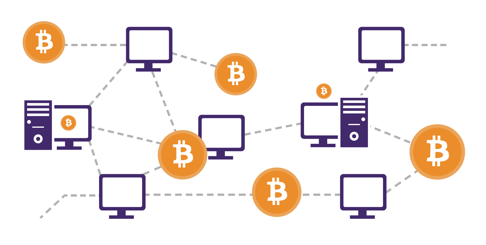

 

3. **Users: Empowered Participants**

   Users—the lifeblood of the Bitcoin network—are individuals who engage in transactions. You can think about users as regular people who just live their lives but who also empowered themselves by integrating Bitcoin. For example, some users save their money in bitcoin while others, like citizens of El Salvador, use it as money to buy groceries and receive bitcoin in the form of a salary.

   Bitcoin empowers users by eliminating the need for intermediaries like banks and governments, allowing for direct peer-to-peer transactions. This also means that users have full control over their money, providing control over their funds and transactions.

 

4. **Developers and Projects: Architects of Innovation**

   The monetary system of the future doesn’t build itself on its own, nor is it globally adopted in an ethically correct way without effort. That’s where Bitcoin developers and projects come into play.

   Developers wield their technical expertise to enhance and innovate the Bitcoin protocol. These individuals contribute code, propose improvements, and address vulnerabilities, ensuring the network evolves in response to all types of challenges. Bitcoin's open-source nature invites collaboration, allowing developers worldwide to contribute to its growth.

   The beauty of this decentralized development prevents a single entity from monopolizing control over the protocol. This happens through a consensus-driven process. Developers propose ideas and changes, and only those with the best ideas who are aligned with the broader vision for a better world receive support from the community, empowering a transparent and democratic evolution of Bitcoin until it’s ready for 8 billion people.

   Bitcoin projects involve diverse groups, from mission-driven nonprofits and corporations to groups and individuals that create valuable content. These people work together on a specific goal or focus within the bigger Bitcoin mission toward collective freedom.

   Bitcoin projects play a crucial role in shaping and promoting the adoption of Bitcoin, working toward a future that prioritizes the empowerment and freedom of the human race.

 

**The Symphony**

Bitcoin's decentralization can be thought of as a synergetic musical orchestra, a balancing act where all the different musicians make the most beautiful music together. There is no boss in the Bitcoin network; instead, miners, nodes, users, developers, and projects perform their roles with autonomy and collaboration.

The decentralized ledger, maintained by nodes, guarantees transparency, while the proof-of-work mechanism provides security and deters centralization in mining. Users experience financial sovereignty and empowerment, free from the control of the fiat system. Developers, guided by consensus, ensure the protocol adapts to meet the evolving needs of humanity. Bitcoin projects, in their own unique ways, contribute to the broader mission of collective freedom.

As you can see, every participant plays a vital role in shaping Bitcoin's adoption and empowering humanity. Each participant in this decentralized orchestra contributes to the resilience and longevity of Bitcoin, creating a trust-free, borderless, and empowering ecosystem.

In summary, the symphony of decentralization in Bitcoin resonates as a testament to Satoshi Nakamoto's vision and the immense passion of a global community seeking freedom and empowerment.

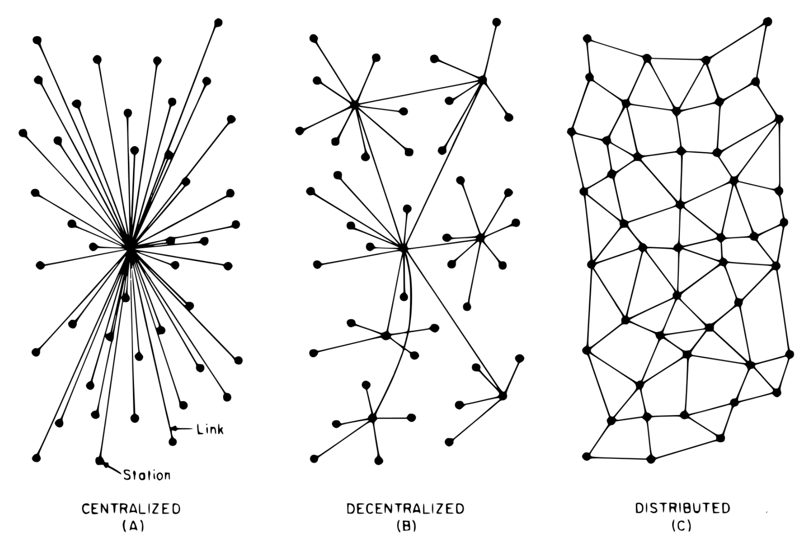

 
 

### **Class Exercise** _- Consensus Building in a Peer-to-Peer Network_

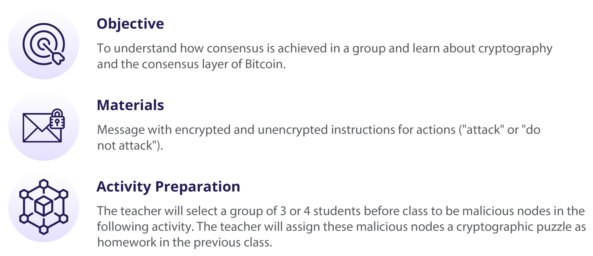

 

**Exercise Steps:**

1. The teacher will select an “originator” who will receive a message on a piece of paper that says "ATTACK" and a series of numbers that says, "4-16-14-21-1-21-21-1-3-11-” to one student in the group.

2. The students will form a circle in the designated space, ensuring the selected students who will be malicious nodes are separated to improve the effectiveness of the lesson.

3. Once the group has formed a circle, the originator will pass the note to the individual to the right side of the circle.

4. After everyone has read the message, the originator will give the signal to the group by saying “now,” and the group will react to the message simultaneously. If the message reads “ATTACK,” then all participants will take a step forward.

5. After the initial reaction, some students (those who received the encrypted message and interpreted it correctly) will remain still, while the rest will follow the original instruction, revealing a lack of consensus.

 

| **$\color[RGB]{36,27,84} Conclusion:$** |
| :------- |
| Discuss why consensus was not achieved, introducing the concept of the Byzantine Generals' Problem, how it relates to the need for a common goal, and later discussing how Bitcoin provides a solution to this problem. |

 
 

### ***6.2 Bitcoin as Sound Digital Money***    
### _6.2.1 Introduction_

<a rel="What is Bitcoin? (v2)" href="https://www.youtube.com/watch?v=Gc2en3nHxA4">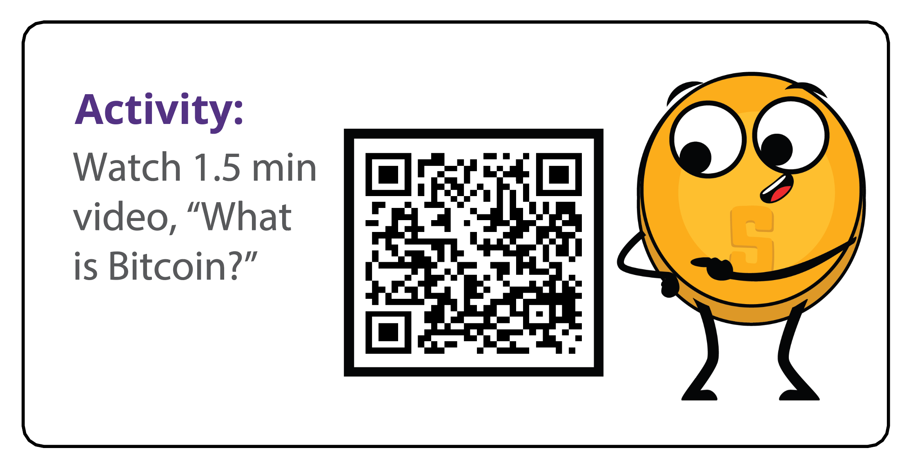

In simple terms, Bitcoin is money. Bitcoin is not an investment but rather a safe, empowering way of saving your hard-earned money. Having bitcoins won’t make you rich because it won’t give you a return of more bitcoins. Its value, measured against a fiat currency, does go up, but this is only because of its growing adoption and the devaluation of fiat currencies.

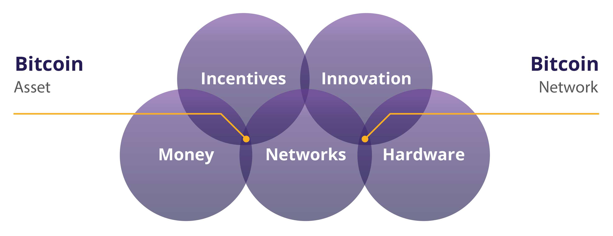

Bitcoin is a new form of money; it is, “The Internet of Money," which means that it is open for anyone to join and start exchanging value with other users. Even the most isolated and poor communities in the world finally have access to a monetary system. Just like everyone who has a phone and an internet connection can use a search engine, Bitcoin makes it possible for everyone with a phone and internet connection to access a new, global monetary system.

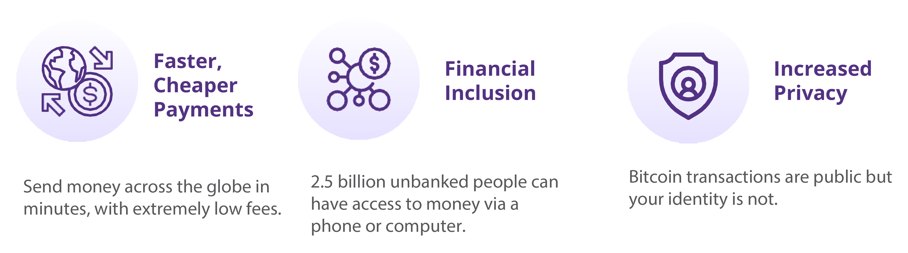

 

Bitcoin is completely digital and borderless. It doesn’t matter where you are located because it lives on computers and smartphones from all over the world. Lots of users worldwide run the Bitcoin software and a copy of its ledger. This software and record of all transactions has a very low chance of disappearing as there are countless copies of it. To shut it down, you would need to shut down the entire internet, forever, which is extremely unlikely to happen.

Finally, Bitcoin is scarce, which means that the quantity of bitcoin tokens that can exist are absolutely limited. No one can counterfeit Bitcoin—not even the most powerful governments and financial institutions.

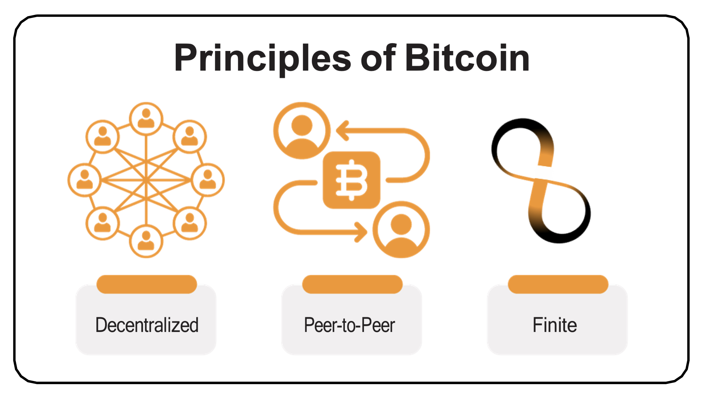

 
 

### _6.2.2 Bitcoin’s Features_

**The Evolution of Sound Money**

As you learned in Chapter 2, the lifecycle of sound money progresses through three stages to receive general acceptance from society: From being a store of value to becoming a medium of exchange and, finally, a unit of account.

The first stage of money, a store of value, is when a currency starts gaining trust as a stable (or appreciating) asset over time. People who recognize this early seek to protect their wealth by storing it in this form of money, especially during a time of geopolitical and macroeconomic uncertainties.

Some groups, like media outlets, call Bitcoin a form of “digital gold.” This is because Bitcoin firmly established itself as a store of value during the past decade. Every day, more and more people start viewing Bitcoin as a hedge against inflation, like gold did historically.

The next stage is when confidence in the stability of a currency solidifies. This is when the currency transitions into a medium of exchange, facilitating transactions in people’s daily lives. During this stage, currency starts to become widely accepted for the exchange of goods and services.

Bitcoin is progressively moving toward becoming a medium of exchange. With growing merchant acceptance and the development of the protocol, Bitcoin transactions are becoming more efficient and commonplace in daily commerce. One example of this is El Salvador, where Bitcoin is officially recognized as legal tender. Each day, more and more ordinary citizens and businesses are using Bitcoin as a medium of exchange.

 

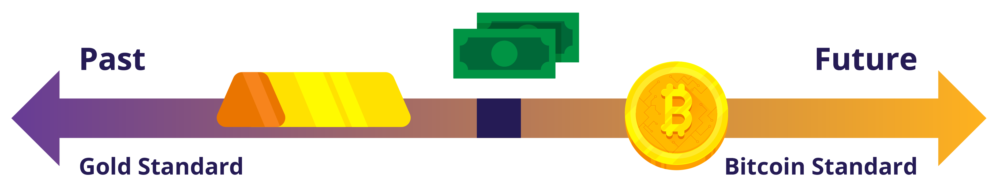

In the final stage, a currency achieves the status of a unit of account, serving as a common measure for pricing goods and services. This is the stage in which it becomes the standard metric against which all other values are measured.

The journey toward becoming a unit of account is a more extended (long-term) process. The world currently measures goods and services only in fiat currencies, and because of that, Bitcoin needs broader adoption and integration into various financial systems. However, the foundation is already laid as businesses and individuals begin to consider and denominate values in Bitcoin.

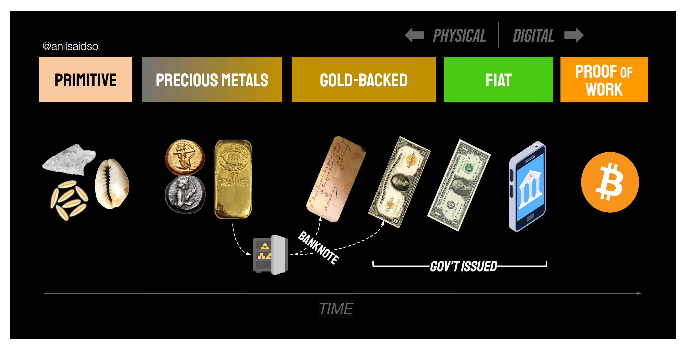

As you can see, Bitcoin is well on its way in this evolutionary cycle of sound money. When Bitcoin becomes fully integrated into the global financial system, it could become a standard unit of account, reshaping the entire global monetary system.

 

**Properties of money**   

As you learned in Chapter 2, over time, humanity has figured out that real sound money must possess certain properties to be effective. These properties are durability, divisibility, portability, acceptability, scarcity, and fungibility.

Let’s see if Bitcoin passes the test.

| Testing Bitcoin for properties of money |
| :------- |
| **Durability:** Bitcoin is purely digital and thus completely durable.     **Divisibility:** For comparison, the fiat currency USD can be divided to the cent (.01). Bitcoin can be divided into what is known as a satoshi or sat (.00000001). And because of Bitcoin’s digital character, it can be even more divided in the future if humanity needs it. Bitcoin is currently the most divisible monetary asset in the world.itcoin is purely digital and thus completely durable.     **Portability:** In April 2020, $1.1 billion was transferred in just a few minutes, and it only cost 68 cents. No other way of paying can move that much money at that low cost so quickly, and all on its own. This is what makes Bitcoin the most easily movable form of money in the world.     **Acceptability:** Bitcoin is still in its early stages of becoming a medium of exchange, and compared to fiat currencies, acceptability is currently low.     **Scarcity:** There will only ever be 21 million bitcoins in existence. By code, it is impossible for this amount to ever increase, which means that Bitcoin is not only scarce but is also the scarcest monetary asset in the world.     **Fungibility:** Each unit of bitcoin is the same as any other unit and can be interchanged and transacted over the Bitcoin protocol on a like-kind basis, which makes it a fungible currency. |

 

| **Properties of Money**  | Gold | Fiat | Bitcoin |
| :------------- | :-------------: | :-------------: | :-------------: |
| Durability | **High** | **Moderate** | **High** |
| Portability | **Moderate** | **High** | **High** |
| Divisibility | **Moderate** | **Moderate** | **High** |
| Fungibility | **High** | **High** | **High** |
| Scarcity | **Moderate** | **Low** | **High** |
| Verifiable | **Moderate** | **Moderate** | **High** |
| Established History | **High** | **Moderate** | **Low** |
| Censorship Resistant | **Moderate** | **Moderate** | **High** |
| Smart/Programmable | **Low** | **Moderate** | **High** |

"Bitcoin vs Gold vs US Dollar" Bitcoin Magazine, https://bitcoinmagazine.com

 

Bitcoin is a type of smart money that's programmable, can't be taken away, and has all the qualities that make it great for saving and easy for merchants who want fast transactions.

Since it's a transparent digital ledger, Bitcoin can be super efficient in things like catching fraud and figuring out risks in its services. It has the good parts of gold, such as there only being a limited amount of it, but it also has the benefits of fiat currencies because you can divide it and carry it around easily. Plus, it brings in new features that work well in our digital world.

What do you think? Bitcoin is not yet widely recognized and adopted, but is it sound money?

 
 

### _Activity: Class discussion - Is Bitcoin Sound Money?_

Now that we have discussed Bitcoin in greater detail, let’s look at our money comparison table from Chapter 2 again and see how Bitcoin compares with other forms of money:

| **$\color[RGB]{82,49,131} Characteristic \ of \ Good \ Money$**  | 🐄   **$\color[RGB]{82,49,131} Cows$** | 🚬   **$\color[RGB]{82,49,131} Cigarettes$** | 💎   **$\color[RGB]{82,49,131} Dimonds$** | 💶   **$\color[RGB]{82,49,131} Euros$** | ₿   **$\color[RGB]{82,49,131} Bitcoin$** |
| :------------- | :-------------: | :-------------: | :-------------: | :-------------: | :-------------: |
| **Durable** |     |     |     |     |     |
| **Portable** |     |     |     |     |     |
| **Uniform** |     |     |     |     |     |
| **Acceptable** |     |     |     |     |     |
| **Scarce** |     |     |     |     |     |
| **Divisible** |     |     |     |     |     |
| **Total** |     |     |     |     |     |
__________________________________________________________________________________________

 
 

### _6.2.3 Embracing Personal Responsibility_

> "The result is a distributed system with no single point of failure. Users hold the crypto keys to their own money and transact directly with each other, with the help of the P2P network to check for double-spending."    
 **$\color[RGB]{250,175,64} Satoshi \ Nakamoto$**

 

In the fiat world, people rely on governments, banks, and established payment providers. The heads of these (financial) institutions set the rules of the network, and the participants, mostly ordinary citizens, must comply with these rules. It doesn’t matter where you live—there are always a set of standard procedures that instruct you on what to do and how to do it. Over time, this led to a cycle of hardship, particularly for families that struggle with the increasing challenges of daily life.

Because of this system, people are accustomed to putting the responsibility for their finances in the hands of others. For example, most people rely on someone else to help them, especially when something goes wrong (like losing access to your bank account).

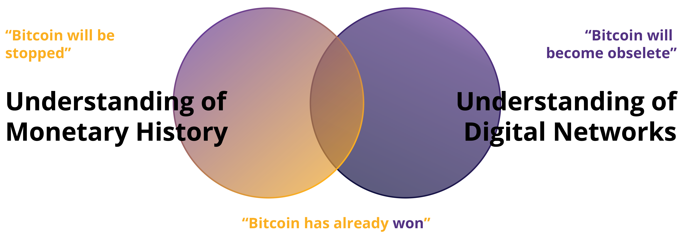

As you know, the monetary system of Bitcoin is very different. Bitcoin operates in a specific way, and rulers have been replaced by an autonomous system of rules. There is no dictator or leader, which also means that no one will dictate to you what you need to do. If you want the newfound freedom and empowerment of Bitcoin, you will need to learn how it works and integrate the technology in a way that works personally for you.

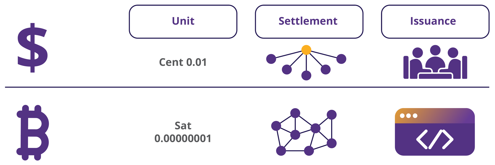

With Bitcoin, you are fully in control over your funds, but with this additional control comes increased responsibility. For example, losing access to your bitcoins by losing your keys to your digital wallet means you have lost your savings—permanently. There's no customer service hotline to call or someone else to turn to when there is a problem you need to take care of it yourself.

Fortunately, this will not happen to those who decide to take full responsibility over their own lives. To use Bitcoin is not inherently complicated; it’s just a new concept. Any discomfort arises because it's unfamiliar, but if you are willing to learn how to use Bitcoin and fully embrace the responsibility of safeguarding your wealth, Bitcoin becomes an empowering tool—you are in control, and no one can seize your wealth.

In summary, the key lies in action, understanding Bitcoin's workings, and implementing it according to your unique needs and life philosophy. Next, we’ll begin to use bitcoins by setting up a Bitcoin wallet, sending and receiving our first transactions, and reviewing security best practices.
