## _Chapter #7_

# ***How to Use Bitcoin***

- [**7.0** Introduction](https://github.com/MyFirstBitcoin/Bitcoin-Diploma-2024/blob/main/Web%20View/19.Chapter-7.md#70-introduction)    
- [**7.1** Acquiring and Exchanging Bitcoin](https://github.com/MyFirstBitcoin/Bitcoin-Diploma-2024/blob/main/Web%20View/19.Chapter-7.md#71-acquiring-and-exchanging-bitcoin)    
  - [**7.1.1** P2P: Physical](https://github.com/MyFirstBitcoin/Bitcoin-Diploma-2024/blob/main/Web%20View/19.Chapter-7.md#711-peer-to-peer-in-person)    
  - [**7.1.2** P2P Exchanges: Online](https://github.com/MyFirstBitcoin/Bitcoin-Diploma-2024/blob/main/Web%20View/19.Chapter-7.md#712-peer-to-peer-online)    
  - [**7.1.3** Centralized Exchanges](https://github.com/MyFirstBitcoin/Bitcoin-Diploma-2024/blob/main/Web%20View/19.Chapter-7.md#713-centralized-exchanges)
- [**7.2** An Introduction to Bitcoin Wallets](https://github.com/MyFirstBitcoin/Bitcoin-Diploma-2024/blob/main/Web%20View/19.Chapter-7.md#72-an-introduction-to-bitcoin-wallets)    
  - [**7.2.1** Self-custodial vs Custodial Wallets](https://github.com/MyFirstBitcoin/Bitcoin-Diploma-2024/blob/main/Web%20View/19.Chapter-7.md#721-self-custodial-vs-custodial-wallets)    
  - [**7.2.2** Different Types of Bitcoin Wallets](https://github.com/MyFirstBitcoin/Bitcoin-Diploma-2024/blob/main/Web%20View/19.Chapter-7.md#722-different-types-of-bitcoin-wallets)
  - [**7.2.3** Open Source vs Closed Source](https://github.com/MyFirstBitcoin/Bitcoin-Diploma-2024/blob/main/Web%20View/19.Chapter-7.md#723-open-source-vs-closed-source)    
  - [**Activity:** Class Evaluation of Bitcoin Wallets](https://github.com/MyFirstBitcoin/Bitcoin-Diploma-2024/blob/main/Web%20View/19.Chapter-7.md#activity-class-discussion-and-evaluation-of-bitcoin-wallets-on-bitcoinorg)
- [**7.3** Setting up a Mobile Bitcoin Wallet](https://github.com/MyFirstBitcoin/Bitcoin-Diploma-2024/blob/main/Web%20View/19.Chapter-7.md#73-setting-up-a-mobile-bitcoin-wallet)    
  - [**Activity:** Setting Up/Recovering a Bitcoin Wallet](https://github.com/MyFirstBitcoin/Bitcoin-Diploma-2024/blob/main/Web%20View/19.Chapter-7.md#activity-setting-uprecovering-a-bitcoin-wallet)    
- [**7.4** Receiving and Sending transactions](https://github.com/MyFirstBitcoin/Bitcoin-Diploma-2024/blob/main/Web%20View/19.Chapter-7.md#74-receiving-and-sending-transactions)    
  - [**Activity** Bitcoin Transactions in Action](https://github.com/MyFirstBitcoin/Bitcoin-Diploma-2024/blob/main/Web%20View/19.Chapter-7.md#activity-bitcoin-transactions-in-action)    
- [**7.5** Saving in Bitcoin](https://github.com/MyFirstBitcoin/Bitcoin-Diploma-2024/blob/main/Web%20View/19.Chapter-7.md#75-saving-in-bitcoin)    
- [**7.6** DYOR - Don’t Trust, Verify](https://github.com/MyFirstBitcoin/Bitcoin-Diploma-2024/blob/main/Web%20View/19.Chapter-7.md#76-dont-trust-verify)    

______________________________________________________________________________________________________

### ***7.0 Introduction***    

> "Why would anyone trust nerd money vs central bank money? Nerds brought you the internet. Banks brought you the great depression."    
 **$\color[RGB]{250,175,64} Andreas \ M. \ Antonopoulos$**

 

Now that we have a better understanding of what Bitcoin is and its purpose, it's time to learn how to use it practically. In this chapter, we'll guide you through the process of acquiring bitcoin step-by-step, explore the various types of wallets available, help you set up your own Bitcoin wallet, and even practice sending and tracking a bitcoin transaction on the network. It's time to turn your understanding into action!

 
 

### ***7.1 Acquiring and Exchanging Bitcoin***    

There are many ways to acquire bitcoin. For example you can:

- ⭐ Get paid in bitcoins in exchange for your work and pay for other people’s products and services with bitcoins (more on that in Chapter 8)

- ⭐ Mine bitcoins (more on that in Chapter 9)

- ⭐ Exchange your fiat currency for bitcoins or exchange your bitcoins for fiat currency in person.

- ⭐ Exchange your fiat currency for bitcoins or exchange your bitcoins for fiat currency online.

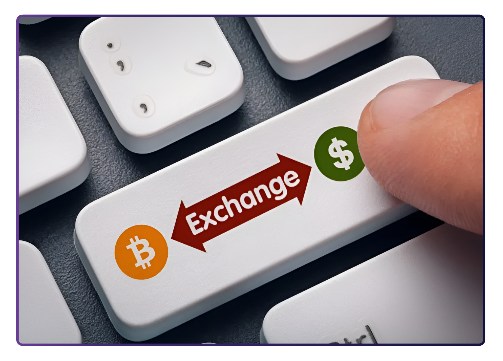

Below, we’ll explore exchanging fiat currency for bitcoins and vice versa, both through in-person transactions and online methods, as they are the most common options.

 
 

### _7.1.1 Peer-to-Peer: In Person_

Engaging in peer-to-peer (P2P) transactions for acquiring and selling bitcoins involves directly exchanging your fiat currency (or any other goods or services) for bitcoins with another individual, eliminating the need for a bank or other party to be involved in the transaction.

Both parties mutually determine the exchange amount and rate. The buyer provides the cash, the seller transfers the bitcoins, and the transaction concludes. While it’s easier to do P2P exchanges physically by meeting with the other individual directly in the real world, you can also do so from virtually anywhere thanks to the internet. Additionally, exchanging bitcoins for fiat currency follows a similar process in reverse.

 
 

### _7.1.2 Peer-to-Peer: Online_

Enter P2P platforms, where Bitcoin buyers and sellers meet in cyber space to conduct transactions without any intermediaries, directly on the internet.

With such platforms, you don’t have to trust anyone with your information or money; you can meet other peers and trade with them directly.

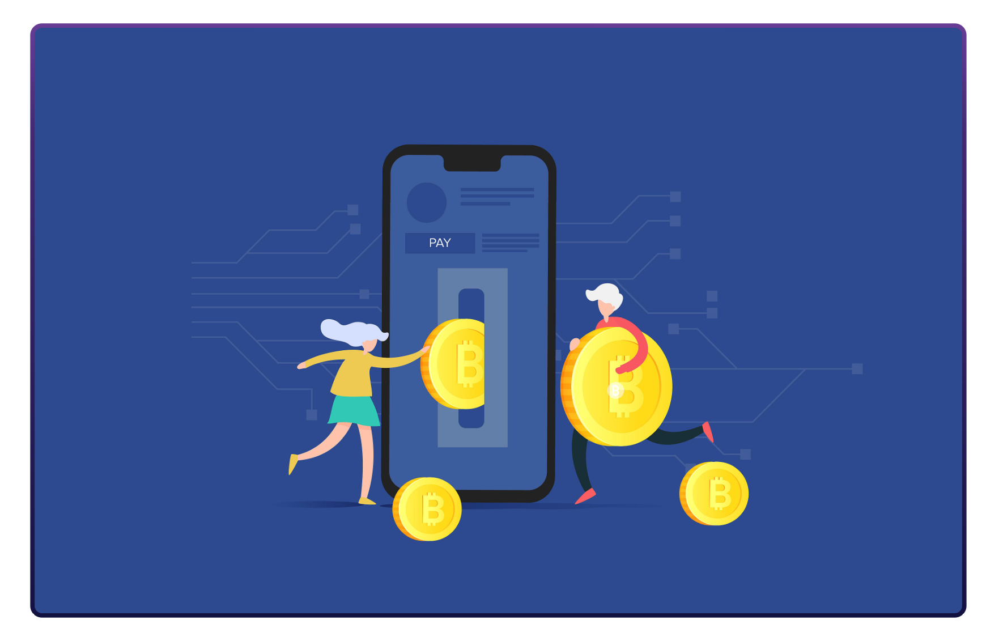

On most P2P platforms, peers have to escrow some of the funds to ensure they will comply with their part of the deal. Escrow means putting the money in a safe place that the platform controls until both parties do what they promised. It's like a trusted friend holding onto your stuff until everyone keeps their word.

 
 

### _7.1.3 Centralized Exchanges_

Using centralized exchanges may be the easiest way to acquire and sell bitcoins but it also involves significant trade-offs. Centralized exchanges are companies that allow clients to buy and sell bitcoins directly through them. However, this convenience comes at a cost.

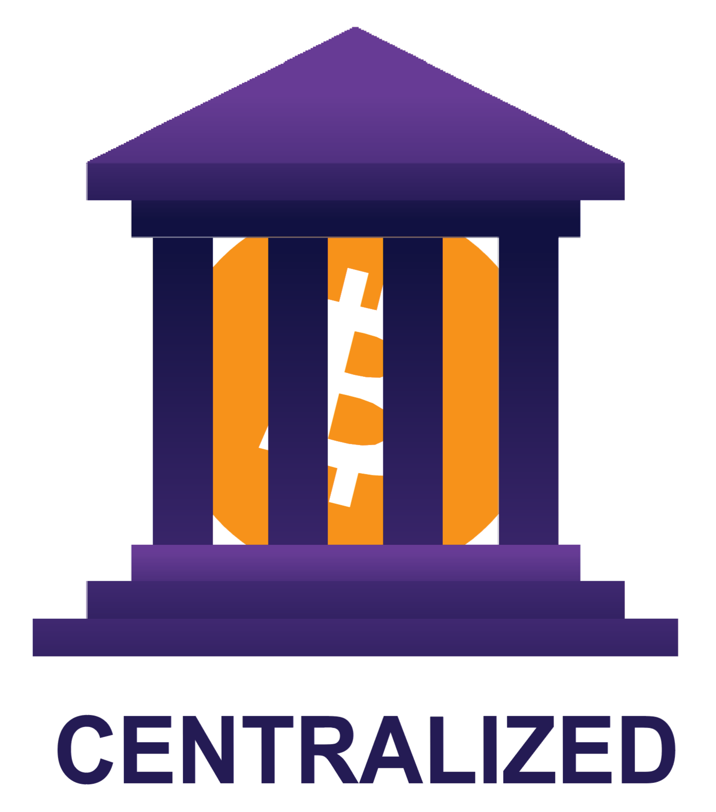

**Centralized Exchanges and their trade-offs**

It’s important to note that when buying bitcoins through a centralized exchange, you are often required to provide personal information and verify your identity. This creates a risk of identity theft and exposes your personal information to potential threats. Additionally, centralized exchanges hold your bitcoins for you, which means you are not in control of your money until you withdraw it from them.

To add to these concerns, centralized exchanges can misappropriate users’ funds or lend more bitcoins than they have in reserves until they collapse. Yes, just like banks! However, in the Bitcoin world, there is no central bank to bail out fraudulent banks by printing more currency because you can't print more bitcoins!

 
 

### ***7.2 An Introduction to Bitcoin Wallets***    

Unlike physical money, bitcoins are not actually present in a Bitcoin wallet. Instead, they live on the distributed ledger that the Bitcoin network constantly verifies and secures. So, how can you own bitcoins?

You have ownership of your bitcoins only when you own the private keys allowing you to sign transactions and transfer ownership of your bitcoins to someone else. This is the act of sending bitcoins.

With that in mind, let’s take a look at two concepts we describe when using the term **$\color[RGB]{82,49,131} “wallet”:$**

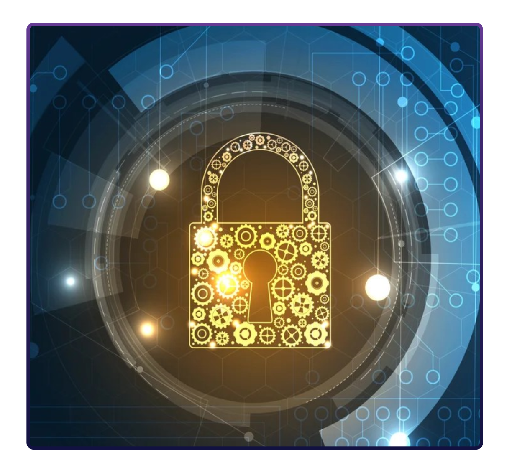

- ⭐ A master private key (like a password) from which you can generate public keys that you can share with others to receive and send bitcoins.

- ⭐ The mobile or desktop interface from which you can interact with the Bitcoin network to retrieve your bitcoin balance, send and receive transactions, and broadcast them to the network. Different types of wallets, along with their benefits and tradeoffs, will be described in the next section.

 
 

### _7.2.1 Self-Custodial vs Custodial Wallets_

Before detailing the different types of Bitcoin wallets and their characteristics, let’s make an important distinction between self-custodial and custodial wallets, shown in the table below. You can see the benefits and risks of using each wallet type and who controls the bitcoins in each case. Self-custodial means the user holds the private keys, which means they are in true possession of their bitcoins, while with the second type, a third party, holds their bitcoins.

| **$\color[RGB]{82,49,131} Wallet \ Type$** | **$\color[RGB]{82,49,131} Who \ controls \ my \ bitcoin?$** | **$\color[RGB]{82,49,131} Benefits$** | **$\color[RGB]{82,49,131} Risks$** |
| :----: | :----: | :----: | :----: |
| **Self Custodial Wallets** | **The user** | Complete control over funds and transactions, no approval process or account freeze, no corporate or government control, protected against arbitrary confiscation, like keeping money at home. | No recovery if recovery phrase is lost, less customer support, full responsibility falls on the user. |
| **Custodial Wallets** | **The thirdparty provider** | Easy recovery if access is lost, easier customer support | Funds are always connected to the internet, more vulnerable to hacking and breaches. Custodians control and can freeze accounts. |

In a self-custodial wallet (also called non-custodial wallet), you are the only one with the keys to the wallet and you have full control over what goes in and out. On the other hand, in a custodial wallet, someone else holds the key and can access and manage the contents of the wallet on your behalf.

- ⭐ Self-custody is like being your own bank. Transactions are not subject to control or authority by any government or company, but it also means you bear full responsibility for keeping your bitcoins secure.

- ⭐ Self-custody ensures that third parties cannot confiscate your bitcoins without your consent.

- ⭐ Self-custody gives peace of mind in times of uncertainty, knowing your bitcoins are secure.

It’s important to choose the right type of wallet for each individual’s needs. Sometimes, people find it hard to distinguish whether they are installing a self-custodial or a custodial wallet. This table shows the differences with the installation process.

| **$\color[RGB]{82,49,131} Wallet \ Type$** | **$\color[RGB]{82,49,131} Step \ 1: \ Choose \ a \ Wallet$** | **$\color[RGB]{82,49,131} Step \ 2: \ Install \ the \ Wallet$** | **$\color[RGB]{82,49,131} Step \ 3: \ Create \ a \ New \ Wallet$** | **$\color[RGB]{82,49,131} Step \ 4: \ Secure \ Your \ Seed \ Phrase$** |**$\color[RGB]{82,49,131} Step \ 5: \ Start \ Using \ Your \ Wallet$** |
| :----: | :----: | :----: | :----: | :----: | :----: |
| **Self Custodial Wallets** | Choose a self-custodial wallet provider | Follow the wallet provider’s instructions | Generate **$\color[RGB]{82,49,131} recovery \ phrase$** and at least one **$\color[RGB]{189,30,44} private \ key$** | Store the **$\color[RGB]{82,49,131} recovery \ phrase$** in a secure location | Start using the wallet to receive and send **$\color[RGB]{247,147,29} bitcoins$** |
| **Custodial Wallets** | Choose a custodial wallet provider | Follow the wallet provider’s instructions | Create an account with the wallet provider | N/A (wallet provider holds the **$\color[RGB]{189,30,44} private \ key$**) | Start using the wallet to receive and send **$\color[RGB]{247,147,29} bitcoins$** |

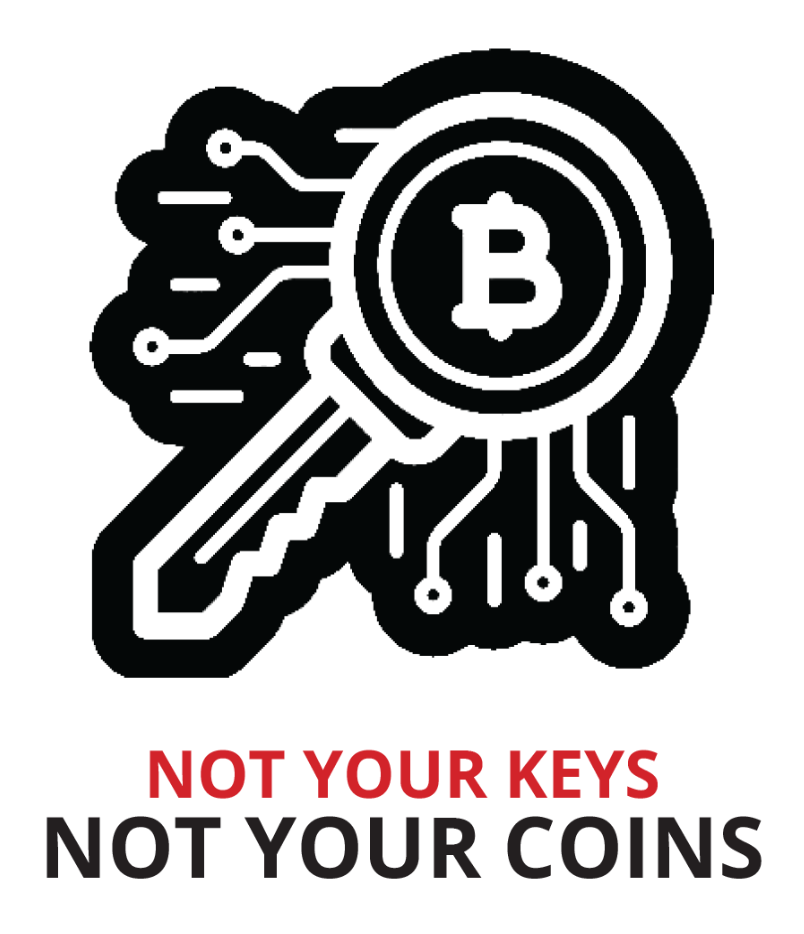

“Not your keys, not your coins” is a popular saying among bitcoin holders. It refers to the idea that if you don’t have direct control over the private keys associated with your Bitcoin wallet, you don’t have true ownership of the coins.

Whoever accesses your private keys will gain ownership of your bitcoins. This is why it is of the utmost importance to protect them by keeping them away from prying eyes! We’ll see a few ways you can do that later in the book.

For what follows, we’ll be talking about self-custodial wallets only, where the user owns their keys and has complete control over their bitcoins.

 

Don’t worry if it seems complicated or you don’t understand everything—this is a journey, and you will understand more as you start using Bitcoin more!

 
 

### _7.2.2 Different Types of Bitcoin Wallets_

Depending on where your private key is created and stored, we commonly use different names to describe Bitcoin wallets. If the keys are stored on your smartphone, we call it a “mobile wallet.” If they’re stored securely on a dedicated device, we call it a “hardware wallet.” If the key is only stored on paper, then it is called a “paper wallet.”

The different names we give to Bitcoin wallets depending on their structure:

| **$\color[RGB]{82,49,131} Wallet \ Type$** | **$\color[RGB]{82,49,131} Description$** | **$\color[RGB]{82,49,131} Advantages$** | **$\color[RGB]{82,49,131} Disadvantages$** | **$\color[RGB]{82,49,131} Example \ User$** |
| :----: | :----: | :----: | :----: | :----: |
| **Online Wallet** | A wallet that is accessed through a web browser. | Accessible from any device with an internet connection. Easy to use. | Less secure. Can be hacked or compromised. | Someone who needs to access their wallet frequently and doesn’t have a lot of funds to store. |
| **Mobile Wallet** | A wallet that is installed on a mobile device. | Convenient. Can be accessed from anywhere. | Can be lost if the device is misplaced, stolen, or hacked. | Someone who needs to make transactions on the go and doesn’t have a lot of funds to store. |
| **Desktop Wallet** | A wallet that is installed on a desktop computer. | More secure than online wallets. Can be used offline. | Can be hacked if the computer is infected with malware. | Someone who wants to store a large amount of **$\color[RGB]{247,147,29} bitcoins$** and is comfortable with using a desktop computer. |
| **Hardware Wallet** | A physical device that stores **$\color[RGB]{247,147,29} bitcoins$** offline. | Very secure. Can be used offline. | Funds could be unrecoverable if the device is lost or stolen. | Someone who wants to store a large amount of **$\color[RGB]{247,147,29} bitcoins$** and is willing to pay for the added security of a hardware wallet. |
| **Paper Wallet** | A physical record of a bitcoin wallet’s private and public keys. | Very secure. Can be used offline. | Can be lost or stolen if the physical record is lost or stolen. | Someone who wants to store a large amount of **$\color[RGB]{247,147,29} bitcoins$** and is willing to take the added precautions to ensure its security. |

Because the keys can be moved from one device to another, the “status” of your Bitcoin wallet is not definitive. For example, if I generate the keys of my Bitcoin wallet on a computer and later upload them to my phone, the “desktop wallet” then becomes a “mobile wallet.”

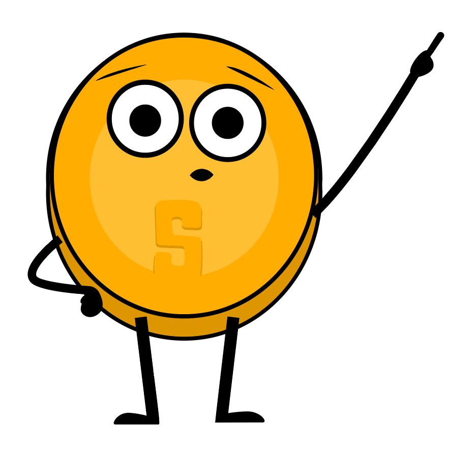

When it comes to storing your bitcoins, it’s not just about who has control over them - there are many other risks to consider. That’s why it’s important to find a storage solution that is both secure and convenient.

When you analyze the trade-offs of the various types of wallets, you will learn there is no ideal wallet that satisfies all needs.

 

**When choosing a Bitcoin wallet, there are several things you should consider:**

- ⭐ **$\color[RGB]{82,49,131} Security:$** Make sure the wallet has strong security measures in place such as two-factor authentication and secure password policies.

- ⭐ **$\color[RGB]{82,49,131} Privacy:$** Consider whether the wallet allows you to remain anonymous or if it requires personal information to set up an account.

- ⭐ **$\color[RGB]{82,49,131} Ease \ of \ Use:$** Choose a wallet that is easy to use and navigate, especially if you are new to Bitcoin.

- ⭐ **$\color[RGB]{82,49,131} Compatibility:$** Make sure the wallet is compatible with your device and operating system.

- ⭐ **$\color[RGB]{82,49,131} Fees:$** Compare the fees charged by different wallets to make sure you are getting the best deal.

- ⭐ **$\color[RGB]{82,49,131} Reputation:$** Research the reputation of the wallet and its team to make sure it is trustworthy.

- ⭐ **$\color[RGB]{82,49,131} Control:$** Some wallets give you more control over your private keys, which can be a security advantage.

Consider whether you want a wallet that gives you full control or one that is more user friendly but may have less control.

 
 

### _7.2.3 Open Source vs Closed Source_

Another important factor to keep in mind when choosing a Bitcoin wallet is knowing if the application or software is open-source.

Open-source code is very important because it allows the community to review the code and continue developing the project if the team were to stop working on it.

Just as Bitcoin’s code is completely open for everyone to review, use, and modify, so should be the code of the wallet you use to store your bitcoins.

 
 

### _Activity: Class discussion and evaluation of Bitcoin wallets on bitcoin.org_

| Go to the following website: |
| :-----: |
| 

<a rel="Choosing a Bitcoin wallet" href="https://bitcoin.org/en/choose-your-wallet">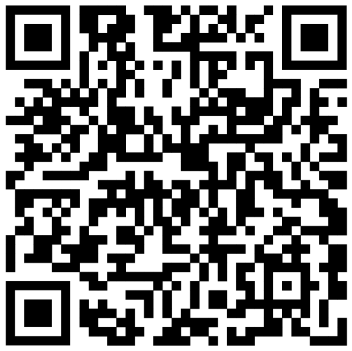
 and use your new knowledge of Bitcoin wallets to select the best one based on the criteria we discussed today. |

 
 

### ***7.3 Setting up a Mobile Bitcoin Wallet***    

Now that we have a better understanding of Bitcoin wallets and the differences between them, we’ll see how to use one in practice. For this example, we’ll create a mobile wallet directly on our smartphone.

 
 

### _Activity: Setting Up/Recovering a Bitcoin Wallet_

If students do not have cell phones, the teacher will provide one to each student to borrow. There are two options for this activity.

| Images | Class Exercise: Option 1 - Download a new wallet. |
| :-------: | :------- |
| 

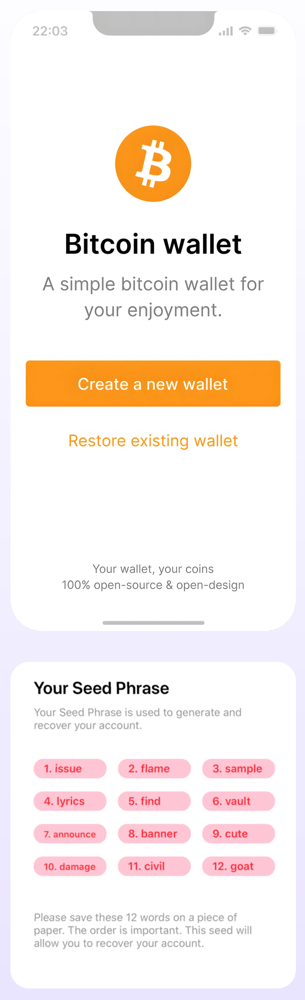
 | **How to create and use a Bitcoin wallet:**     1. ⭐ Search for the app in the App Store (iOS) or Google Play Store (Android).     2. ⭐ Open the app and type in your 12- or 24-word recovery phrase (sometimes called a seed phrase). **Be sure to write it down and keep this in a safe place!** This recovery phrase allows you to recover full access to your funds if needed.     **Remember that if you lose or forget this sequence of words, you will not be able to access your bitcoins if you lose access to your wallet.**     3. ⭐ You must then confirm that you have actually saved your recovery or seed phrase. To do this, you must enter, in the same order, the words of your seed phrase.     4. ⭐ As an additional measure of security, some wallets allow you to choose a secure password. Your private key and first Bitcoin address are automatically created for you by your wallet.       Think of your public address as your email address – you want to share this with others so that they can send you bitcoins— or, in the case of an email address, an email.     Think of your private address as the password to your email – you wouldn’t want to share this with anyone as it would give them access to your email.       5. ⭐ Use your “receive” address to receive bitcoins. Transfer bitcoins to your wallet. With a self-custodial wallet, you cannot always buy bitcoins directly with fiat, so you might need to purchase and transfer it from an exchange first. |

 

| Images | Class Exercise: Option 2 - Restore Wallet (Time Limited). |
| :-------: | :------- |
| 

 | **Download a Bitcoin wallet and add some satoshis for each student.**     Give each student a sheet with a seed phrase to retrieve a wallet.     **Guide students step-by-step:**     1. ⭐ When you first start your wallet, you will see three methods of wallet creation, tap **[Import an existing wallet]** You will see an introduction screen, tap **[Restore with recovery phrase]**     2. ⭐ Enter your 12/18/24-word recovery phrase one by one, in the correct order.     3. ⭐ Touch **[Restore]** when finished.     4. ⭐ You will see an “Import Successful” mode when your wallet has been successfully imported. |

 
 

### ***7.4 Receiving and Sending Transactions***    

A bitcoin transaction is a transfer of ownership of existing bitcoins to a new owner. However, instead of transferring actual coins, all the nodes in the network update their local copy of the public ledger to reflect the change in ownership.

When sending a bitcoin transaction, the sender signs a message that only they can sign with their private key, signaling to the network that the ownership of the bitcoins changes to the recipient’s address.

The bitcoins will now be tied to an address that only the new owner can send from, giving them ownership of the bitcoins.

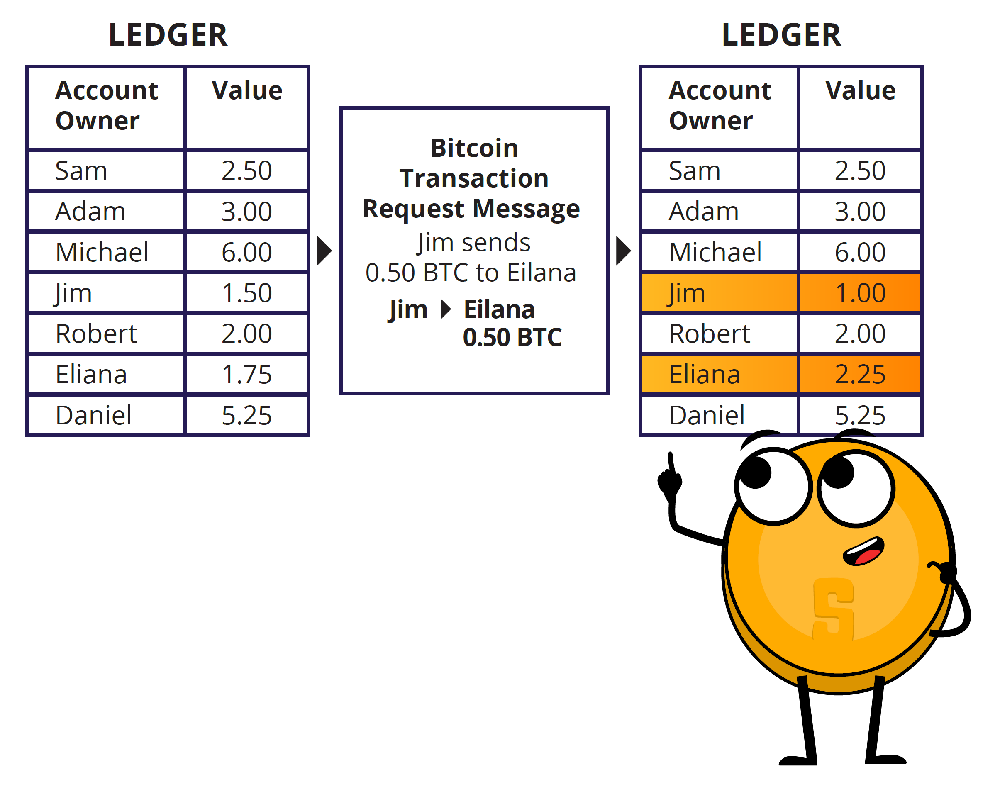

New bitcoin transactions are initiated from wallets around the world, but there is no central payment processor. Instead, miners around the world compete to record transactions in the ledger.

Let’s say Jim owes Eliana 0.5 BTC and is ready to pay her back. Both have digital wallets.

1. ⭐ Eliana shares her address with Jim.

2. ⭐ Jim uses his wallet software to create the transaction, which includes Eliana’s address, the amount to be transferred (0.5 BTC), and a fee for the miner.

3. ⭐ After signing the transaction, it is broadcast to the network where it is verified by nodes. Nodes check the transaction for validity and ensure that Jim has enough funds. If he does not, they reject the transaction immediately.

4. ⭐ Once the transaction is verified, it is added to the blockchain by miners, and the funds are transferred to Eliana’s address.

5. ⭐ Eliana can then use her private key to access the transferred funds in her wallet.

It’s important to note that once the transaction is complete, it cannot be reversed.

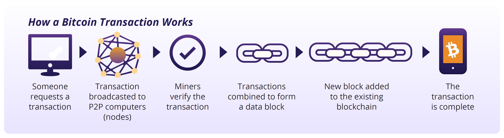

| Images | Receiving Bitcoin Transactions: |
| :-------: | :------- |
| 

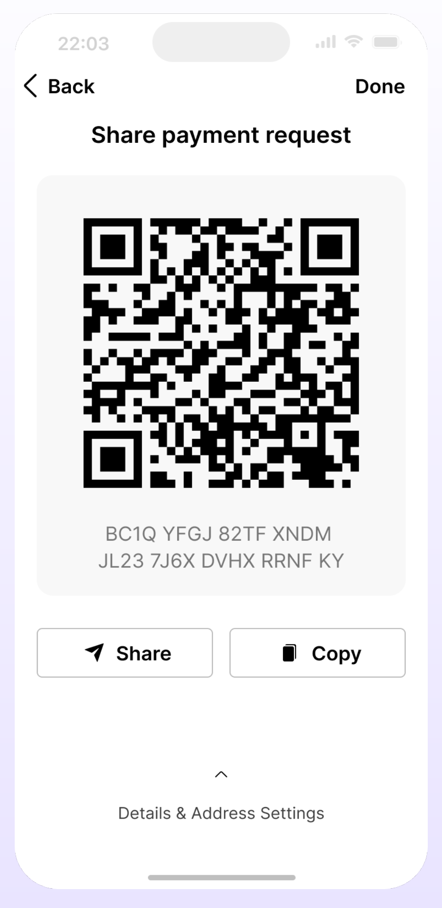
 | To receive bitcoins, you will need to provide the sender with your Bitcoin wallet address. This is a unique string of letters and numbers that represents your wallet and is used to identify it on the Bitcoin network. You can find your wallet address by logging into your Bitcoin wallet and looking for an option to “Receive” or “Deposit” bitcoins.     **You can then share your Bitcoin address with the sender in one of several ways:**     1. ⭐ Copy and paste the address: You can copy the address by highlighting it and pressing “Copy” on your keyboard, then paste it into an email or message to the sender.     2. ⭐ Share a link to your Bitcoin wallet: Some Bitcoin wallets allow you to create a link to your wallet that you can share with the sender. They can then click on the link to access your wallet and send the bitcoins.     3. ⭐ Share a QR code: If the sender has a smartphone with a Bitcoin wallet app, they can scan the QR code to get your Bitcoin address |

 

Once the sender has your Bitcoin address, they can send you bitcoins by entering your address and the amount they want to send you and initiate the transaction. The bitcoins will then be sent to your wallet and will be visible once the transaction is confirmed on the Bitcoin Network. This usually takes a few minutes.

Next, we will take a look at sending bitcoin transactions.

| Images | Sending Bitcoin Transactions: |
| :-------: | :------- |
| 

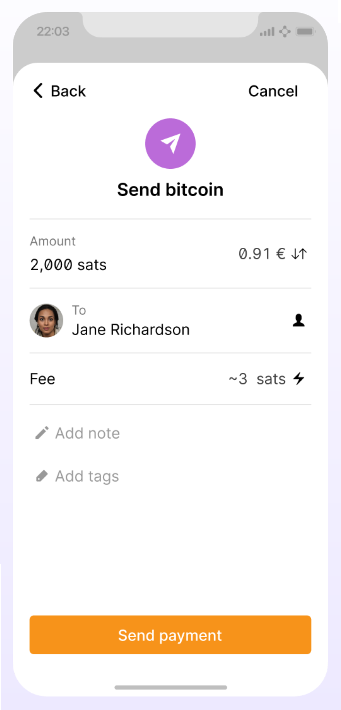
 | To send bitcoins, you will need a few things: a Bitcoin wallet, the recipient’s Bitcoin address, and the amount of bitcoin you want to send.     1. ⭐ Open your Bitcoin wallet. An SMS code will be sent to your phone number, and you will need to enter it in the dialog box. Alternatively, if you have enabled Google 2FA, you will need to enter the six-digit code from the Google Authenticator app.     2. ⭐ Navigate to the “Send” or “Withdraw” feature and copy the recipient’s address.     3. ⭐ Enter the recipient’s Bitcoin address by pasting it in the “To” field.     4. ⭐ Enter the amount of bitcoins you want to send in the “Amount” field.     5. ⭐ Double-check the recipient’s address and the amount to be sent.     6. ⭐ Before clicking “Confirm and Send,” we recommend you double-check the transaction details one more time to ensure that you are sending the correct amount of bitcoins to the correct wallet address.     7. ⭐ Confirm the transaction and wait for the network to confirm the transaction.       Now you know how to evaluate, select, and set up a self-custodial Bitcoin wallet. Sending bitcoins from one wallet to another on the Bitcoin network is called sending an “on-chain” transaction. This is because the transaction occurs on the main Bitcoin network blockchain. On-chain transactions are the safest way to transact with bitcoins; however, transactions are more expensive and slower than other options, as we will discuss in Chapter 8. |

 
 

### _Activity: Bitcoin Transactions in Action_

**Objective:** To understand the underlying concepts and mechanics of a peer-to-peer bitcoin transaction.

**Before we get started, here’s a quick reminder on the key players in a bitcoin transaction:**

- ⭐ Senders and Receivers are the parties who wish to transact with each other.

- ⭐ Nodes validate transactions and store a complete copy of the blockchain. *Light nodes let people validate transactions while using less storage and fewer computational resources.

- ⭐ Miners are responsible for adding new transactions to the blockchain.

**Understand your role. You have been assigned one of the following: sender, receiver, node, or miner.**

- ⭐ Senders will be responsible for creating and broadcasting transactions.

- ⭐ Receivers will be responsible for receiving and verifying transactions.

- ⭐ Nodes will be responsible for validating the transactions.

- ⭐ Miners will be responsible for adding the transactions to the blockchain.

**Both nodes and receivers have to verify transactions**

1. ⭐ **As a sender:** Create a transaction.    
    To create a transaction, follow these steps:
    - ☆ Take a transaction note and write the number of coins you want to send and the name or initials of the receiver.
    - ☆ Sign the note with your name or initials, simulating a private key.
    - ☆ Pass the transaction note and the corresponding number of coins to the receiver.

2. ⭐ **As a receiver:** You are responsible for verifying the transactions. Follow these steps:
    - ☆ Check the transaction note to ensure that the correct number of coins and the receiver’s name or initials are written.
    - ☆ Count the coins received and compare them to the number of coins written on the note.
    - ☆ If the coins match, check the approval box. If the coins do not match or you have doubts, reject the transaction.

| **$\color[RGB]{82,49,131} Coins \ Sent$** | **$\color[RGB]{82,49,131} Sender$** | **$\color[RGB]{82,49,131} Sender \ Signature$** | **$\color[RGB]{82,49,131} Reciver$** | **$\color[RGB]{82,49,131} Date \ and \ Time$** | **$\color[RGB]{82,49,131} Recipient \ Approval$** |
| :----: | :----: | :----: | :----: | :----: | :----: |
| ______ | ______ | ______ | ______ | ______ | ______ |

3. ⭐ **As a node:** Verify and validate transactions. You are responsible for checking that the transaction is valid.
    - ☆ Verify that the sender’s address and the receiver’s address are valid.
    - ☆ Check that the sender has enough funds to complete the transaction and that the transaction does not double-spend any coins.

| **$\color[RGB]{82,49,131} Coins \ Sent$** | **$\color[RGB]{82,49,131} Sender$** | **$\color[RGB]{82,49,131} Sender \ Signature$** | **$\color[RGB]{82,49,131} Reciver$** | **$\color[RGB]{82,49,131} Date \ and \ Time$** | **$\color[RGB]{82,49,131} Node \ Approval$** |
| :----: | :----: | :----: | :----: | :----: | :----: |
| ______ | ______ | ______ | ______ | ______ | ______ |

4. ⭐ **As a miner:** You are responsible for adding the transactions to the blockchain. Follow these steps:

    - ☆ Check the transactions that have been approved by the receivers and validated by the nodes.
    - ☆ Roll the dice and compare the numbers with the other miner. The miner with the smaller number will add the transaction to the blockchain.
    - ☆ For your time, energy, and effort, you will earn a point. At the end of the activity, the miner with the most points wins.

**Once a transaction is added to the blockchain, it cannot be changed or reversed.

5. ⭐ **Keep track of your coin balance:** Throughout the activity, keep track of your coin balance by counting the coins in your digital wallet.

| **$\color[RGB]{82,49,131} Coins \ Sent$** | **$\color[RGB]{82,49,131} Sender$** | **$\color[RGB]{82,49,131} Sender \ Signature$** | **$\color[RGB]{82,49,131} Reciver$** | **$\color[RGB]{82,49,131} Date \ and \ Time$** | **$\color[RGB]{82,49,131} Approval$** |
| :----: | :----: | :----: | :----: | :----: | :----: |
| ______ | ______ | ______ | ______ | ______ | ______ |

6. ⭐ Discuss the concepts learned with your class.

 
 

### ***7.5 Saving in Bitcoin***    

Bitcoin is a way to safeguard your money against inflation and protect it from being controlled by anyone else, if you do it correctly. Saving in bitcoins provides a vehicle to store, accumulate, and build wealth over time. As you understand by now, the type of money you choose to save is one of the most important decisions you can make. Choosing wisely allows you to build a better future for yourself and your family.

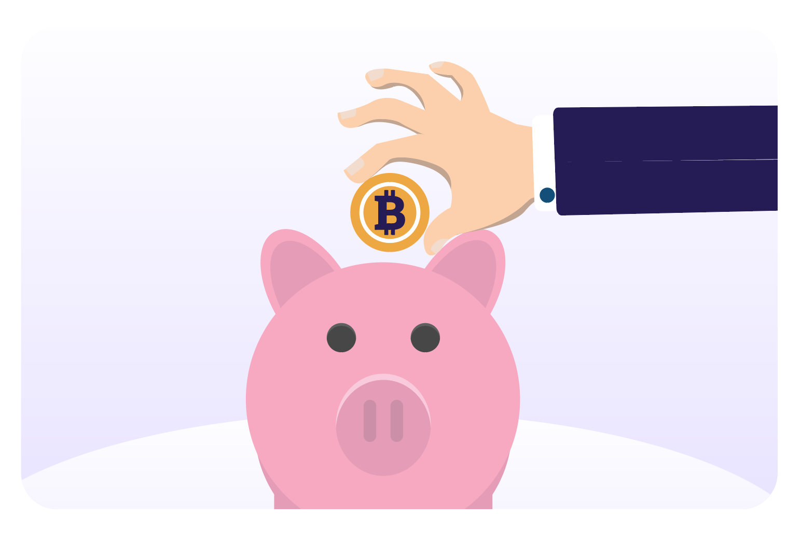

 

**Peace of Mind:** When stored properly, Bitcoin is the only form of property no one can take away from you.

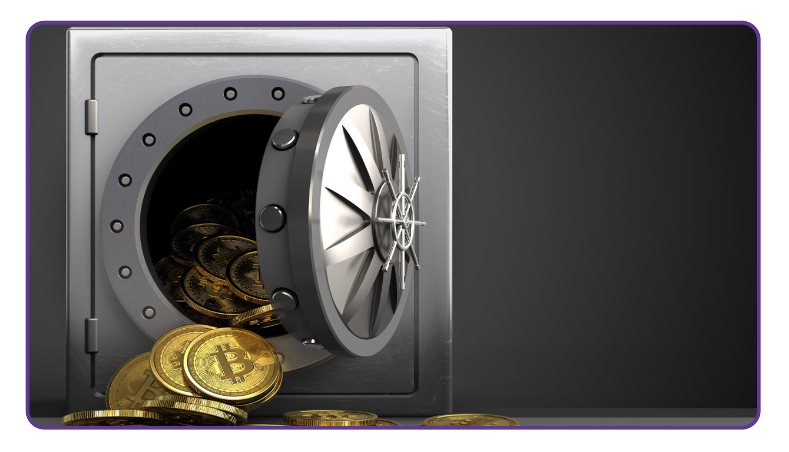

 
 

### ***7.6 Don’t Trust, Verify***    

Whatever you do in Bitcoin, remember this: “Don’t Trust, Verify.” There are no leaders in Bitcoin. You should never blindly follow someone’s claims. Rather, you should always question what you’re being told and verify it for yourself. By following this mantra, you’ll protect yourself from losing your bitcoins. This goes for claims such as “the next Bitcoin” just as it does for “investment opportunities” or promises of “quick and easy profits.”

In summary, Chapter 7 has given you the important skills to use Bitcoin in your everyday life. You have learned how to get and exchange bitcoins in different ways and how to keep it safe using various wallets.

By setting up your mobile Bitcoin wallet and making transactions with others, you now have hands-on experience to confidently use Bitcoin day-to-day. Understanding Bitcoin as a way to save money and following the idea of DYOR – “Don’t Trust, Verify," you're now in control of your money.

In the upcoming chapter, we will explore the Lightning Network. We will look at how this innovative technology is changing the way people worldwide access and use money. From everyday transactions to more advanced applications, you will learn how the Lightning Network empowers individuals, communities, and businesses by providing them access to financial services.
