## _Chapter #8_

# ***Lightning Network: Using Bitcoin in Your Daily Life***

- [**8.0** Introduction](https://github.com/MyFirstBitcoin/Bitcoin-Diploma-2024/blob/main/Web%20View/20.Chapter-8.md#80-introduction)    
  - [**Activity:** Watch “Bitcoin Lightning Network Explained: How it Actually Works”](https://github.com/MyFirstBitcoin/Bitcoin-Diploma-2024/blob/main/Web%20View/20.Chapter-8.md#activity-watch-this-video-on-the-lightning-network)    
- [**8.1** The Lightning Network](https://github.com/MyFirstBitcoin/Bitcoin-Diploma-2024/blob/main/Web%20View/20.Chapter-8.md#81-the-lightning-network)    
- [**8.2** Different Types of Lightning Wallets](https://github.com/MyFirstBitcoin/Bitcoin-Diploma-2024/blob/main/Web%20View/20.Chapter-8.md#82-different-types-of-lightning-wallets)    
  - [**8.2.1** Self-Custodial vs Custodial Wallets](https://github.com/MyFirstBitcoin/Bitcoin-Diploma-2024/blob/main/Web%20View/20.Chapter-8.md#821-self-custodial-vs-custodial-wallets)
  - [**8.2.2** Open Source vs Closed Source](https://github.com/MyFirstBitcoin/Bitcoin-Diploma-2024/blob/main/Web%20View/20.Chapter-8.md#822-open-source-vs-closed-source)    
- [**8.3** Setting Up a Bitcoin Lightning Wallet](https://github.com/MyFirstBitcoin/Bitcoin-Diploma-2024/blob/main/Web%20View/20.Chapter-8.md#83-setting-up-a-bitcoin-lightning-wallet)    
- [**8.4** Sending and Receiving Lightning Transactions](https://github.com/MyFirstBitcoin/Bitcoin-Diploma-2024/blob/main/Web%20View/20.Chapter-8.md#84-sending-and-receiving-lightning-transactions)
  - [**Activity:** Lightning Wallet Relay Race](https://github.com/MyFirstBitcoin/Bitcoin-Diploma-2024/blob/main/Web%20View/20.Chapter-8.md#activity-class-exercise-lightning-wallet-relay-race)    
- [**8.5** Buying Coffee and Groceries with Bitcoin](https://github.com/MyFirstBitcoin/Bitcoin-Diploma-2024/blob/main/Web%20View/20.Chapter-8.md#85-buying-coffee-and-groceries-with-bitcoin)
  - [**8.5.1** Online: Payment Plugins - Ecommerce](https://github.com/MyFirstBitcoin/Bitcoin-Diploma-2024/blob/main/Web%20View/20.Chapter-8.md#851-online-payment-plugins---ecommerce)    
  - [**8.5.2** In person: Find a Merchant in Your Area](https://github.com/MyFirstBitcoin/Bitcoin-Diploma-2024/blob/main/Web%20View/20.Chapter-8.md#852-in-person-find-a-merchant-in-your-area)    
  - [**8.5.3** Transitional tools: Gift Cards and Payment Cards](https://github.com/MyFirstBitcoin/Bitcoin-Diploma-2024/blob/main/Web%20View/20.Chapter-8.md#853-transitional-tools-vouchers-gift-cards-and-payment-cards)    
  - [**8.5.4** Circular Economies and Bitcoin as a Medium of Exchange](https://github.com/MyFirstBitcoin/Bitcoin-Diploma-2024/blob/main/Web%20View/20.Chapter-8.md#854-circular-economies-and-bitcoin-as-a-medium-of-exchange)    

 

______________________________________________________________________________________________________

### ***8.0 Introduction***    

> "We’re building the Visa network for bitcoin. But what I think is powerful, is unlike Visa, anybody can build on top of it.”    
 **$\color[RGB]{250,175,64} Elizabeth \ Stark$**

 

Technologies typically grow and expand in layers, like a stack. Think of your favorite website, email, or social media: they were built on top of the internet protocol, which was built on top computers, which were built on top of electricity, and so on. These technologies started out with a very simple design and continued to improve over time.

Bitcoin is no exception. As Andreas Antonopoulos famously put it, “Bitcoin is the Internet of Money.” It is the base layer of sound digital money, providing a solid foundation upon which new technology will be built.

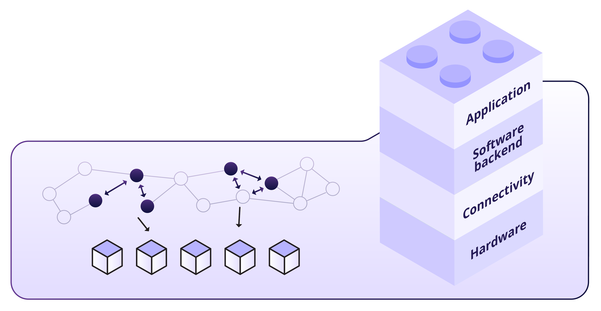

One of these layers is called the Lightning Network. This is like a super-fast highway for Bitcoin, helping people send and receive bitcoins quickly and with very low fees. It allows users to make instant, small transactions on top of the regular Bitcoin network. This makes buying a coffee or paying a friend simple and fast!

Remember: A satoshi is like the smallest coin of bitcoin. Just like a dollar can be broken into cents, one bitcoin can be split into smaller units called satoshis. One bitcoin equals 100 million satoshis, making satoshis the tiniest bits of value in the Bitcoin system. In this chapter, when we talk about sending bitcoins through the Lightning Network, we'll call it "sending sats," which are just smaller parts of a bitcoin.

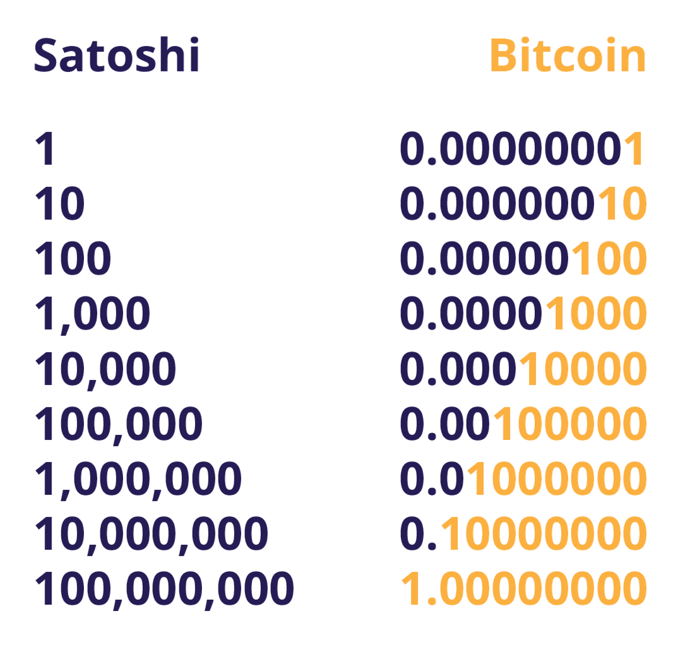

 
 

### _Activity: Watch this video on the Lightning Network_

<a rel="YouTube video of -- Bitcoin Lightning Network Explained: How it Actually Works" href="https://www.youtube.com/watch?v=yKdK-7AtAMQ">

 
 

### ***8.1 The Lightning Network***   

As we've just seen, the Lightning Network serves as a payment system facilitating quick and cost-effective transactions with bitcoins. It operates by establishing a shared wallet where both parties hold some bitcoins. They can conduct numerous transactions between each other without the need to record each one on the main ledger. The final balance is then recorded on the ledger once the transactions are complete.

 

- 💡 **The Lightning Network is a payment system that allows users to send and receive payments quickly and inexpensively using bitcoin. It works by setting up a shared wallet where both people store their bitcoins and then making unlimited transactions between each other without touching the main blockchain. When they're done, the final balance is recorded on the main blockchain.**

 

Picture a day spent doing some work in a cafe. Anticipating a full day's stay, you open a tab and prepay some money instead of paying each time you order something. When you're ready to leave at the end of the day, you and the owner review the tab to settle the final bill. If you paid more than your actual consumption, you receive some money back.

Now, envision thousands of people doing the same thing simultaneously and allowing others to use their tabs to connect with more people. That's the Lightning Network!

With Lightning, you can make payments to anyone on the network, not just the person you share a direct tab with. Your payment can navigate through the network until it reaches its destination, even if you don't have an open channel with the recipient.

Let’s take a look at the difference between on-chain transactions (the type we discussed in Chapter 7) and off-chain transactions (Lightning Network):

 

**On-Chain Transactions:**    
These are transactions that happen directly on the Bitcoin blockchain. They take about 10 minutes to confirm and the fees depend on the size of the transaction in bytes. They are more secure but slower.

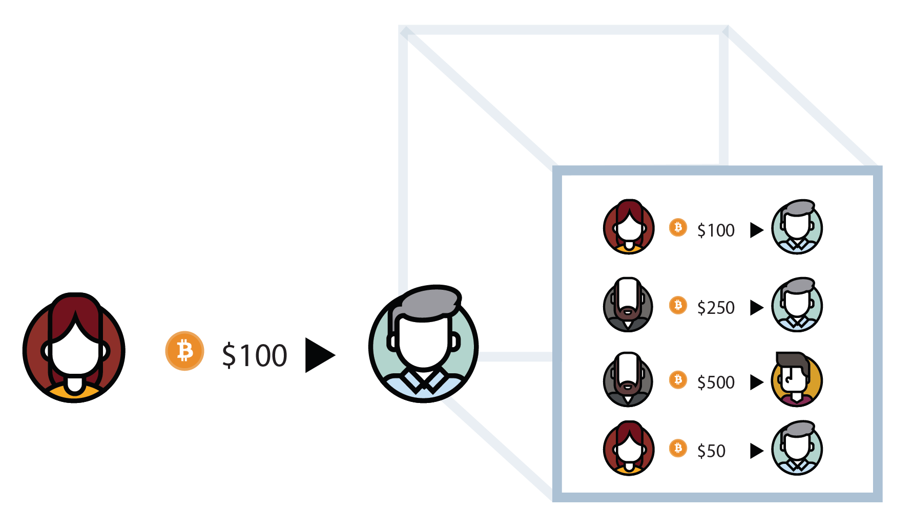

 

**Off-chain transactions (Lightning Network):**
These transactions happen on a separate network built on top of the Bitcoin blockchain. They are settled faster and with lower fees.

They are commonly used where regulations and laws support their adoption and where features like the speed and cost of transactions are more important. When compared to transactions on-chain, they are less secure.

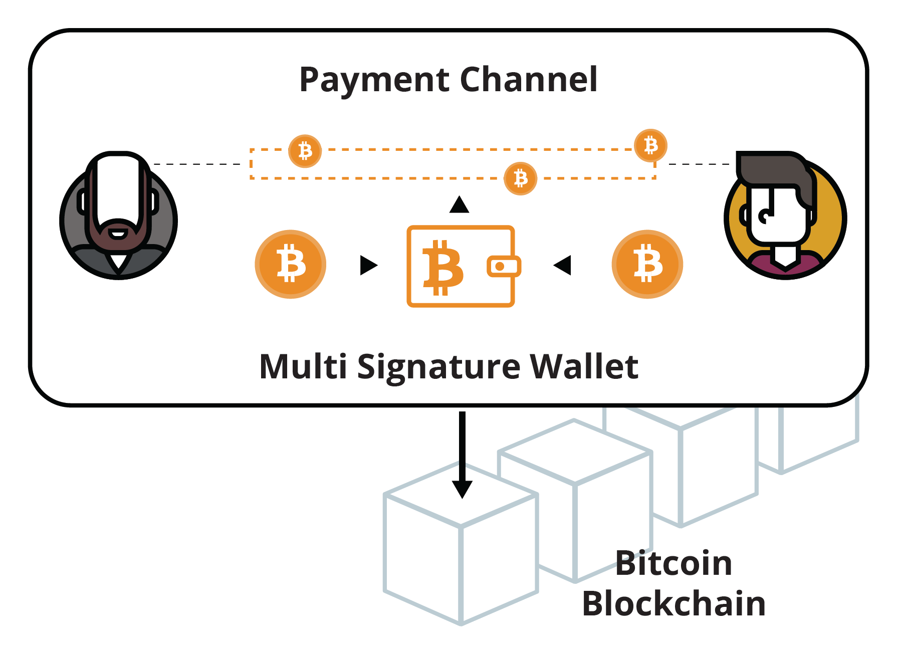

 

| **Payment Network** | **Bitcoin Network** | **Lighting Network** |
| :-----: | :------------: | :-----------: |
| **Definition** | A decentralized digital network that uses cryptography to secure financial transactions | A second layer payment protocol that operates on top of the Bitcoin blockchain, enabling faster and cheaper transactions |
| **Advantages** | Decentralized and secure. No chargebacks or fraud. Can be used anonymously. Global acceptance | Faster and cheaper transactions. Increased scalability. Off-chain transactions do not clog the blockchain |
| **Disadvantages** | Slow transaction times. High fees for certain types of transactions. Complex for beginners | Requires trust in the channel operators. Still experimental and not widely adopted. Requires on-chain transaction to open and close channels |

 
 

### ***8.2 Different Types of Lightning Wallets***    

A Lightning wallet is a bit different than a Bitcoin wallet, though it performs the same function: receiving and sending bitcoins. The difference is that a Lightning wallet allows you to send bitcoins on the Lightning Network, which itself is a second layer on top of the Bitcoin network.

Just as we saw in the previous chapter with Bitcoin wallets, Lightning wallets have different characteristics that need to be considered before choosing one.

 
 

### _8.2.1 Self-Custodial vs Custodial Wallets_

Lightning wallets can be broken down into very specific categories, but for the sake of simplicity, we’ll divide them into two: self-custodial and custodial.

Just like Bitcoin wallets, a self-custodial Lightning wallet is one where you control the keys to the wallet, whereas a custodial Lightning wallet is one where someone else controls the keys.

When using a custodial wallet, you’re only given access to the wallet, but you depend on someone else for permission to use your money; you’re giving up ownership of your money for convenience.

This can be acceptable for small amounts, although it’s recommended to use a self-custodial wallet once you have an understanding of the technology.

For what follows, we’ll be talking about self-custodial Lightning wallets only.

 
 

### _8.2.2 Open Source vs Closed Source_

Just like the Bitcoin wallets we saw in the previous chapter, Lightning wallets can be open-source or closed source. Always use open-source wallets as they are completely open for review and vetted by the community.

An open-source application also means that anyone can contribute to the improvement of the software, making it a better choice for users.

 
 

### ***8.3 Setting up a Bitcoin Lightning Wallet***    

Setting up a self-custodial Bitcoin Lightning wallet is the same as setting up a self-custodial on-chain Bitcoin wallet.

 

**Class Exercise** - Option 1. Download a new self-custodial lightning wallet

**How to create and use a Bitcoin Lightning wallet.**

1. ⭐ Search for the app in the App Store (iOS) or Google Play Store (Android).

2. ⭐ Open the app and type in your 12- or 24-word recovery phrase (sometimes called a seed phrase). **Be sure to write it down and keep this in a safe place!** This recovery phrase allows you to recover full access to your funds if needed.

**Remember that if you lose or forget this sequence of words, you will not be able to access your bitcoins if you lose access to your wallet.**

3. ⭐ You must then confirm that you have actually saved your recovery or seed phrase. To do this, you must enter, in the same order, the words of your seed phrase.

4. ⭐ As an additional measure of security, some wallets allow you to choose a secure password. Your private key and first Bitcoin address are automatically created for you by your wallet.

5. ⭐ Generate a Lightning invoice, address, or QR code to receive bitcoins. Transfer bitcoins to your wallet. With a self-custodial wallet, you cannot always buy bitcoins directly with fiat, so you might need to purchase and transfer it from an exchange first.

| Your Seed Phrase |
| :------------- |
| Your seed phrase is used to generate and recover your account.     1 **Issue** ; 2 **Flame** ; 3 **Sample** ; 4 **Lyrics** ; 5 **Find**   6 **Vault** ; 7 **Scissors** ; 8 **Banner** ; 9 **Cute** ; 10 **Damage**   11 **Civil** ; 12 **Goat**     Please save these 12 words on a piece of paper. The order is important. This seed will allow you to recover your account. |

*Note: if you are using a custodial wallet, you will not need to follow some of the steps in section 8.3. Using a custodial wallet comes with risk, as you will not be in control of your private key, which means you will not be in control of the money you keep in your wallet.

Now that we have set up our Bitcoin Lightning wallet, let’s look at receiving and sending Lightning transactions and how they are different from the on-chain transactions we sent in Chapter 7.

 
 

### ***8.4 Sending and Receiving Lightning Transactions***    

With a Lightning wallet, using Bitcoin is fast, cheap, and private, making transactions between two people easy. You can quickly send and receive bitcoins for everyday things like buying coffee or shopping.

Let’s look at a few examples of the Lightning Network in action.

 

**Example 1:**

Below, both Marcia and Eve have 5 units of currency each. Marcia wants to send 2 of her units to Eve, so she sends 2 units to Jeff. Jeff then passes on the 2 units to Eve, who now has 7 units. Marcia now has 3 units. And that’s it! The transaction is done.

The key point here is that Marcia and Eve don’t have to go through a bank or other intermediary to make the transaction happen.

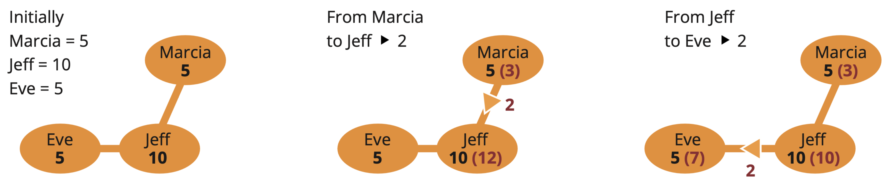

Jeff acts as an intermediary or a “trusted third party” in this scenario, where Marcia and Eve do not trust each other directly. Jeff receives the 2 units from Marcia and then passes it on to Eve, thus completing the transaction. By using Jeff as an intermediary, Marcia and Eve can complete the transaction without the need for a bank or other centralized institution, which can make the transaction faster, cheaper, and more secure. Jeff is a key element in this peer-to-peer transaction process.

 

As a node operator in a Lightning Network transaction, Jeff benefits in several ways:

1. ⭐ **Transaction fees**    
    Jeff earns a small fee for each transaction that passes through his node, which compensates him for the time and effort he puts into maintaining and running his node.

2. ⭐ **Network participation**    
    By running a Lightning node, Jeff is participating in the network and helping to increase its decentralization, security, and stability. This can increase Jeff’s reputation and credibility as a reliable node operator, making him a more attractive intermediary for future transactions.

3. ⭐ **Network growth**    
    As the Lightning Network grows and more people use it, the number of transactions passing through Jeff’s node is likely to increase, which can result in increased income from transaction fees.

4. ⭐ **Increased network security**    
    Jeff’s role as an intermediary helps to increase the security of the network by adding an additional layer of protection between Marcia and Eve. This can increase the confidence of users in the network, making it more attractive to new users and helping to drive growth. Overall, being a node operator in the Lightning Network can provide Jeff with a steady source of income, as well as the opportunity to contribute to the growth and development of the network.

In summary, **on-chain transactions are slower but more secure, while off-chain (Lightning Network) are faster but less secure.** You should consider the tradeoff between security and speed depending on your needs.

 

**Example 2:**

Mina has a serious love for McDonald’s; she goes there for breakfast, lunch, and dinner every day! But with so many different payment options available, she’s not sure which one is the best choice. Luckily, she’s learned a little bit about Bitcoin and the Lightning Network. After comparing the tables below, Mina has no doubt that using a Lightning payment method is the way to go.

**The Lightning Network vs The Traditional Banking System**
| Benefits | Lightning | Traditional Banking System |
| :-------------: | :-------------: | :---------: |
| **Speed** | Fast | Slow |
| **Transparency** | Transparent | Opaque |
| **Security** | Secure | Vulnerable |
| **Transaction Fees** | Low | High |
| **Financial Inclusion** | High | Limited |

 

| Benefits | Lightning | Traditional Banking System |
| :-------------: | :-------------: | :---------: |
| **Scalability** | High | Low |
| **Privacy** | High | Moderate |
| **Interoperability** | High | Low |
| **Legal Compliance** | Moderate | High |
| **Costeffectiveness** | High | Moderate |

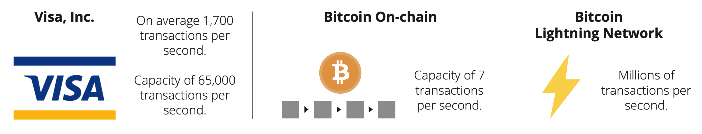

 

Mina is also a fan of fast, secure, and cost-effective transactions, so she decided to use Lightning for her purchases at McDonald’s. With Lightning, she can enjoy her meals even more knowing that her payments are processed instantly, securely, and with low fees. Plus, since the Lightning Network provides financial inclusion, Mina can now pay for her meals even if she is in a remote area in El Salvador.

To get started with Lightning, Mina first downloads a Lightning wallet on her phone. She then funds her wallet by sending some bitcoins from her regular Bitcoin wallet to her new Lightning wallet. This process is called “funding the wallet” or “funding a payment channel.” Mina can fund her wallet with any amount of bitcoins she is comfortable with, but it’s important to note that the amount of bitcoins she locks in her Lightning wallet cannot be used in her on-chain transactions.

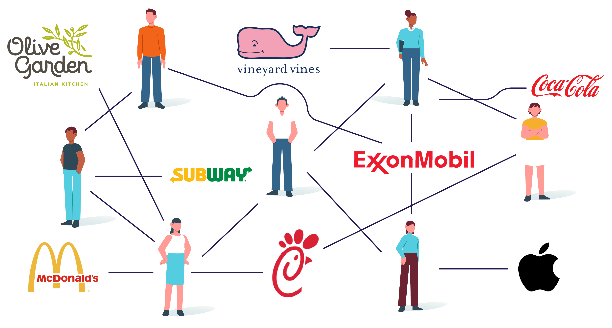

Once her Lightning wallet is funded, she can use it to make payments to McDonald’s.

McDonald’s has a Lightning node, so Mina can open a payment channel with them by sending some of her bitcoins from her Lightning wallet to a specific address provided by McDonald’s. This moves her bitcoins from the Bitcoin blockchain to an off-chain transaction on the Lightning network.

 

With the payment channel open, Mina can now make purchases at McDonald’s without having to open a new channel or pay high fees each time. The channel stays open as long as both Mina and McDonald’s want to use it. For example, if Mina buys a hamburger for 0.0005 bitcoins, the channel tracks that Mina now has 0.9995 bitcoins. And if she buys a milkshake for 0.0003 bitcoins the next day, the channel tracks that Mina now has 0.9992 bitcoins.

 

When Mina decides she wants to use her bitcoin balance for something else, she closes the channel by broadcasting a closing transaction to the Bitcoin blockchain. This is done by initiating a closing transaction in her Lightning wallet, and the transaction contains the final balance of the channel agreed to by both parties. The transaction is then broadcast to the Bitcoin blockchain and confirmed by a miner. Once the transaction is confirmed, the channel is closed, and the remaining bitcoins in the channel will be returned back to Mina and McDonald’s.

It’s important to note that closing a channel can take some time to be confirmed on the blockchain. During this waiting period, the funds are still locked in the channel and cannot be used for on-chain transactions. Mina will receive a notification once the closing transaction is confirmed.

Now that we have set up our Lightning wallet and read about how to use the Lightning network to send transactions, we are going to play a game where we send satoshis (the smallest unit of bitcoin) to other students in the class over the Lightning network.

| 

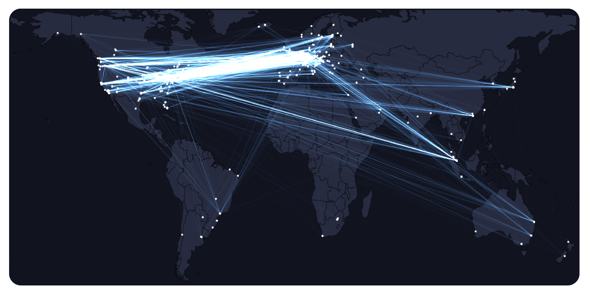
 |
| :-------: |
| This is a map of the entire world. With the Lightning Network, you can send satoshis to any user on the network with a Bitcoin Lightning wallet. The payment will arrive in a few seconds and will only cost a few cents.     Check it out for yourself:   

<a rel="Lightning network map in Mempool" href="https://mempool.space/graphs/lightning/nodes-channels-map">
 |

 
 

### **Activity:** _Class Exercise: Lightning Wallet Relay Race_

1. ⭐ First, you will need to download a Lightning wallet onto your phone or computer.

2. ⭐ Follow the instructions for installing the wallet on your device in section 8.3 of this chapter.

3. ⭐ Once the wallet is installed, open it and follow the prompts to set it up. This may involve creating a new wallet or restoring an existing one and securing it with a password or other form of authentication.

4. ⭐ Generate a Lightning invoice, address, or QR code to receive bitcoin.

5. ⭐ When your wallet is set up and you are ready to receive satoshis, your teacher will give you and your group a starting amount of satoshis by sending them directly to your wallet.

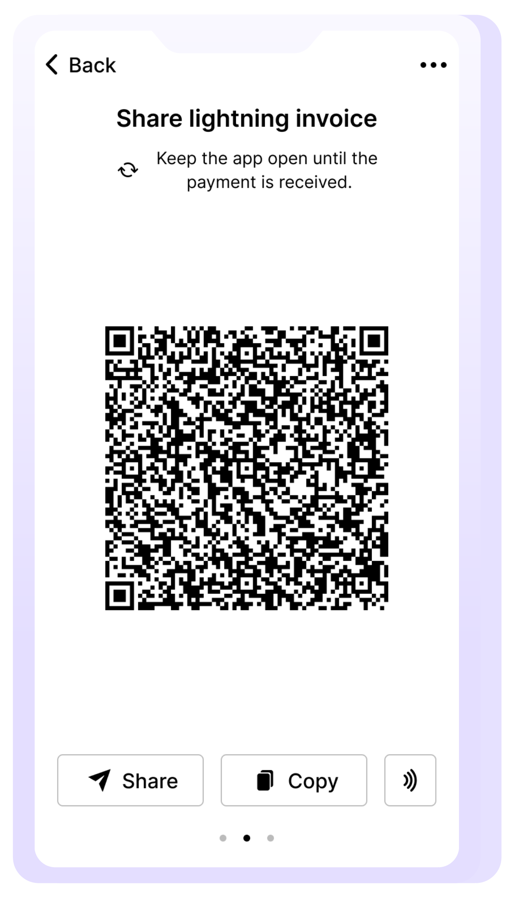

| Group Activity: |
| :------ |
| 1. Your group’s goal is to pass the satoshis from one person’s wallet to another using the Lightning Network until they reach the last person in the group.     2. To send satoshis to another person, open your wallet and follow the instructions for making a payment. You will need to provide the recipient’s Lightning invoice or scan a QR code and enter the amount of satoshis you want to send.     3. If your group is the first to successfully send the satoshis to the last person, you win! (And get to keep the sats).       **$\color[RGB]{62,45,109} Discuss \ any \ difficulties \ your \ group \ had \ with \ the \ activity. \ Was \ sending \ a \ transaction \ easy, \ fast, \ and \ inexpensive? \ Do \ you \ think \ the \ Lightning \ Network \ is \ easy \ to \ use \ and \ understand?$** |

 
 

### ***8.5 Buying Coffee and Groceries with Bitcoin***    

Have you ever wondered if you could use bitcoins to buy your daily cup of coffee or stock up on groceries? Turns out you can. There are many options both online and in person that let you pay with bitcoins. We’ll explore some of those options and tools which will help you find local stores so you can spend bitcoins.

Even though paying with a credit card or an app can seem easy to understand for the person paying, the processing of the payment is actually very complex and involves many different parties.

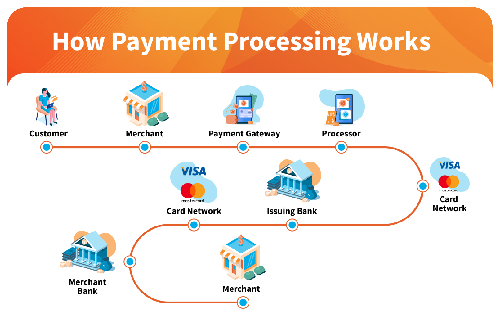

When you buy things, there are many parties involved, and each party charges a fee. For store owners, these fees can be a lot—more than 3% of the price, which is a big amount for them.

And that’s not to mention currency exchange fees!

 

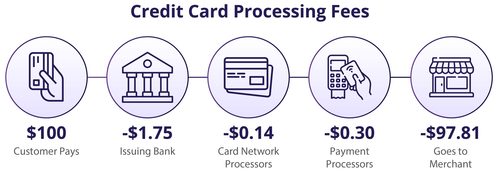

With Bitcoin and the Lightning Network, businesses can receive instant payments from all over the world via an open, secure, internet-native, borderless, and censorship-resistant monetary system.

Next, we will look at a few ways merchants can easily accept payments in bitcoins.

 
 

### _8.5.1 Online: Payment Plugins - Ecommerce_

BTCPayServer is an open-source payment processor that allows merchants to accept payments in bitcoins with little technical knowledge. It’s completely free and doesn’t charge any commission.

**Online businesses can integrate BTCPayServer seamlessly by adding the BTCPay plugin to their website.**

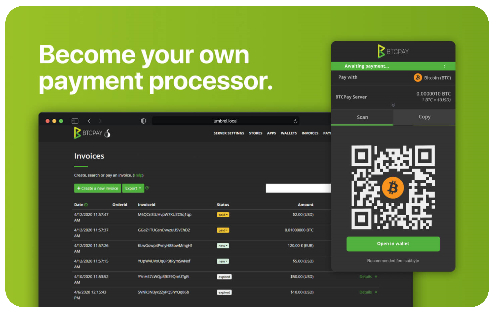

 

Because BTCPay Server is an open-source project, not a company, you can contribute to the project once you learn more about it and computer programming.

**Check out [BTCPayServer](https://btcpayserver.org/) for more information on how to use this payment system for your in-person or online business.**

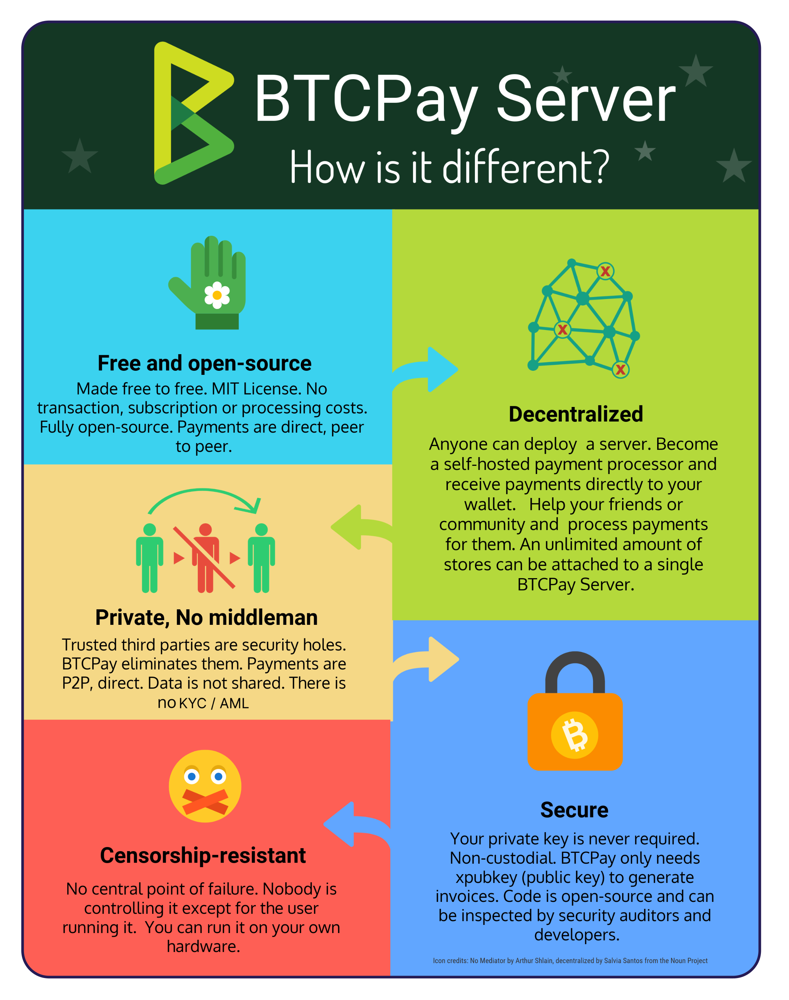

 
 

### _8.5.2 In-Person: Find a Merchant in Your Area_

Physical shops can also use BTCPayServer to accept payments, or they can simply download a Bitcoin wallet and accept Bitcoin payments directly from their phone.

 

To find a merchant that accepts Bitcoin in your area, go to BTCMap.org and search for your region.

[BTCMap.org](https://btcmap.org/) is an open-source map where merchants that accept Bitcoin can list their businesses. It’s a powerful tool for people who wish to spend their bitcoins.

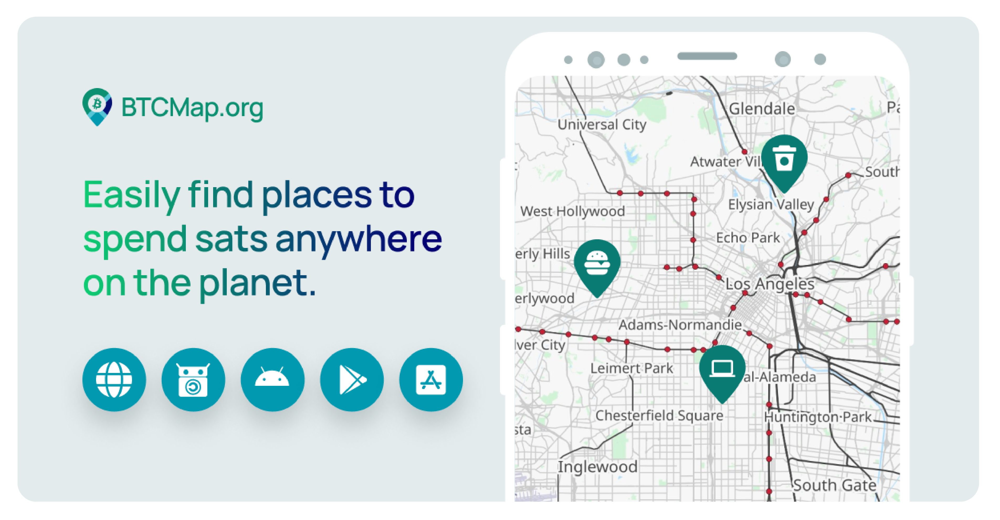

 
 

### _8.5.3 Transitional Tools: Vouchers, Gift Cards, and Payment Cards_

To purchase products or services from businesses that do not yet accept Bitcoin, there is an intermediary tool you can use: gift cards.

Some businesses focus on buying and selling gift cards in exchange for bitcoins. That means you can acquire a gift card for the store you’d like to go to in exchange for bitcoins and then spend the gift card directly at the store.

Plane tickets, hotels, games, SIM cards… you can buy almost anything with bitcoins and gift cards!

 
 

### _8.5.4 Circular Economies and Bitcoin as a Medium of Exchange_

The concept of circular economy comes from the idea of minimizing waste in an economy by reusing and recycling as many products and byproducts as possible.

Drawing from this concept, a Bitcoin circular economy is one where the transactions are made in bitcoins and where the money in the form of bitcoins stays and grows within the economy, benefitting its individuals and businesses.

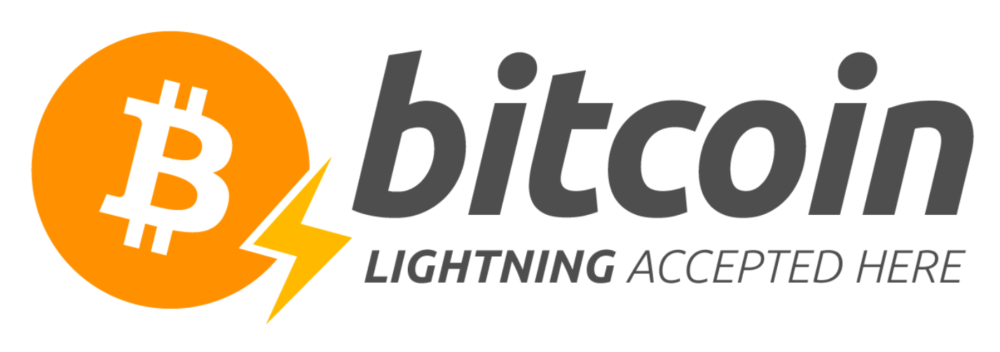

 

The Lightning Network enables Bitcoin circular economies to flourish all around the world thanks to near-instant and low-fee bitcoin transactions.

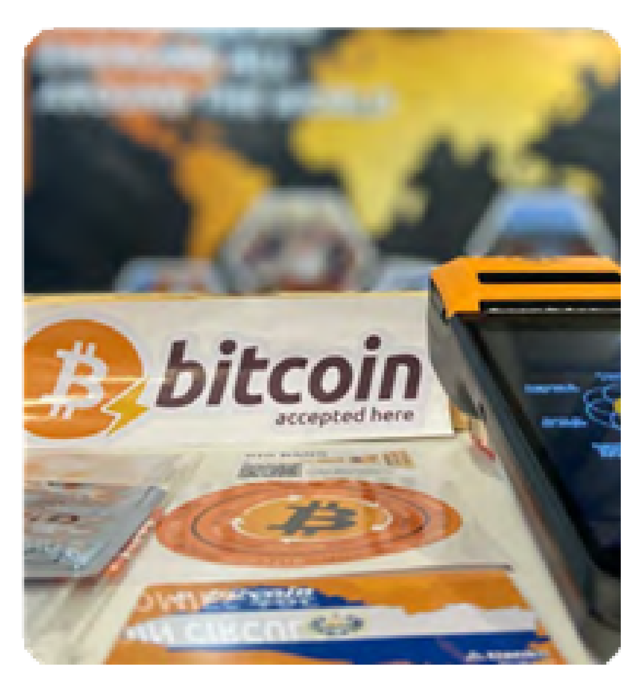

The first Bitcoin circular economy ever created is located in Arnhem, Netherlands. It was created way before the Lightning Network existed, but back then, on-chain fees were really low!

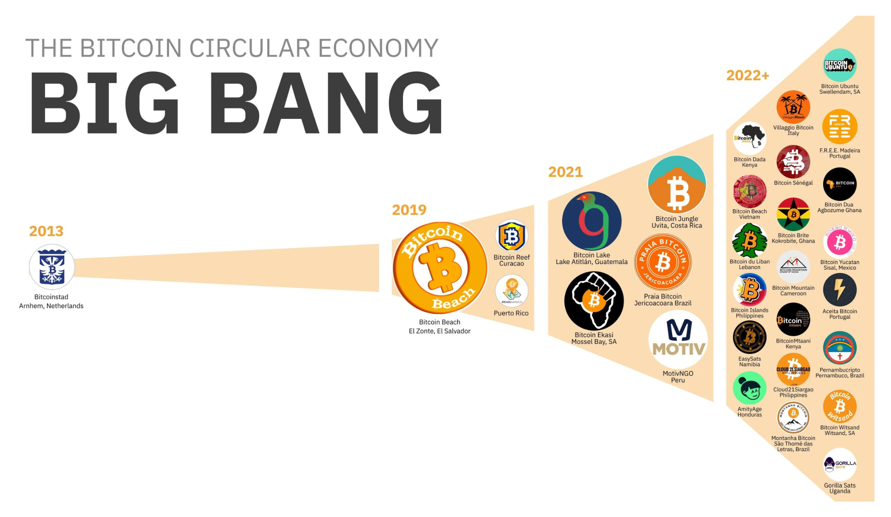

 

________________________________________________________________________________________________

The second one was Bitcoin Beach, located in El Zonte, El Salvador. It leveraged the power of the Lightning Network to provide the community, that was mostly unbanked, with instant digital payments directly with their smartphones!

Today, hundreds of circular economies are being created all around the world, powered by Bitcoin, the Lightning Network, and educational resources.

 

On [BTCMap.org](https://btcmap.org/), you can also look for Bitcoin communities where you will meet other Bitcoin users and find businesses that accept Bitcoin. Some of our teachers and students have actually added businesses and circular economies to [BTCMap.org](https://btcmap.org/), and once you are ready, you can too!

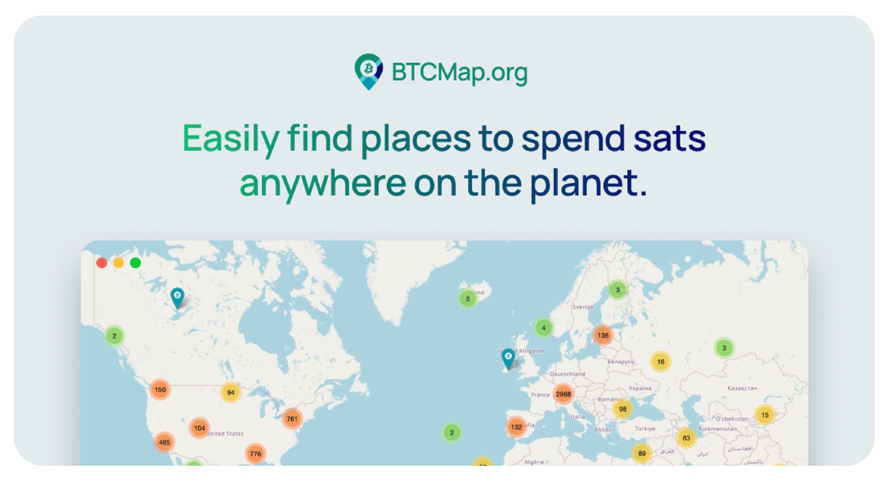

**Resource:** [Bitcoin communities](https://btcmap.org/communities)    

As we wrap up Chapter 8, you've gained insights into using Bitcoin in your daily life through the Lightning Network. The Lightning Network makes transactions quicker and more accessible, offering a preview of how Bitcoin will continue to change and evolve in layers.

In Chapter 9, we will investigate the technical side of Bitcoin. From cryptography to nodes, miners, and more, get ready to take a closer look at how Bitcoin really works.
