## _Chapter #9_

# ***An Introduction to the Technical Side of Bitcoin***

- [**9.0** Introduction](https://github.com/MyFirstBitcoin/Bitcoin-Diploma-2024/blob/main/Web%20View/21.Chapter-9.md#90-introduction)    
  - [**Activity:** Watch “How Bitcoin Works Under the Hood”](https://github.com/MyFirstBitcoin/Bitcoin-Diploma-2024/blob/main/Web%20View/21.Chapter-9.md#activity-watch-how-bitcoin-works-under-the-hood)    
- [**9.1** Public and Private Keys: Security through Cryptography](https://github.com/MyFirstBitcoin/Bitcoin-Diploma-2024/blob/main/Web%20View/21.Chapter-9.md#91-public-and-private-keys-security-through-cryptography)    
  - [**9.1.1** Cryptography Public/Private Keys](https://github.com/MyFirstBitcoin/Bitcoin-Diploma-2024/blob/main/Web%20View/21.Chapter-9.md#911-cryptography-publicprivate-keys)    
  - [**9.1.2** Hashing Explanation](https://github.com/MyFirstBitcoin/Bitcoin-Diploma-2024/blob/main/Web%20View/21.Chapter-9.md#912-hashing-explanation)
  - [**Activity:** Generate SHA 256 Hash](https://github.com/MyFirstBitcoin/Bitcoin-Diploma-2024/blob/main/Web%20View/21.Chapter-9.md#activity-generate-sha-256-hash)    
- [**9.2** The UTXO Model](https://github.com/MyFirstBitcoin/Bitcoin-Diploma-2024/blob/main/Web%20View/21.Chapter-9.md#92-the-utxo-model)    
- [**9.3** Bitcoin Nodes and Miners](https://github.com/MyFirstBitcoin/Bitcoin-Diploma-2024/blob/main/Web%20View/21.Chapter-9.md#93-a-closer-look-at-bitcoin-nodes-and-miners)
  - [**9.3.1** What is a Bitcoin Node and How Do I Set One Up?](https://github.com/MyFirstBitcoin/Bitcoin-Diploma-2024/blob/main/Web%20View/21.Chapter-9.md#931-what-is-a-bitcoin-node-and-how-do-i-set-one-up)    
  - [**Activity:** Watch Video on Bitcoin Nodes](https://github.com/MyFirstBitcoin/Bitcoin-Diploma-2024/blob/main/Web%20View/21.Chapter-9.md#activity-watch-video-on-bitcoin-nodes)
  - [**9.3.2** What is a Bitcoin Miner and How Does Mining Work?](https://github.com/MyFirstBitcoin/Bitcoin-Diploma-2024/blob/main/Web%20View/21.Chapter-9.md#932-what-is-a-bitcoin-miner-and-how-does-mining-work)    
- [**9.4** What is the Mempool?](https://github.com/MyFirstBitcoin/Bitcoin-Diploma-2024/blob/main/Web%20View/21.Chapter-9.md#94-what-is-the-mempool)    
  - [**Activity:** Mempool](https://github.com/MyFirstBitcoin/Bitcoin-Diploma-2024/blob/main/Web%20View/21.Chapter-9.md#activity-mempool)    
- [**9.5** How Bitcoin Transactions Work from Start to Finish](https://github.com/MyFirstBitcoin/Bitcoin-Diploma-2024/blob/main/Web%20View/21.Chapter-9.md#95-how-bitcoin-transactions-work-from-start-to-finish)

 

______________________________________________________________________________________________________

### ***9.0 Introduction***    

> "Bitcoin is not “unregulated”; it is regulated by algorithm instead of being regulated by government bureaucracies. Un-corrupted.”    
 **$\color[RGB]{250,175,64} Andreas \ M. \ Antonopoulos$**

 

In this chapter, we will take a closer look at the technology that enables the Bitcoin network to operate in a fully decentralized way. We will explain in simple terms what happens when you send a bitcoin transaction, how those transactions are processed, and what miners and nodes do in the Bitcoin network. We are going to cover some challenging and technical concepts in this chapter. One thing important thing to remember: many people don’t understand how the internet works, yet they are able to use it every day to send emails, contact friends on social media, and even pay their bills. Learning the technical side of how Bitcoin works is a long journey that not everyone may want to take, even if they decide to use it as money. While we do encourage you to keep learning about the technical aspects of Bitcoin, we will keep this chapter focused on basic key concepts.

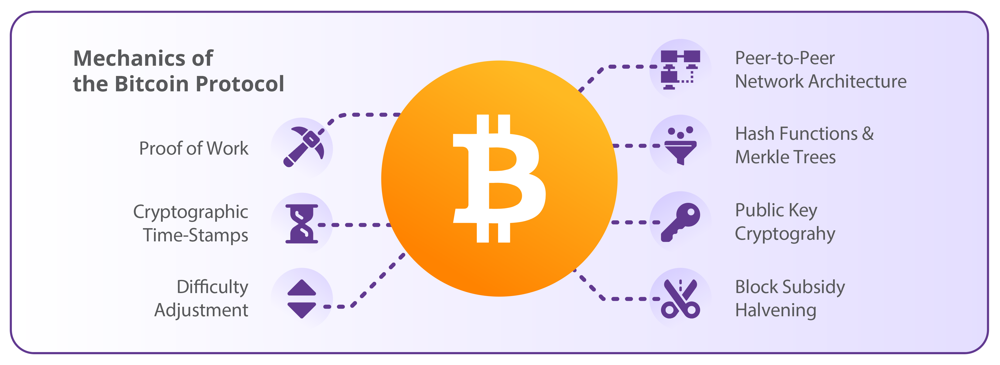

- If you want a deeper technical understanding of how Bitcoin works, we have included resources in the back of this workbook. You can also register on our website for the Bitcoin Diploma - Technical Edition to be notified when this more technical course is ready.

Let’s jump in by watching a video that shows how the Bitcoin network works.

 
 

### _Activity: Watch “How Bitcoin Works under the Hood”_

<a rel="YouTube video of -- How Bitcoin Works Under the Hood" href="https://www.youtube.com/watch?v=Lx9zgZCMqXE">

As you saw in the video, the Bitcoin network is simply a ledger or record of transactions stored on multiple computers called nodes. The Bitcoin ledger is pseudonymous, meaning it doesn't have personal details, only transaction and address information. The ledger shows every bitcoin and its movements since the network started on January 3rd, 2009.

Next we’ll take a closer look at the technology that makes this system possible.

 
 

### ***9.1 Public and Private Keys: Security through Cryptography***    

> "What Bitcoin gives us is a hard promise: the program will execute exactly as specified.”    
 **$\color[RGB]{250,175,64} Andreas \ M. \ Antonopoulos$**

 
 

### _9.1.1 Cryptography Public/Private Keys_

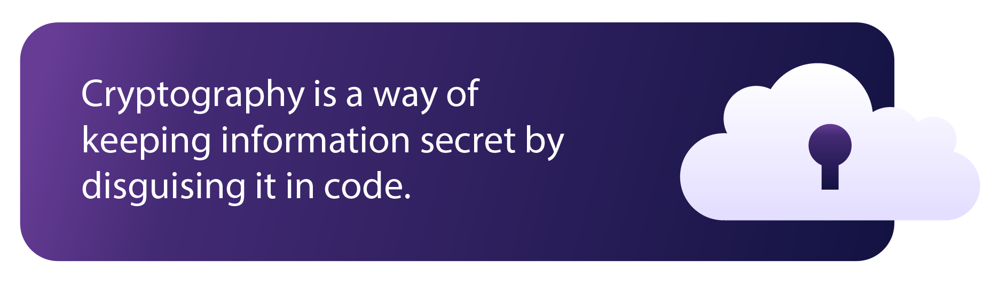

- ⭐ Encryption is the process of taking information and transforming it in a special code, making it unreadable to anyone who does not have the correct decryption method. This is similar to locking a safe, where only the person with the correct key or combination can open it.

- ⭐ Decryption, on the other hand, is the process of taking the encrypted information and making it readable again, like unlocking the safe and being able to read the information inside.

 

For instance, let’s say John wants to send Arel a secret message that isn’t meant for anyone else to read. They agree to use the Pigpen Cipher encryption method to disguise the message before sending it. Only those with the cipher can decrypt the message, making it unreadable to anyone else. Though this method is not considered secure today, it does illustrate the principle of private-key cryptography to send messages.

| **How to Solve**   Pigpen Cipher |
| :---------: |
| When solving the Pigpen Cipher,   the player is given an encrypted   message and a cipher. To decrypt   the message, the player will find   the symbol from the encrypted   message on the cipher to find the   decrypted letter.     - ⭐ Example of an encrypted message:     

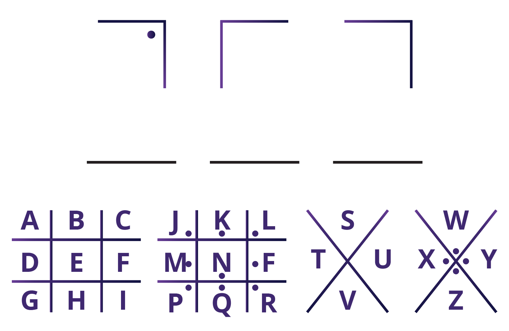
 |

 

**So, how does cryptography work in bitcoin transactions?**

In traditional private-key cryptography, John and Arel would have to first share a secret key, like a password or the Pigpen Cipher. John would then use this key to encrypt his message before sending it to Arel. Arel, who also knows the secret key, would then use the same key to decrypt the message and read it.

However, if someone else is in possession of the key and intercepts the message, they could decrypt it and read it.

 

Public key cryptography, the type used in bitcoin transactions, has solved this problem. With public key cryptography, John and Arel don’t need to share the password or encryption method with each other. Instead, they each have two different keys: a **$\color[RGB]{104,59,147} public \ key$** (which is safe to share with anyone) and a **$\color[RGB]{255,166,21} private \ key$** (which should be kept private).

In this case, when John wants to send a message to Arel, he can use Arel’s **$\color[RGB]{104,59,147} public \ key$** to encrypt his own message before sending it to Arel. When Arel receives the message, only he is able to decrypt it with his **$\color[RGB]{255,166,21} private \ key$**. Anybody else, even if they intercept the message, would not be able to read the message. Chances are also much lower to steal the key because even John and Arel don’t need to share the key with each other.

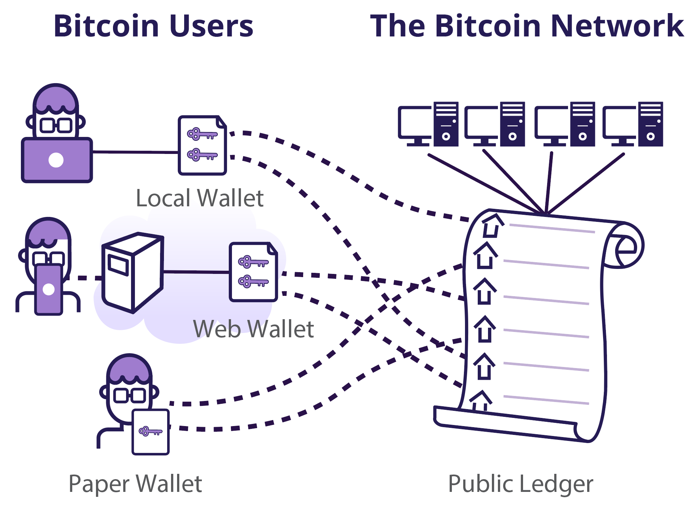

 

So, the main advantage of public key cryptography over private is that it allows for secure communication without the need for the sender and receiver to first share a secret key (or another encryption method like Pigpen Cipher), which could be intercepted by a third party.

In Bitcoin, public key cryptography is not used to send encrypted messages. Instead, it is used to create unique **$\color[RGB]{31,110,199} digital \ signatures$** that make bitcoin transactions immutable. A **$\color[RGB]{31,110,199} digital \ signature$** is a way to prove the authenticity of a bitcoin transaction, in some way similar to when you write your signature on a physical document.

 

- 💡 **Public Key Cryptography (for every transaction between two users):**     Each user has two keys; a **$\color[RGB]{255,166,21} private \ key$**, which is **$\color[RGB]{255,166,21} kept \ secret$**, and a **$\color[RGB]{104,59,147} public \ key$** that can be **$\color[RGB]{104,59,147} shared \ with \ others$**.     The **$\color[RGB]{255,166,21} private \ key$** serves as a form of identification and proof of ownership, confirming: **“This address belongs to me and I have control over it.”**     **$\color[RGB]{31,110,199} Digital \ signatures$** are created to identify unique transactions.

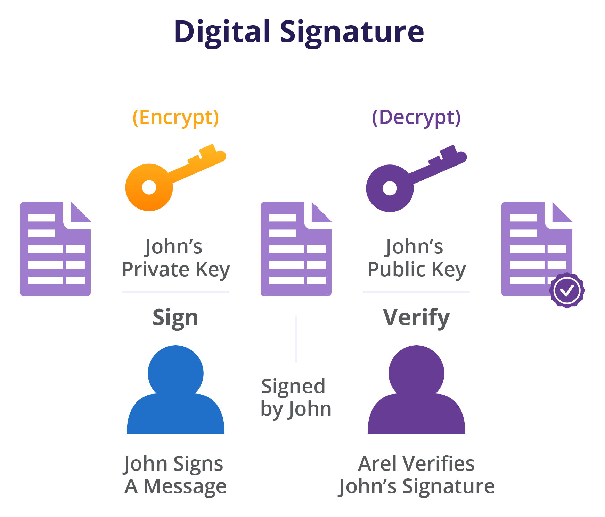

 

- ⭐ Bitcoin transactions involve transferring a certain amount of bitcoins directly to another person’s account.

- ⭐ that only the real holder of the bitcoins has the control to send their money to someone else. It makes sure that the property is guarded from malicious actors.

- ⭐ As an additional measure of protection, each transaction that you send in Bitcoin automatically gets a **$\color[RGB]{31,110,199} UNIQUE \ signature$**. This **$\color[RGB]{31,110,199} unique \ signature$** is empowered by tamper-proof technology that helps the network verify that the real owner of the bitcoins, and not someone else, has sent them.

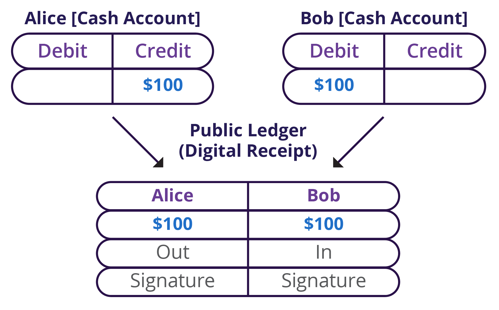

How this works in a real bitcoin transaction in simple terms:

1. ⭐ **Creating the Transaction:**  
    A user initiates a bitcoin transaction by specifying details such as the recipient's address and the amount of bitcoins to be sent.

2. ⭐ **Digital Signature Generation:**  
    The sender generates a unique **$\color[RGB]{31,110,199} digital \ signature$** using their **$\color[RGB]{255,166,21} private \ key$**. This signature is a unique cryptographic code that verifies the authenticity of the transaction.

3. ⭐ **Broadcasting the Transaction:**  
    The signed transaction is broadcasted to the Bitcoin network, indicating the intent to transfer ownership of bitcoins from the sender to the recipient.

4. ⭐ **Verification on the Network:**  
    Nodes on the Bitcoin network receive the transaction and use the **$\color[RGB]{104,59,147} public \ key$** of the recipient to decrypt and verify the integrity of the transaction. Simultaneously, they use the sender's **$\color[RGB]{104,59,147} public \ key$** to verify the **$\color[RGB]{31,110,199} digital \ signature$**.

5. ⭐ **Confirmation on the Bitcoin network:**  
    If the verification is successful, the transaction will be added to the ledger, which serves as a secure, transparent record of all transactions. Once confirmed, the ownership of the bitcoins is officially transferred from the sender to the recipient.

In summary, the digital signature, created with the sender's private key, serves as cryptographic proof of authenticity and ownership, allowing Bitcoin’s decentralized network to validate and record the transaction on the ledger.

 
 

### _9.1.2 Hashing Explanation_

Please don’t be intimidated by the technical terms and mathematical concepts ahead. We understand that not everyone is crazy about math, but you might surprise yourself and see that even the most complex ideas can be grasped with a little bit of effort.

**What is a function?**

- 💡 A **function** is like a machine that takes some information and turns it into something new. The information you give the function is called the **$\color[RGB]{255,166,21} input$**. The new information the function creates is called an **$\color[RGB]{31,110,199} output$**. Functions help computers do tasks and solve problems.

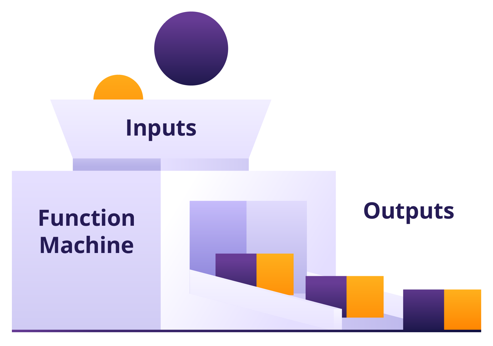

 

Think of it like a recipe for making a salad. The recipe (or function) tells you what ingredients to use and how to mix them together to make the salad. You can put different ingredients in, but the recipe will always give you the salad as the output. Functions can be used to help make things easier and more efficient.

This recipe is a function that takes the ingredients as the **$\color[RGB]{255,166,21} input$** and generates the tossed salad as the **$\color[RGB]{31,110,199} output$**.

In Bitcoin, functions are utilized to execute transactions. We already know that transactions in bitcoin are essentially transfers of value (money) from one address to another. To perform a transaction, a number of cryptographic functions are used to validate the transaction and update the state of Bitcoin’s ledger.

The functions used in a bitcoin transaction include verifying the authenticity of the transaction inputs, checking that the sender has sufficient funds, and updating the balances of the relevant addresses. Once a transaction is verified and added to a block in the ledger, it becomes part of the permanent record of all transactions on the network.

 

**What is a one-way function?**

A one-way function uses a set of instructions to process the information and turns it into something new, like a smoothie recipe turns ingredients into a new drink. But, just as you can’t un-blend a smoothie to get the original ingredients back, you can’t reverse the one-way function to get the original information back.

 

Public-key cryptography, of which the **$\color[RGB]{104,59,147} public \ key$** is a part of, relies on the use of one-way functions, which make it difficult to determine the **$\color[RGB]{255,166,21} private \ key$** from the **$\color[RGB]{104,59,147} public \ key$**. In theory, it is not exactly “impossible” to find the **$\color[RGB]{255,166,21} private \ key$** from the **$\color[RGB]{104,59,147} public \ key$**, but it is extremely difficult to do so and would take an inordinate amount of time and computational power to accomplish this task.

Finding a **$\color[RGB]{255,166,21} private \ key$** from a **$\color[RGB]{104,59,147} public \ key$** in Bitcoin is like trying to find a needle in a haystack as large as a football field. The needle represents the **$\color[RGB]{255,166,21} private \ key$** and the haystack represents all the possible **$\color[RGB]{255,166,21} private \ keys$**.

In the same way, one-way functions are designed to be irreversible and cannot be decrypted.

 

**What is a hash function?**

- 💡 **Hashing** is like a fingerprint for digital data. It is a process of taking a digital message and turning it into a fixed length code, which serves as a unique identifier.

Just like a fingerprint can identify a person, a hash can identify a digital message. Hashes are used in many applications, including bitcoin transactions.

**How hashing is used in bitcoin transactions**

In Bitcoin, every transaction is hashed before it is added to a block in the ledger. The hash acts as a signature for the transaction, verifying that the transaction is valid and has not been tampered with. If someone tries to change even a single letter in the transaction, the hash will be completely different, alerting others to the change.

**The role of hashing in providing security**

Hashing is essential to the security of the Bitcoin network. By using hashes to identify transactions, the network can detect any attempt to change or manipulate a transaction. This helps to prevent fraud and ensure that all transactions are recorded accurately on the ledger.

A hash function is a type of one-way function that takes an input (referred to as the “message” or “data”) and converts it into a numerical representation referred to as a “hash.” The **$\color[RGB]{31,110,199} output$** hash is unique to the input data, so even a small change in the **$\color[RGB]{87,88,91} input$** data results in a completely different hash.

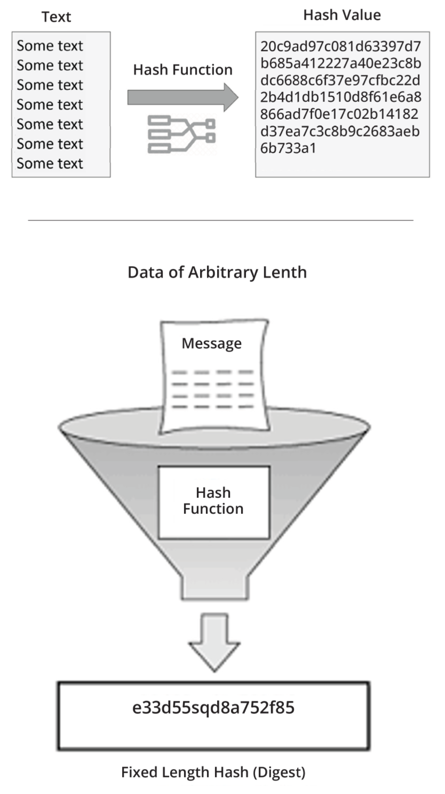

- 💡 **A hash function** is like a secret code machine. It takes in a **$\color[RGB]{255,166,21} message$** and turns it into a code.

 
 

### _Activity: Generate SHA 256 Hash_

<a rel="Website of -- SHA256 Generator" href="https://tools.keycdn.com/sha256-online-generator">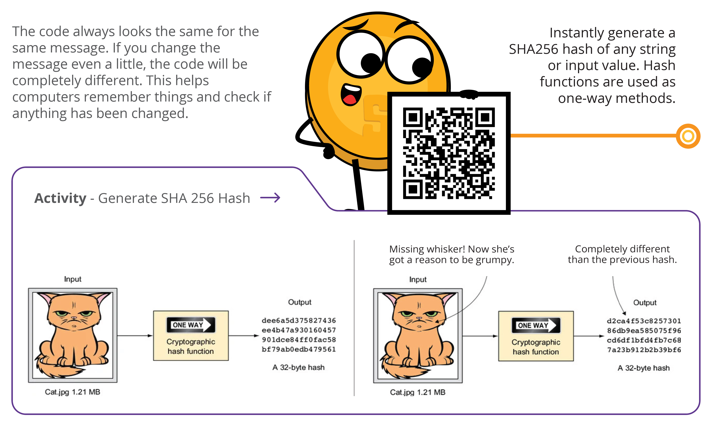

The **$\color[RGB]{31,110,199} output$**, or hash, is always the same length, no matter how long the original information was.

Bitcoin uses a few specific types of hash function called **SHA-256** and **RIPEMD160**. A few examples are below:

- ⭐ Notice that a small change in the second input changes the output completely when compared to the first one.

- ⭐ The third input is a huge file yet the output is still the same fixed length as the other two.

**Hashing** can also be thought of as a musical score that captures the essence of a piece of music. Just as a musical score is a unique representation of a tune, a hash value is a unique representation of a piece of data. By comparing the score of a piece of music with the actual performance, a musician can determine if the performance is accurate. Similarly, by comparing the hash value of received data with the original hash value, one can determine if the data has been altered during transmission.

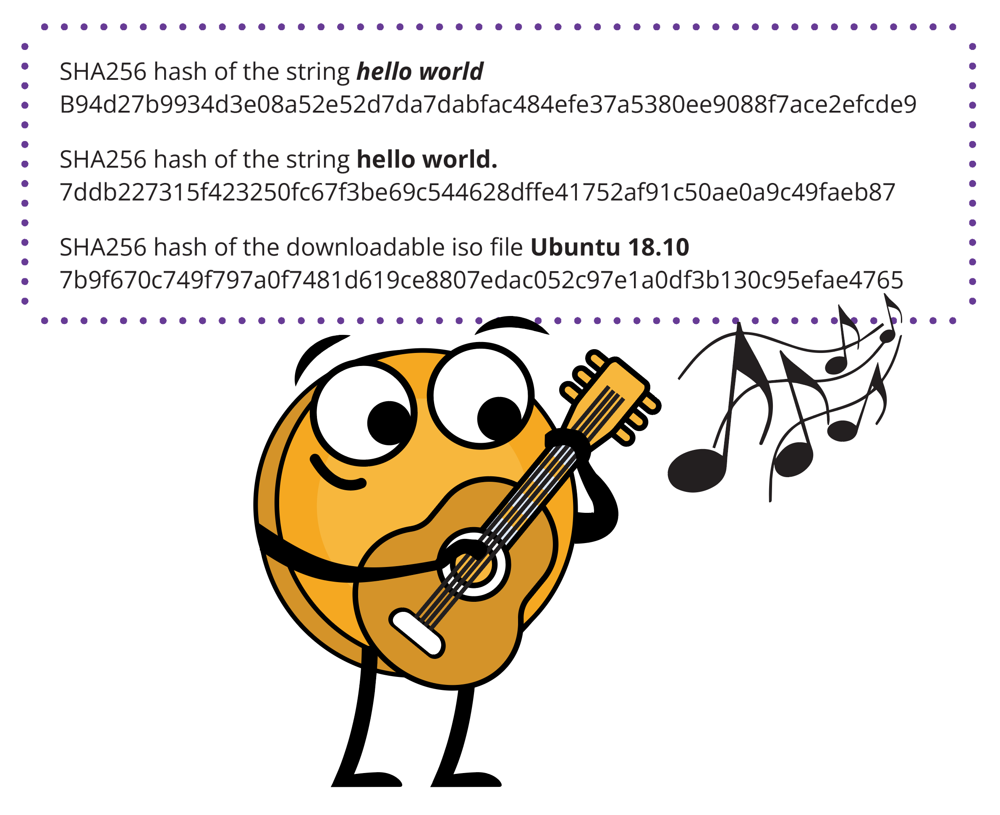

 

Just as a slight deviation in a musical performance can cause it to sound different, even the slightest change to the original data will result in a different hash value. This makes hashing a powerful tool for ensuring the integrity and authenticity of a bitcoin transaction.

The process of encoding the **$\color[RGB]{104,59,147} public \ key$** through hashing is used to improve the security of information by converting it into a fixed-length, unreadable format. Bitcoin uses the SHA-256 and Ripemd-160 algorithms to produce public addresses. The resulting output serves as a unique identifier for the **$\color[RGB]{104,59,147} public \ key$** and helps to ensure the integrity and security of transactions stored in the ledger. By encrypting the information in this way, it becomes more difficult for unauthorized individuals to access and manipulate the data.

<a rel="Website of -- another hash Generator" href="https://www.bitcoinsimulator.tk/explanation?page=10">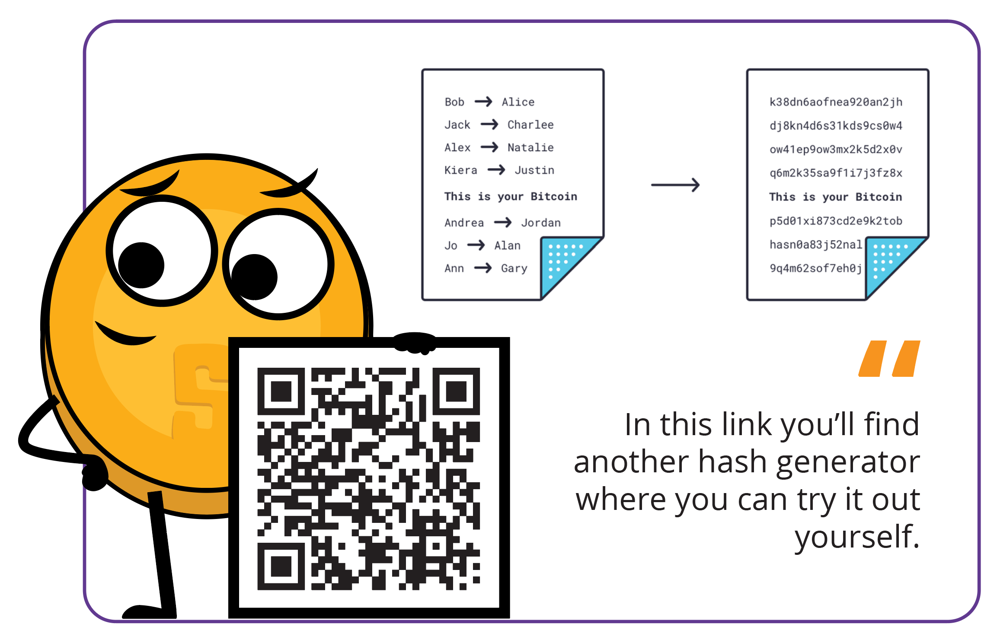

 

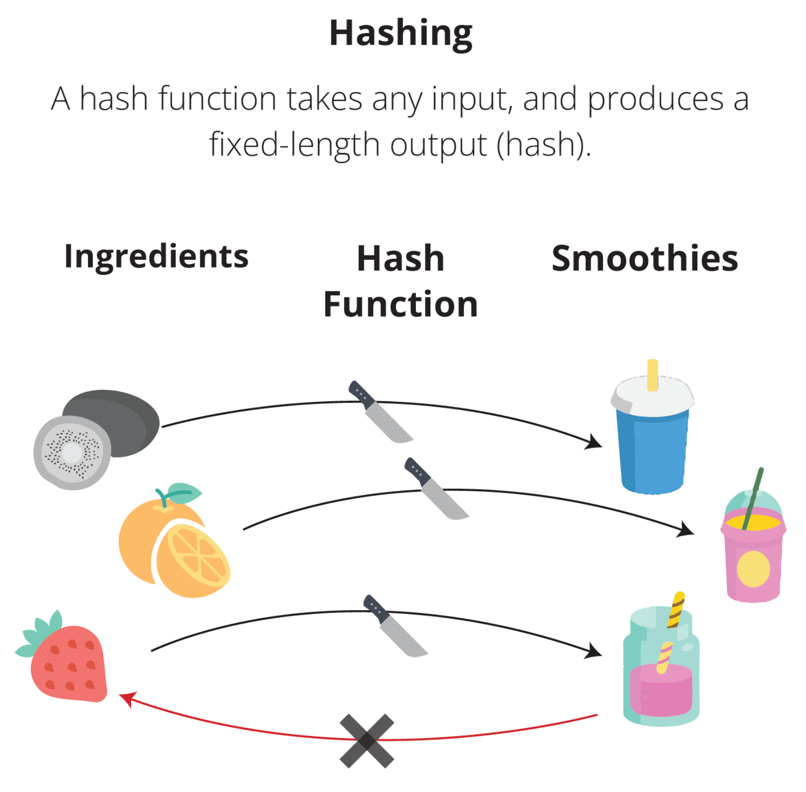

- ⭐ **Deterministic.**  
   The same ingredients always yield the same smoothie.

- ⭐ **Pre-Image Resistance.**  
   You can’t glue together a strawberry when given a smoothie.

- ⭐ **Correlation Resistance.**  
   Changing the ingredients a little results in a completely different smoothie.

- ⭐ **Collision Resistance.**  
   It’s hard to find different ingredients for a smoothie that result in the exact same one.

- ⭐ **Speed & Verifiablility.**  
   Throw fruit into the mixer. It’s fast and what comes out for sure is a smoothe.

 
 

### ***9.2 The UTXO Model***    

- 💡 **UTXO - Unspent Transaction Output**

 

**What are UTXOs?**

In Bitcoin, transactions work like breaking a bigger piece of gold into smaller pieces and sending these smaller pieces both to others and to yourself.

You can think of UTXOs as different sizes and pieces of bitcoin or differently denominated bills in your wallet. When you spend a UTXO, it is recreated into a new UTXO for the receiver, and whatever is left over is sent back to you in a different new UTXO known as “the change UTXO.” This is much like using a $10 bill to buy two cups of coffee for $6. The coffee shop keeps the $6 piece and hands you $4 in change.

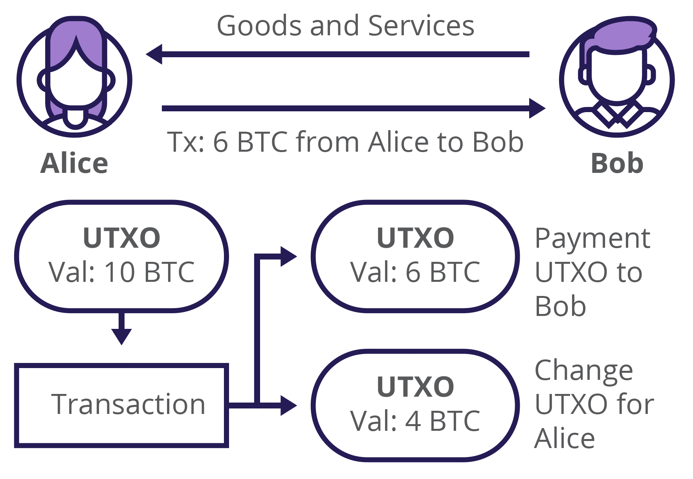

When sending bitcoins, you always send the entire amount of one (or more) of your UTXOs in your Bitcoin wallet. What happens? You send a piece to the recipient, and you receive the remaining amount back as change to one of your new Bitcoin addresses. The change you receive is called an unspent transaction output, or UTXO, and can be used as an input for a new future transaction.

The balance of your Bitcoin wallet is the sum of all your different UTXOs. So, the sum of your UTXOs is the sum of the amount of bitcoins you own.

 

- 💡 It is important to note that you should not make others aware of your UTXOs because when someone knows them, they can track your bitcoin transactions in the network and will ultimately know how much money you own.

 

In conclusion, each time you make a transaction, you use one or more of your existing UTXOs to spend bitcoins and new UTXOs are created (for both you as the recipient).

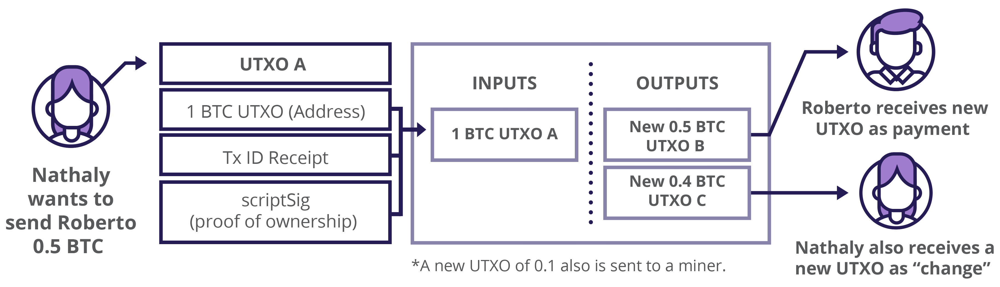

When a transaction is made, the amount of bitcoins sent are divided into multiple outputs, each of which are associated with a new Bitcoin address (a new UTXO).

 

When sending bitcoins to someone, you will use one or more UTXOs as the source of the funds (input). These UTXOs will be combined, if necessary, to create new outputs that belong to both the recipient of the transaction and yourself. These new outputs, or UTXOs, will become the recipient’s property and your property. These UTXOs can then be used as the source of funds in other future transactions. This chain of UTXOs creates a transparent, traceable history of all bitcoin transactions on Bitcoin’s ledger, starting from the very first block (January 3rd, 2009).

An example to illustrate how this works: if you want to send two bitcoins but you only have a UTXO worth five bitcoins, the difference of three bitcoins is sent back to you as “change.” This change is a new UTXO for you, and you can spend that new UTXO in a future transaction.

Another example:
1. ⭐ Alice wants to send Bob five bitcoins.
2. ⭐ She combines six bitcoins from two of her UTXOs
3. ⭐ From these UTXOs, she sends five bitcoins to Bob, gets 0.99 bitcoins as change back to herself, and needs to pay a 0.01 transaction fee.
4. ⭐ After confirmation, the transaction is added to Bitcoin’s ledger, updating all the nodes that have a copy of the ledger.

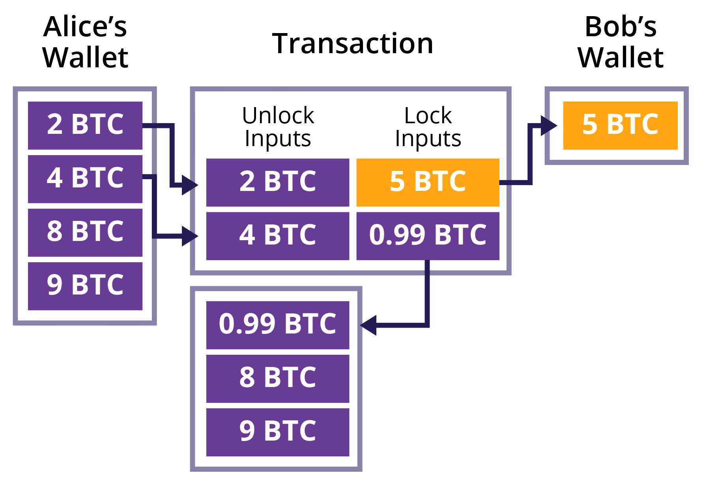

If Alice attempts to use one of her already spent outputs to make another transaction, it would automatically be rejected by the nodes. This is because the nodes maintain a copy of Bitcoin’s ledger (and all its transactions), so they can easily check the balance of Alice’s UTXOs and verify that the transaction is not valid.

Below is an actual screenshot of a real transaction where there is only one input. However, the starting balance could, in another case, be the sum of multiple UTXOs (multiple inputs). What observations can you make when you look at the two transactions below? Do the inputs match the outputs? Can you describe the details of the transaction? Is there a connection between the two screenshots? And which transaction occurred first?

 
 

### ***9.3 A Closer Look at Bitcoin Nodes and Miners***    

In this section, we’ll take a more detailed look at two very important parts (and participants) of the Bitcoin network that were first introduced in Chapter 6. We’ll look at:

1. ⭐ **Bitcoin Nodes:**  
    Gatekeepers of Validation whose main job is to keep a copy of Bitcoin’s ledger, make sure that all transactions are valid, and that everyone follows the same rules.    
    By spreading out this job among many people worldwide, Bitcoin stays strong against potential problems. These nodes help keep the system trustworthy and true to its decentralized idea, where no one person or group has too much power.

2. ⭐ **Bitcoin Miners:**  
    Architects of Security that use powerful computers and electricity to check and confirm transactions, making sure everything is secure. This work helps make the ledger, or blockchain, resistant to any bad actors trying to mess things up.

Together, Bitcoin nodes and miners work as a team to maintain a decentralized, secure, and strong system—a new way of handling money that people all around the world can rely on. Let's explore these roles in more detail to understand how they contribute to the innovative Bitcoin system.

 
 

### _9.3.1 What is a Bitcoin Node and How Do I Set One Up?_

A Bitcoin node may sound technical but it is just a piece of software which runs a copy of the Bitcoin ledger. When you run your own Bitcoin node, you gain a voice in shaping the rules of the Bitcoin network.

Imagine this: if a group of people attempts to change how Bitcoin functions, say by altering the total supply of bitcoins, you have a say. You can choose not to change your node to the new system, which is like voting to enforce the rules of the network you support.

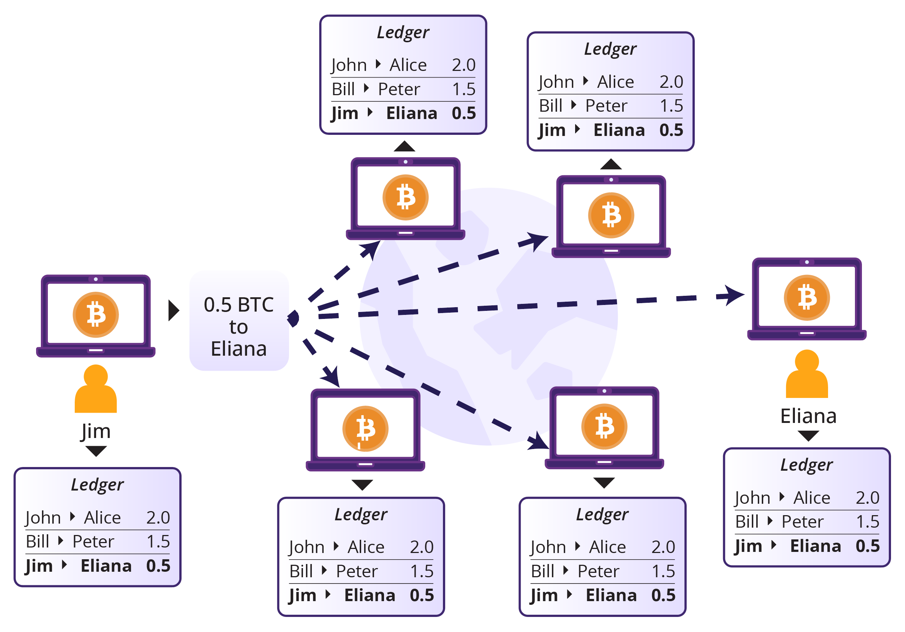

 

Let’s imagine a Bitcoin node as a digital traffic cop with some essential tasks:

1. ⭐ **Gatekeepers of Validation:**  
    A Bitcoin node keeps a digital copy of the blockchain, which is like a shared ledger of all bitcoin transactions. Many nodes around the world hold this same record.

2. ⭐ **Communication Hub:**  
    Nodes connect with each other, creating a vast communication network. They share information, especially transactions waiting to be added to the blockchain, stored in a digital waiting room called “the mempool."

3. ⭐ **Quality Checker:**  
    Every addition to the blockchain undergoes scrutiny. Nodes ensure that transactions are valid, rejecting any that don't meet the rules of the Bitcoin network.

4. ⭐ **Blockchain Informant:**  
    Other software, like wallets, can ask a node for information about the blockchain, such as bitcoin balances. Nodes serve as information hubs.

5. ⭐ **New Node Welcomer:**  
    When a new node wants to join, existing nodes generously provide a copy of the blockchain. The new node independently checks the validity of each transaction, emphasizing a trustless system.

 
 

### _Activity: Watch video on Bitcoin Nodes_

<a rel="Website of -- Bitcoin Nodes" href="https://www.youtube.com/watch?v=xc_TxlByxeY">

One of the options to run your own node is to download the Bitcoin Core software and give it some time to download the entire blockchain. Once ready, you can leave it on and, approximately every 10 minutes, new blocks with transactions arrive. Your node checks their validity, adding them to your local copy of the blockchain.

 

<a rel="Website of -- Bitcoin Core software download" href="https://bitcoin.org/en/download/">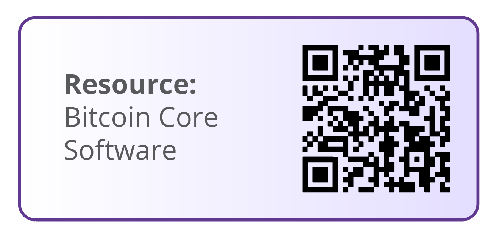
 

Running a node provides sovereignty and independence. You don't rely on others; it's your own traffic cop. Unlike your Bitcoin wallet, which lacks a copy of the blockchain, a node ensures self-sufficiency. Instead of trusting others about your bitcoin holdings (and the state of the Bitcoin network), your wallet communicates with your personal node, making your digital experience more secure and trustworthy.

 
 

### _9.3.2. What is a Bitcoin Miner and How Does Mining Work?_

> "The purpose of mining is not the creation of new bitcoin; that’s the incentive system. Mining is the mechanism by which Bitcoin’s security is decentralized.”    
 **$\color[RGB]{250,175,64} Andreas \ M. \ Antonopoulos$**

 

- 💡 **Miners** collect unconfirmed transactions, form a block, and expend energy to look for a valuable key that will **add and secure the block’s spot in the blockchain**.

Miners are in a race to add the next block to the blockchain. The sought-after prize is a “valid block hash,” cleverly hidden among billions of others, and only a specific key assigned by the network can unlock it.

Picture a massive haystack filled with millions of keys, each representing a unique block hash. The network has chosen one specific key to unlock a valuable reward. Miners rummage through the haystack, testing each key in the lock, but only one lucky miner will discover the perfect match.

Once a miner finds the correct block hash, they share it with the network along with their created block of new transactions. Other miners verify the solution to make sure it’s the right fit. If everything checks out, the block is added to the blockchain, creating a secure and public ledger.

Miners earn rewards for their efforts in two ways:
1. ⭐ Block rewards
2. ⭐ Transaction fees

Block rewards are new bitcoin released into circulation with each block added to the blockchain. Transaction fees are small bitcoin payments users make to have their transactions processed faster and prioritized by the miner. Miners can pick which transactions to include in the block they mine, usually giving preference to those with higher transaction fees.

 

**Bitcoin halvings**
A bitcoin halving is an essential part of the Bitcoin universe that helps maintain its scarcity and value over time. As you know, there is a fixed supply of 21,000,000 bitcoins in total. This supply isn’t fully available from the day Bitcoin launched. Instead, this supply enters the Bitcoin universe in a step-by-step fashion.

Satoshi Nakamoto cleverly designed a block reward system to distribute new bitcoins without a central authority. In Bitcoin’s early days, miners got a sweet 50 bitcoin reward for each block they mined, motivating them to invest in powerful equipment and electricity for their mining operations.

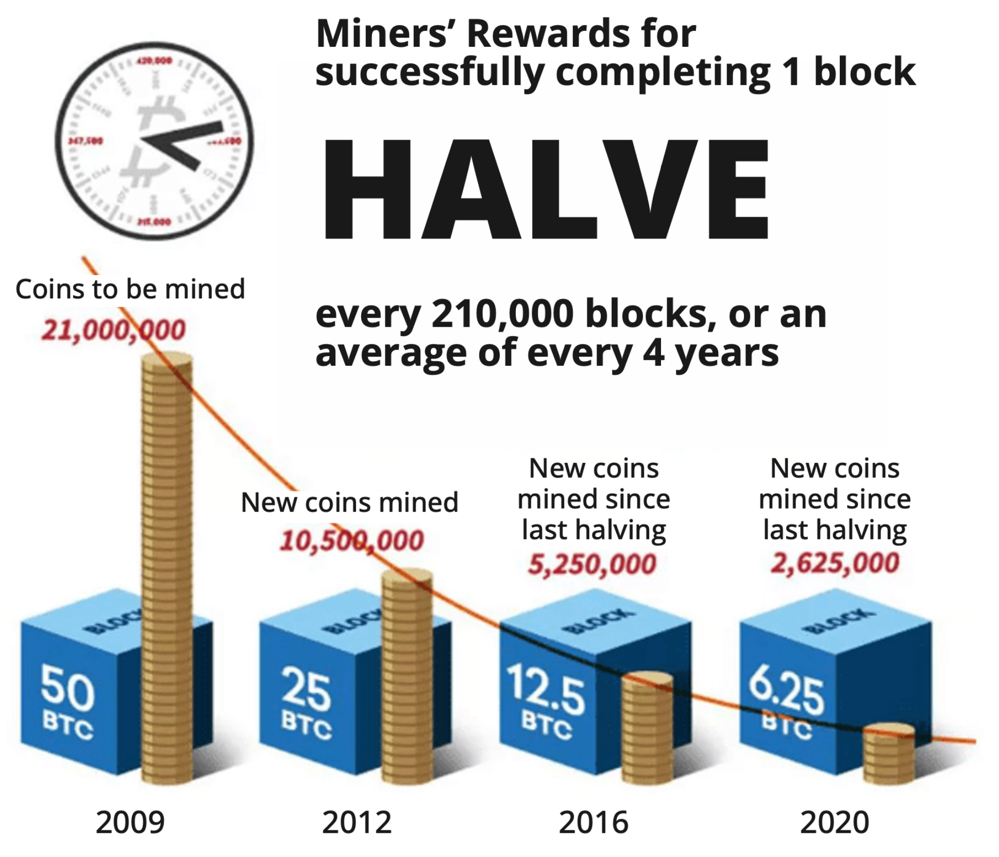

To keep the network stable and manage new bitcoin supply, the block reward is halved about every 210,000 blocks. This event, called “the halving,” decreases the number of new bitcoins entering circulation and continues to motivate miners to protect the network and uphold its decentralization. Historically, halving events have led to significant price increases in the Bi tcoin market due to the reduced supply of new bitcoins making their way into circulation.

 

- 💡 **Circulating Supply** refers to the total amount of a currency. With Bitcoin, the total circulating supply is the number of coins that have been mined and are in circulation at any given time, excluding any coins that are lost forever.

During each halving event, miners receive fewer bitcoin rewards, which lowers the issuance rate of new coins. As a result, Bitcoin’s mining difficulty increases to maintain a block time of approximately 10 minutes, ensuring new blocks are added to the blockchain at a steady pace. The reduction in mining rewards doesn’t necessarily mean miners make less profit, as they can also earn transaction fees for verifying transactions and adding them to the blockchain, which can offset the decrease in mining rewards.

Halving events are pre-programmed into the Bitcoin protocol, making the supply schedule of bitcoins predictable and transparent.

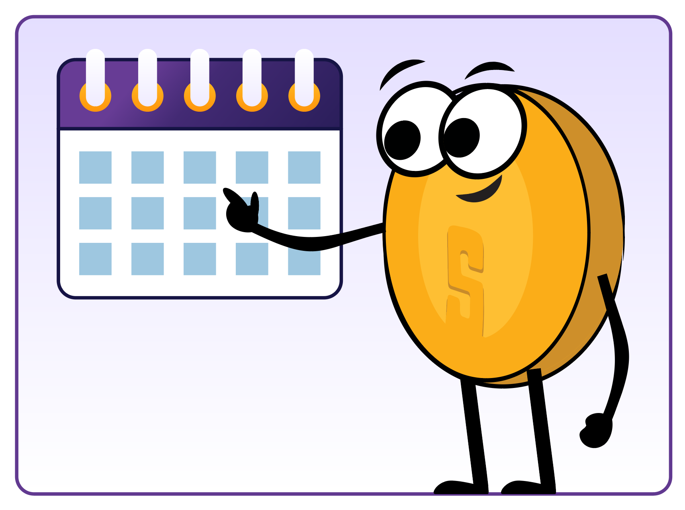

- 💡 The **Bitcoin supply schedule** is the predetermined and public plan for the release of new bitcoins into circulation, designed to maintain Bitcoin’s scarcity over time.

The following table outlines the details of upcoming halving events for Bitcoin, including the expected date of the next halving event, the block number at which the halving event will happen, the block rewards (per mined block) during that halving event, and the percentage of the total supply that will be mined.

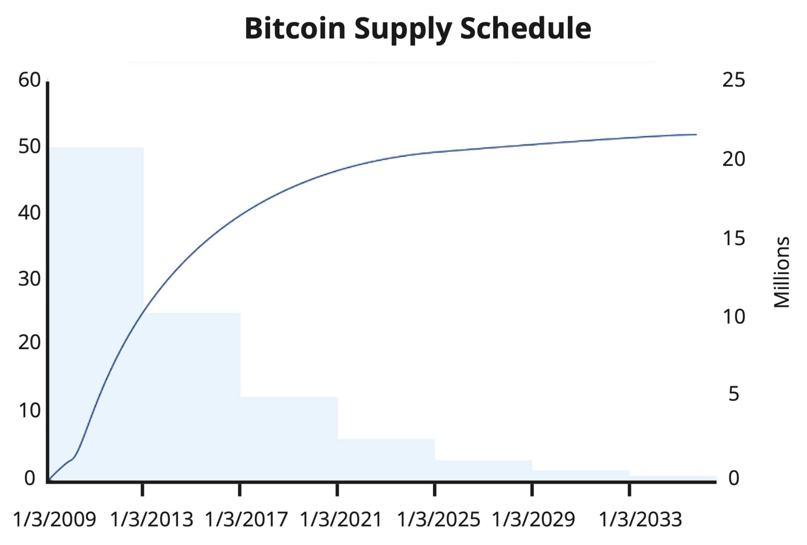

| Event | Expected Date | Block | Block Reward | Percentage Mined |
| :-------------: | :-------------: | :---------: | :---------: | :---------: |
| **Fourth Halving** | 2024 | 840,000 | 3.125 | 96.875 % |
| **Fifth Halving** | 2028 | 1,050,000 | 1.5625 | 98.4375 % |
| **Sixth Halving** | 2032 | 1,260,000 | 0.78125 | 99.21875 % |

As more bitcoins are mined, the circulating supply and the percentage of the total supply that has been mined will keep increasing until the total supply of 21,000,000 is reached. The reduced supply, combined with rising demand, can boost Bitcoin’s price (measured in dollars). This benefits early adopters and also motivates miners to continue securing the network and contributing their computing power and resources.

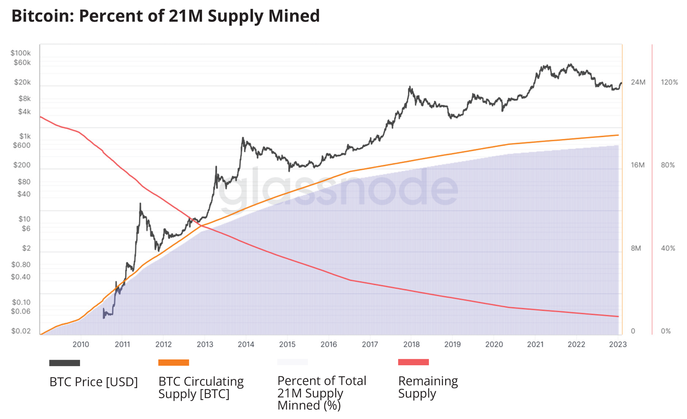

 

**What is a valid block hash in Bitcoin?**    
In Bitcoin, a valid block hash is like a special code that miners try to find. It's a unique number that helps keep track of each block in the blockchain that stores information about transactions. The blocks connect in a chain from the first one (genesis block) to the latest, making a public record of all transactions. This block hash is crucial because it links each block to the one before it, making it easy for anyone to check the history of transactions. It's a bit like a fingerprint for each block, ensuring the information is correct and secure. The block hash acts as a way to confirm that the data in the block hasn't been changed.

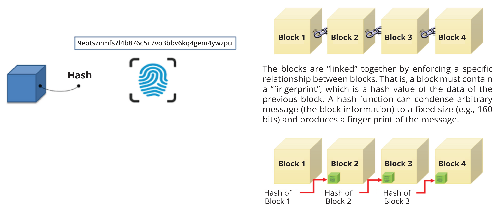

- Satoshi Nakamoto, the creator of Bitcoin, mined the initial block, which held a total of 50 bitcoins.

 

**The race to mine a block**
Miners engage in a competition to uncover the block hash that aligns with the target (a special number) set by the network. The miner who’s the first to successfully discover the correct block hash is granted the opportunity to add that block to the blockchain and assign it with the corresponding hash ID. This solution serves as validation for the block’s authenticity.

Mining can be compared to a race where the goal is to reach the finish line as quickly as possible. How difficult it is to find the block hash is adjusted periodically, ensuring that each block continues to be mined in approximately 10 minutes (as miners join and leave). This mechanism is called “the difficulty adjustment.”

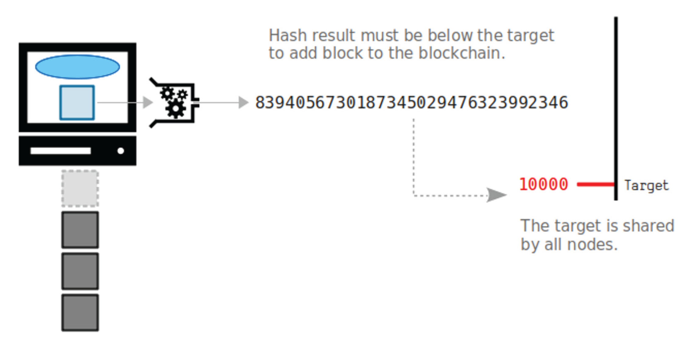

Let’s say the target number set by the Bitcoin network is 1,000. The miners would have to use their computational power and energy to search for a block hash (a specific number) that is lower than 1,000. The first miner to find a block hash lower than 1,000 gets to add the new block to the blockchain and is rewarded with bitcoins.

- 💡 The difficulty level in Bitcoin mining is a measure of how difficul t it is to find a valid block hash that meets the target set by the network. It is adjusted every 2016 blocks, or roughly every two weeks, to ensure that blocks are added to the blockchain at a c onsistent rate. The difficulty level is expressed as a number, and the higher the difficulty lev el, the more difficult it is to find a valid block hash.

For example, consider two different hashes:
- ⭐ **Hash 1:** 0000A1mINgF0RbL0cK5wItHth3hAy5tAcK  
   **Difficulty level:** 1
- ⭐ **Hash 2:** 00000000A1mINgF0RbL0cK5wItHth3hAy5tAcK  
   **Difficulty level:** 2

In this example, Hash 2 has a higher difficulty level than Hash 1 because it is a longer hash with more zeros at the beginning. It would be harder for miners to find Hash 2 because their computers would need to do more work.

- 💡 By finding a valid block hash, a miner demonstrates that they ha ve done the work required to add the new block to the blockchain and are paid a reward in bitcoins, plus transaction fees, for their effort. Proof-of-Work (PoW) is the method the Bitcoin network uses to validate transactions and add new blocks to the blockchain.

 

PoW keeps Bitcoin safe by making it difficult for anyone with malicious intentions to take control.

In summary, the tasks of miners consist of:

1. ⭐ **Bundling transactions into blocks:**  
    While nodes verify newly created transactions that are waiting in “the Mempool,” miners select a subset of these to include in their candidate block.

2. ⭐ **Proof-of-Work:**  
    Miners race with each other to find the valid block hash.

3. ⭐ **Broadcast valid blocks:**  
    After finding the valid blockhash, they propagate the new block to the network.

4. ⭐ **Earn Rewards:**  
    Lastly, they receive newly created bitcoins and transaction fees for successfully adding the block to the blockchain.

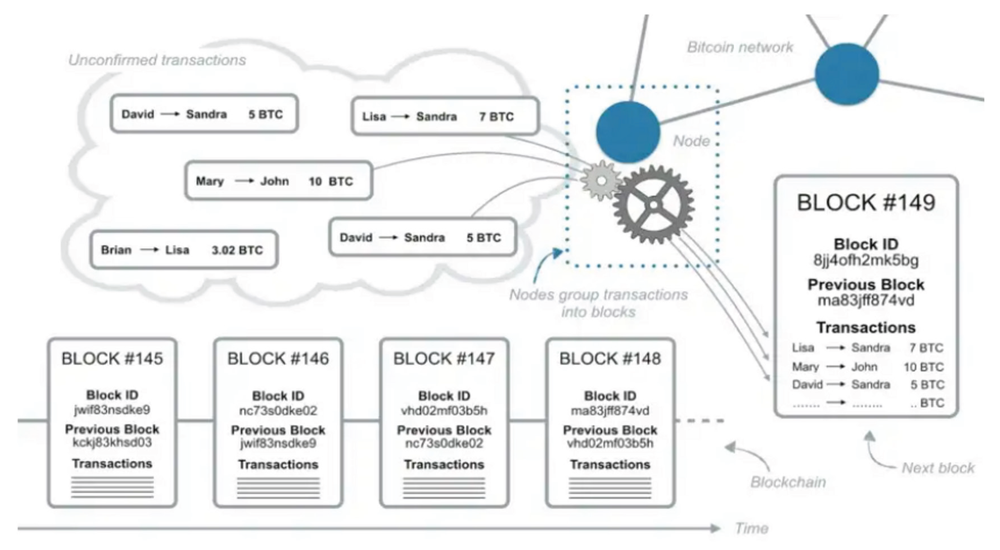

Multiple miners can work on creating new blocks simultaneously. The first miner to discover a block hash that meets the target set by the network announces it to the network, and the other miners then check the transactions in that miner’s candidate block to make sure they are valid. If the transactions are indeed valid, the block is added to the blockchain. The other blocks created by the other miners at the time are not added and are discarded. This process helps maintain consensus within the network and prevents double-spending.

- 💡 A candidate block is a set of transactions considered for addition to the blockchain but has not been added yet.

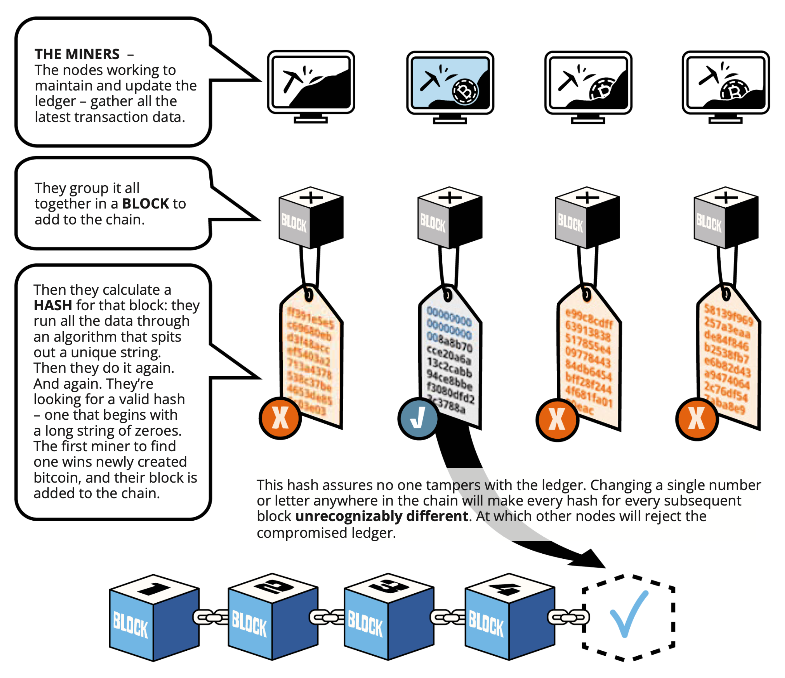

 
 

### ***9.4 What is the Mempool?***    

The “Mempool” or Memory Pool is like a waiting room for transactions in the Bitcoin network. When you make a transaction, it is first broadcasted to the Mempool b efore it is verified, selected, and added to the blockchain.

Imagine you are waiting in line at a restaurant. Your name is added to a list of people waiting for a table. When a table becomes available, the host calls your name and seats you. Similarly, a bitcoin transaction is added to the Mempool when it is made and is confi rmed and added to the blockchain when a miner includes it in a block.

 

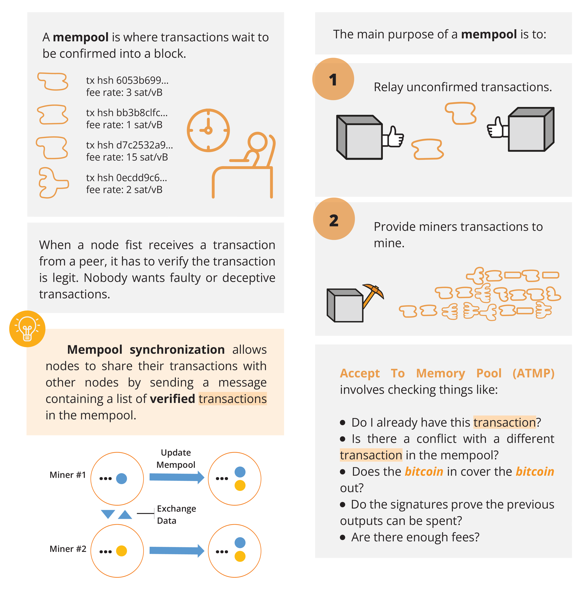

 

**How are transactions verified and added to the Mempool?**
When new transactions are broadcasted to the Bitcoin network, nodes verify these transactions to make sure they are valid and that the funds have not been spent before. Once these transactions are verified, the nodes will add them to their Mempool. The nodes will then share the transactions with other nodes to double-check. Finally, if the majority of nodes agree, the transactions will be made available for miners to select and include them in a block. However, there are several reasons why a transaction might not be confirmed after 72 hours:

1. ⭐ **Low transaction fees:**  
    Transactions with a low fee may not be processed quickly enough as miners are more likely to choose transactions with higher fees to include in their blocks.

2. ⭐ **Network congestion:**  
    If the network is congested, there may be a delay in confirmingt ransactions, even if they have a high fee.

3. ⭐ **Double spend attempt:**  
    If a malicious actor attempts to double spend, their transaction may be rejected by the network.

4. ⭐ **Incorrect or incomplete data:**  
    If a transaction contains incorrect or incomplete data, it may be rejected by the network.

5. ⭐ **Malformed transaction:**  
    If a transaction is malformed, it may be rejected by the network.

To avoid having transactions rejected, it’s recommended to include a fee that is high enough to ensure the transaction is processed in a timely manner and to double check that all the data in the transaction is correct before sending it.

 
 

### _Activity: Mempool_

1. ⭐ Scan the following **QR code:**

<a rel="Website of -- Mempool" href="https://mempool.space/">

2. ⭐ Review the various elements displayed on the page, including the latest blocks, confirmed transactions, the number of transactions, memory usage, and approximate value of the entire block. Answer the questions:
    - ⭐ What was the last mined block?
    - ⭐ How many transactions were included in that block?
    - ⭐ What is the total value traded in bitcoin?
    - ⭐ What was the size in megabytes of the block?
    - ⭐ How many zeros does the nonce of the block start with?
    - ⭐ How much bitcoin did the miner earn in total?
    - ⭐ What was the total value of fees received by the miner for adding the transactions to the network?
    - ⭐ Choose one of the highest-value transactions in the block. How many Bitcoin addresses was the amount distributed to?

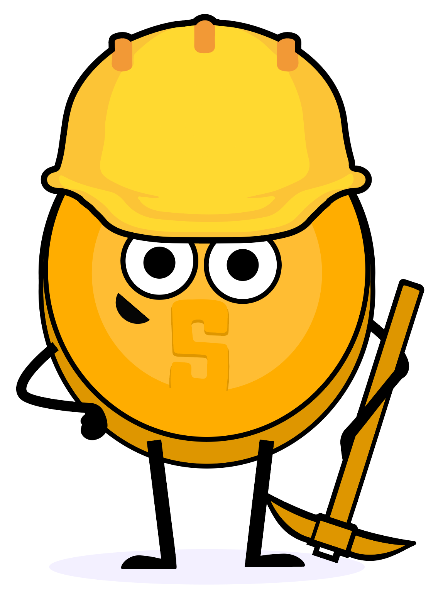

 
 

### ***9.5 How Bitcoin Transactions Work from Start to Finish***    

1. ⭐ Adam wants to send bitcoin to Gerardo. He picks one of his UTXOs, creates a transaction, and adds all necessary details, including the amount of bitcoins he wants to send, Gerardo’s receiving address, and an above average amount of transaction fees.

2. ⭐ After a final check to ensure all details are correct, Adam uses his private key to sign the transaction.

3. ⭐ Adam broadcasts the transaction to the Bitcoin network.

 

<a rel="Website of -- How Bitcoin transactions work from start to finish" href="https://unchained.com/blog/what-is-a-bitcoin-node/">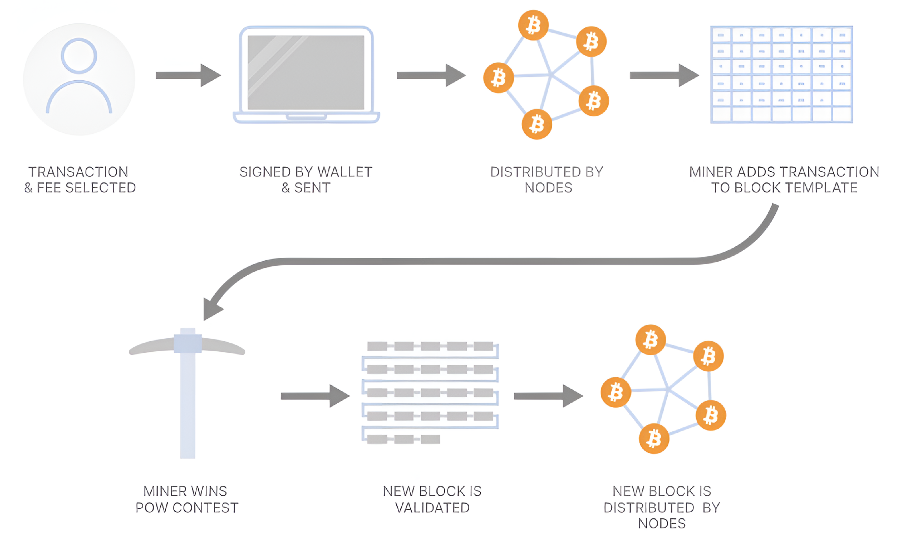

From: Stevenot, Ted, “What is a bitcoin node and how does one work?”. Unchained   Capital, 17, January, 2023 (click on image to go to the website)

 

4. ⭐ The nodes on the network receive the transaction and verify its validity according to the consensus rules (like checking if Adam’s signature is valid and if he has sufficient funds to make the transaction).

5. ⭐ The transaction is marked valid, and the nodes propagate it to other nodes on the network, adding it to the Mempool.

6. ⭐ Since Adam picked a high enough transaction fee, almost all miners include his transaction in their blocks.

7. ⭐ Proof-of-Work: Miners race and try to mine their block by finding the valid block hash. One of the miners finds the hash and broadcasts their block to the network.

8. ⭐ The nodes receive the newly mined block and verify its validity. This includes validating all transactions within the block and ensuring that the Proof-of-Work requirement is met.

9. ⭐ The majority of nodes agree that the block is valid and add it to the blockchain. Gerardo receives the confirmed bitcoins on his receiving address.

10. ⭐ As additional blocks are added to the blockchain in the subsequent hour, the number of confirmations for the transaction grows. As the number of confirmations for the transaction increases, Gerardo gains greater confidence in its success and irreversible nature.

 

- 💡 In summary, the sender signs the transaction with their private key, the nodes verify the transaction UTXOs, and the miners add the verified transaction to the blockchain. The receiver can then access the bitcoins using their private key. Once a block is mined, all the transactions included in it are considered confirmed and the UTXOs used as inputs in these transactions are considered spent and will not be used again.

 

As we wrap up this chapter, you've gained valuable insights into the fundamental concepts of how Bitcoin works. We've covered essential aspects, from the basics of money to the technical side of Bitcoin technology. Now, let's tie it all together in the next chapter. Chapter 10 awaits, where we'll delve into the significant question: "Why Bitcoin?"
